# UTB 双核 AMP FreeRTOS 平台软件概要设计与详细设计说明书

## 1. 文档信息

- 文档类型：概要设计 + 详细设计合并文档
- 适用对象：架构设计、平台开发、驱动开发、集成验证、评审人员
- 设计基线：[System_Overall_Architecture_Diagram.md](./System_Overall_Architecture_Diagram.md)

## 1.1 已冻结设计输入

- BootROM 默认仅负责主核启动；主核完成早期初始化后负责释放从核。
- 从核 ILM 硬件容量为 `64 KB`（`0x09000000`，ILM_ADDR_WIDTH=16），**热点代码放置预算控制在 `48 KB` 以内**。
- 主核 ILM 硬件容量为 `64 KB`（`0x08000000`），主核 DLM `32 KB`（`0x08010000`）。
- 从核 DLM 硬件容量为 `32 KB`（`0x09010000`）。
- 两核均有外部访问端口（Slave Port），主核可直接写从核 ILM/DLM。
- 从核热数据允许进入 ILM，ILM 用于放置从核快路径热点代码和热点数据。
- 从核允许直接访问 Flash，但 Flash 空间按主核区域和从核区域分区管理。
- 外部 SRAM 共 `384 KB`，4 banks：SRAM0 `128 KB`@`0x30000000`、SRAM1 `128 KB`@`0x30020000`、SRAM2 `64 KB`@`0x30040000`、SRAM3 `64 KB`@`0x30060000`。
- 核间中断使用 IDU（`INTER_CORE_IRQn = 19`，IDU 基址 `0x10010000`）。
- 两核 ECLIC 均支持 `128` 个外部中断，`CFG_CLICINTCTLBITS=3`。
- CPU 型号为 xunlian v5.5.0（N300 系列），rv32imafc，单精度 FPU，双发射。
- 主核 I-Cache `16 KB`（ICACHE_ADDR_WIDTH=14）；从核 I-Cache `32 KB`（ICACHE_ADDR_WIDTH=15）。两核均无 D-Cache。
- 验收性能目标暂定为：从核转发吞吐不低于 `25 Mbps`。
- 验收资源目标暂定为：`31` 个节点场景下内存占用不超过 `192 KB`。
- 验收质量目标暂定为：目标工况下不允许丢包。

> **SDK 基线说明**：以上硬件参数已由芯莱定制 SDK（`ql25-mcu-sdk`）确认，具体数据提取自 `SoC/ns_core0/ns_core0_feature.mk`、`SoC/ns_core1/ns_core1_feature.mk` 和 `SoC/ns_core0/Common/Include/ns.h`。SDK 采用双核分离构建模型（`SoC/ns_core0/` + `SoC/ns_core1/`），Board 为 `fpga_eval`，CORE 分别为 `core0_n300f` / `core1_n300f`。

## 2. 完整目录

1. 文档范围与设计目标
2. 系统总体架构与设计原则
3. 主从核职责划分与运行边界
4. 软件分层、模块边界与依赖规则
5. BootROM 启动链路与从核 ILM Bring-up
6. 初始化阶段模型、依赖矩阵与就绪规则
7. 内存架构、ILM 放置与缓冲/描述符设计
8. Flash/存储布局、镜像规划与持久化模型
9. HAL/BSP/Driver 架构与外设 Ownership
10. OSAL 与 RTOS 适配模型
11. 核间通信 IPC 架构与消息契约
12. 从核转发面详细设计
13. 主核管理面承载与上层能力域设计
14. 外部适配、对外接口与内部平台服务接口
15. 集成、验证与验收计划

## 3. 正文

### 1. 文档范围与设计目标

架构设计、平台开发、驱动开发、集成验证

#### 1.1 文档范围

本文档用于描述 UTB 双核 AMP FreeRTOS 平台的软件体系结构与关键详细设计，覆盖范围包括：总体架构、主从核职责划分、软件分层、启动与初始化、内存与存储、HAL/BSP/Driver、OSAL、IPC、转发面、管理面承载、外部适配接口，以及集成验证与验收路径。

本文档的责任边界聚焦在平台和系统软件基础，不覆盖以下内容：

- 第三方网管系统的业务实现细节
- 外部客户 MCU 侧业务策略本身
- 超出平台边界的上层业务算法
- 与当前架构无关的 Linux 旧实现细节

因此，本文档的重点是定义“平台必须提供什么、边界如何划分、模块如何协同、后续如何验证”。

#### 1.2 设计目标

本文档对应的系统设计目标包括：

- 建立适合双核 AMP 目标形态的系统软件架构，而不是延用 Linux 时代的软件组织方式。
- 明确主核管理面和从核转发面的职责边界，避免职责漂移。
- 为后续实现、联调、评审和验证提供统一设计基线。
- 支持 BootROM 主核启动、主核释放从核、从核 ILM（硬件 `64 KB`，热点预算 `48 KB`）热路径放置。
- 支持外部客户 MCU 域、第三方网管系统和芯片内部上层能力域在清晰接口边界上协同运行。
- 支持未来 RTOS 演进，在当前 FreeRTOS 基础上保留 NuttX 适配边界。

#### 1.3 非目标

为避免设计范围失控，本文档明确以下非目标：

- 不以 Linux 基线的软件进程/线程结构作为目标架构。
- 不定义外部网管 UI、客户业务应用或第三方平台的内部业务流程。
- 不在本阶段详细展开所有驱动寄存器级实现。
- 不在本阶段给出最终地址级 Flash 分区表和所有任务栈精确数值。
- 不在本阶段把所有验证脚本和测试用例细化到执行步骤级别。

#### 1.4 设计输入与主要约束

本文档基于以下设计输入展开：

- 当前总体架构图：[System_Overall_Architecture_Diagram.md](./System_Overall_Architecture_Diagram.md)
- 已冻结设计输入：BootROM 仅启动主核，主核完成早期初始化后释放从核；从核 ILM 硬件 `64 KB`（热点预算 `48 KB`）；两核均有 ILM/DLM；热数据允许进入 ILM；从核允许直接访问 Flash，且 Flash 按主核区/从核区分区管理
- 当前验收门槛：从核转发吞吐 `>=25 Mbps`；`31` 节点场景整体内存占用 `<=192 KB`；目标工况 `0` 丢包

这些输入在本文档中被视为设计基线。若后续发生变化，应在文档修订中显式标识其影响范围。

#### 1.5 术语与阅读对象

本文档默认面向以下读者：

- 架构设计与方案评审人员
- 主核/从核平台开发人员
- HAL/BSP/Driver 与 OSAL 开发人员
- IPC、转发面、管理面模块开发人员
- 集成验证与测试人员

文中核心术语包括但不限于：

- 主核：管理面 / 控制面执行核心
- 从核：数据面 / 转发面执行核心
- OSAL：RTOS 抽象边界
- IPC：核间通信子系统
- 平台服务接口：对上统一能力契约层
- 系统服务框架：平台内部运行时组织能力层

#### 1.6 文档使用方式

本文档建议按如下方式使用：

- 架构评审阶段，优先阅读第 2~4 章，确认总体边界是否正确。
- 平台实现阶段，重点参考第 5~11 章，收敛启动、资源、基础平台和 IPC 契约。
- 功能实现阶段，重点参考第 12~14 章，保证转发面、管理面和对外接口不偏离平台边界。
- 集成与验收阶段，以第 15 章作为验证闭环基准，反向检查前文设计是否具备可测性和可恢复性。

### 2. 系统总体架构与设计原则

系统软件架构目标基于以下设计目标：

#### 2.1 设计目标

UTB 双核 AMP FreeRTOS 系统的软件总体架构，目标不是复制 Linux 时代的进程/线程组织方式，而是围绕目标芯片的双核形态、启动模型、性能约束和平台化承载能力，重新构建一个适合长期演进的系统软件基础。当前架构需要同时满足以下目标：

- 支持 BootROM 以主核为启动入口，主核完成系统基础初始化后释放从核。
- 支持从核承载性能敏感的数据面与协议快路径，并利用从核 ILM（硬件 `64 KB`，热点预算 `48 KB`）放置热点代码与热点数据。
- 支持主核承载管理面、配置控制、日志告警、升级协调和外部接口接入。
- 支持外部客户 MCU 域、第三方网管系统以及芯片内部上层能力域在统一平台接口之上稳定运行。
- 支持后续 RTOS 演进，当前以 FreeRTOS 为实现基线，同时为 NuttX 适配保留 OSAL 边界。

#### 2.2 总体架构概述

#### Fig-02 系统总体架构图

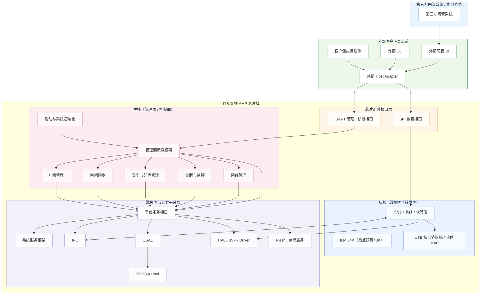

当前系统总体架构由六个主要域构成：第三方网管系统、外部客户 MCU 域、芯片对外接口层、主核管理面、从核数据面、芯片内部公共平台层。各域关系以 [System_Overall_Architecture_Diagram.md](./System_Overall_Architecture_Diagram.md) 为设计基线。

从系统边界上看，第三方网管系统处于最外层，承担北向管理、远程运维和自动化集成职责；外部客户 MCU 域处于芯片外部但接近设备运行现场，承载外部网管 UI、外部 CLI、客户侧应用逻辑和 Host Adapter。Host Adapter 通过 `UART` 与主核管理面交互，通过 `SPI` 与从核数据面交互，形成管理通路与数据通路分离的接入结构。

芯片内部首先区分“对外接口层”和“内部执行域”。对外接口层是对外协议和访问入口的收敛位置，包括网管代理/配置管理接口、诊断监控接口、CLI/脚本接入接口和数据收发接口。内部执行域再分为主核、从核和公共平台层三部分。其中：

- 主核负责控制面和管理面，是系统启动、配置控制、上层能力域承载和全局协调的中心。
- 从核负责数据面和协议快路径，是分片、重组、转发和高速报文处理的执行核心。
- 公共平台层负责提供 OSAL、HAL、IPC、存储和系统服务框架等公共基础能力。

#### 2.3 为什么采用双核 AMP

本设计采用双核 AMP，而不是单核集中承载或类 SMP 共享调度模型，主要原因如下：

- 管理面与转发面对实时性、资源占用和故障隔离的诉求显著不同。管理面更强调可维护性、配置一致性、日志与诊断；转发面更强调确定性、低开销和吞吐稳定性。
- 从核具备 ILM，可将快路径热点逻辑和热点数据放入本地低时延存储，减少共享资源争用和非确定性访问延迟。
- 主核和从核职责明确后，可以减少跨域耦合，使启动、异常处理、升级和调试流程更容易收敛。
- 在当前产品目标下，AMP 比 SMP 更容易建立清晰的 owner 模型，尤其适合共享内存、描述符环、外设 ownership 和配置 authoritative owner 的明确管理。

因此，AMP 在本系统中的价值不只是“多一个核”，而是通过职责分离建立一个能够同时满足管理复杂性和转发性能要求的平台形态。

#### 2.4 架构分域说明

##### 2.4.1 第三方网管系统与外部客户 MCU 域

第三方网管系统并不直接进入芯片内部软件栈，而是通过外部客户 MCU 域形成上层集成关系。外部客户 MCU 域中的 Host Adapter 负责适配北向系统、现场 CLI、客户逻辑与芯片的交互模型。该结构的好处在于：

- 芯片内部软件不直接暴露给外部业务逻辑，降低长期接口耦合风险。
- 外部管理逻辑和芯片内部平台逻辑之间保留适配层，便于协议升级和接口版本演化。
- UART 与 SPI 的职责被清晰拆开，避免管理请求与数据转发走同一条逻辑路径。

##### 2.4.2 芯片对外接口层

芯片对外接口层位于芯片执行域之前，是所有外部访问入口的显式边界。该层并不承担复杂业务逻辑，而是完成对外协议入口的分类、请求分发和内部目标域的路由。当前建议保持四类接口：

- 网管代理 / 配置管理接口：面向外部管理请求、参数查询、配置变更。
- 诊断监控接口：面向日志抓取、状态诊断、统计读取和故障观察。
- CLI / 脚本接入接口：面向现场调试、维护命令和自动化脚本。
- 数据收发接口：面向从核数据面的报文或轻量控制输入输出。

##### 2.4.3 主核管理面

主核承担控制面和管理面的核心责任。其内部由启动与系统初始化、UART 管理接入边界、管理面承载框架以及主核上层能力域构成。管理面承载框架本身不等于某个业务模块，而是统一承载网络管理、诊断监控、安全配置、时间同步和升级管理等能力域。其主要职责包括：

- 对外承接配置、诊断、CLI 等管理请求。
- 对内组织配置应用、日志告警汇聚、升级协调和恢复控制。
- 通过 IPC 向从核下发已校验配置和控制命令，并接收状态、统计和故障反馈。

##### 2.4.4 从核数据面

从核是性能敏感的数据面执行域。其入口为 SPI 数据接入边界，内部由 ILM 驻留快速路径、UTB 核心协议栈和数据转发快路径组成。当前从核设计明确要求：

- 分片、重组、软转发和报文快路径逻辑在从核执行。
- 热点代码与热点数据优先进入 ILM。
- 从核通过 `S_FWD -> HAL` 路径直接完成报文 TX/RX，避免管理面介入快路径。
- 与主核之间的交互仅通过受控 IPC 完成，不允许管理面逻辑直接侵入数据快路径。

##### 2.4.5 芯片内部公共平台层

公共平台层是整个系统的软件基础能力域，负责将“可移植性、硬件抽象、共享资源协同、平台公共服务”从业务能力域中剥离出来。其包括：

- 平台服务接口：对上提供统一能力边界。
- 系统服务框架：提供生命周期、事件分发、公共定时、统计汇聚、配置调度和平台组织能力。
- IPC：提供跨核控制、状态、统计、告警和故障消息承载。
- 存储服务：提供 Flash 和持久化能力。
- OSAL：提供 RTOS 抽象与可移植边界。
- HAL/BSP/Driver：提供硬件抽象和外设访问能力。

#### 2.5 关键设计原则

本系统总体架构遵循以下原则：

- 数据面和管理面必须分离，不允许将管理策略直接带入转发快路径。
- IPC 是第一类系统组件，而不是某个模块的私有辅助工具。
- 外部承载和芯片内部平台接口必须显式隔离，避免外部逻辑直接耦合到内部私有结构。
- 主核与从核的 owner 关系必须明确，禁止“双方都可写”的共享状态设计。
- 共享内存、描述符环、DMA 缓冲等资源必须明确 owner、生命周期和一致性规则。
- 平台服务接口与系统服务框架要分层定义，前者面向上层能力契约，后者面向平台运行时组织。

#### 2.6 总体数据流与控制流

从总体路径上看，系统至少存在三条重要逻辑通路：

- 管理通路：第三方网管系统/外部 MCU -> Host Adapter -> UART -> 芯片对外接口层 -> 主核管理面承载 -> 主核上层能力域 -> 平台服务接口 / IPC。
- 数据通路：外部 MCU -> Host Adapter -> SPI -> 芯片对外接口层 -> 从核协议栈 / 数据转发快路径 -> HAL。
- 平台协同通路：主核上层能力域 -> 平台服务接口 -> IPC / 存储 / OSAL / HAL，并通过系统服务框架组织生命周期、事件、统计和配置调度。

三条通路被显式分离后，系统的性能路径、配置路径和诊断路径不会混在一起，这为后续章节中职责划分、软件分层、IPC、转发面和管理面设计提供了稳定的结构基础。

#### 本章对外接口

总体架构章节的对外接口重点在于定义系统级入口，而不是给出某个模块的私有调用细节。对外应明确三类系统级接口：管理类入口、数据类入口、平台能力类入口。管理类入口由外部 Host Adapter 通过 UART 进入主核管理面；数据类入口由外部 Host Adapter 通过 SPI 进入从核数据面；平台能力类入口由内部上层能力域通过平台服务接口访问控制、配置、状态、统计、告警和诊断能力。

建议在总体架构层冻结以下接口面：

- `UART management interface`
- `SPI data interface`
- `platform service interface`
- `IPC mediation interface`

#### 本章代码示例

```c
typedef struct {
    uint8_t  version;
    uint8_t  channel;
    uint16_t cmd;
    uint32_t seq;
} utb_sys_req_t;

int utb_sys_uart_submit(const utb_sys_req_t *req, const void *payload);
int utb_sys_spi_submit(const void *frame, uint16_t len);
```

### 3. 主从核职责划分与运行边界

#### Fig-03 主从核职责与共享资源图

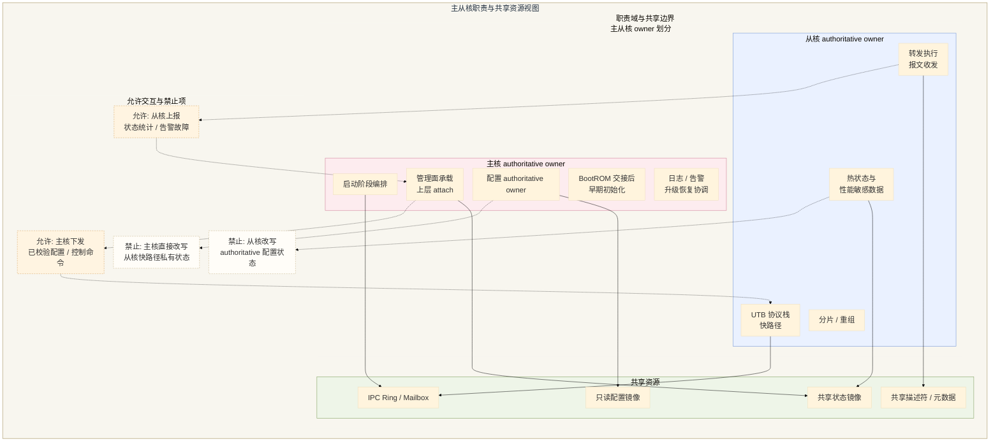

#### 3.1 划分原则

主从核职责划分以“最小耦合、单一 authoritative owner、快路径独立、管理面稳定承载”为基本原则。任何功能在设计时必须首先回答四个问题：由哪个核执行、为什么由该核 owning、另一个核允许看到什么、跨核交互通过什么契约完成。四个问题明确回答，再进入实现阶段。

#### 3.2 主核职责

主核是系统的管理核和控制核，默认承担以下职责：

- 接收 BootROM 启动，完成系统早期初始化。
- 初始化共享基础资源，并在满足条件后释放从核。
- 承载管理面框架以及网络管理、诊断监控、安全配置、时间同步、升级管理等上层能力域。
- 负责外部管理请求的入口接收、参数校验、配置 authoritative owner 判定和回滚控制。
- 汇聚日志、告警、统计、审计信息，并向外部系统提供可观测能力。
- 协调系统级故障处理、看门狗策略和升级恢复逻辑。

主核虽然可以向从核下发配置和控制命令，但并不直接越过 IPC 改写从核私有运行时结构。

#### 3.3 从核职责

从核是系统的数据核和转发核，默认承担以下职责：

- 执行 UTB 协议快路径。
- 执行分片、重组、转发决策和数据面状态机。
- 通过快路径专用 HAL 子集完成报文收发和必要的 DMA 提交。
- 管理从核本地快路径状态、热点缓存和 ILM 中的热点对象。
- 向主核上报必要的状态、统计、告警和故障信息。

从核不承担管理策略生成、不承载复杂日志/告警策略、不直接拥有全局配置 authoritative owner，也不承担面向外部管理系统的接入逻辑。

#### 3.4 共享资源与 owner 模型

系统中的共享对象不能采用“谁都能写”的模式，而必须采用 clear owner 模型。当前建议如下：

| 资源/对象                        | owner            | 非 owner 权限 | 备注                      |
| ---------------------------- | ---------------- | ---------- | ----------------------- |
| 系统启动序列                       | 主核               | 从核仅读就绪结果   | 主核负责释放从核                |
| 全局配置 authoritative state     | 主核               | 从核仅读取已下发结果 | 配置 apply/rollback 由主核裁决 |
| 从核快路径运行状态                    | 从核               | 主核只读镜像/统计  | 不允许主核直接修改               |
| IPC ring / 核间中断状态位           | 单 ring 单 owner 写 | 对端只读/消费    | 明确 producer/consumer    |
| 主核日志/审计缓冲                    | 主核               | 从核仅事件上报    | 汇聚在主核                   |
| 快路径 descriptor / packet pool | 从核               | 主核不直接访问    | 避免快路径争用                 |
| Flash 配置/升级元数据               | 主核               | 从核受限访问     | 从核直访受分区限制               |
| 从核专用 Flash 分区                | 从核受限管理           | 主核可监管      | 需在存储章节细化                |

#### 3.5 允许的跨核交互

主从核之间允许的交互必须收敛在明确的 IPC 类别内，当前允许如下：

- 主核向从核下发控制命令和已校验配置。
- 主核请求从核返回状态、统计、拓扑、运行健康信息。
- 从核向主核主动上报告警、异常、故障和关键计数器。
- 主核请求从核执行受控的局部动作，例如启停某类转发功能或刷新局部运行参数。
- 从核在必要时向主核请求少量平台级服务结果，但不依赖主核参与快路径逐包处理。

#### 3.6 禁止的耦合模式

以下模式在本系统中明确禁止：

- 主核直接进入从核快路径数据结构并原位修改状态。
- 将日志、告警、审计、配置策略等管理逻辑嵌入从核快路径。
- 为方便实现而让同一共享对象同时存在双 owner。
- 让每个报文处理都依赖一次跨核往返。
- 让从核通过未经约束的通用 HAL 接口使用重型平台服务。
- 让外部 Host Adapter 直接耦合内部私有结构、RTOS 私有 API 或驱动内部对象。

#### 3.7 新增功能落位规则

未来新增功能落位时，建议遵循以下判断顺序：

1. 若功能属于配置、日志、告警、升级、诊断、同步协调，优先落在主核。
2. 若功能属于逐包处理、重组、快速分类、时延敏感动作，优先落在从核。
3. 若功能属于 OSAL、HAL、存储、IPC、平台运行时组织能力，落在公共平台层。
4. 若功能需要对外暴露而又不应泄漏内部细节，则通过对外接口层或平台服务接口暴露。

按此规则可以避免功能扩展过程中逐步模糊管理面和数据面的分界。

#### 本章对外接口

本章对外接口主要体现为跨核职责边界上的受控调用面，而不是把对方核心内部状态直接暴露为公共对象。主核对外暴露的职责接口包括启动编排、配置 authority、恢复协调和管理 attach 控制；从核对外暴露的职责接口包括 forwarding enable、状态上报、统计快照和故障上报。共享资源层只暴露 IPC ring、核间中断状态位、共享状态镜像和只读配置镜像，不允许暴露私有任务控制块、快路径私有缓存和未版本化内部结构体。

职责边界上的典型接口包括：

- `utb_core_ctrl_send()`：主核向从核发送控制或配置命令。
- `utb_core_status_report()`：从核向主核上报状态、统计和告警。
- `utb_cfg_publish_snapshot()`：主核发布只读配置镜像。
- `utb_core_fault_notify()`：从核上报故障与恢复请求。

#### 本章代码示例

```c
typedef enum {
    UTB_CORE_MSG_CFG_APPLY = 1,
    UTB_CORE_MSG_FWD_ENABLE,
    UTB_CORE_MSG_STATS_QUERY,
    UTB_CORE_MSG_FAULT_REPORT,
} utb_core_msg_type_t;

typedef struct {
    uint16_t type;
    uint16_t len;
    uint32_t seq;
} utb_core_msg_hdr_t;

int utb_core_ctrl_send(const utb_core_msg_hdr_t *hdr, const void *payload);
int utb_core_status_report(const utb_core_msg_hdr_t *hdr, const void *payload);
```

### 4. 软件分层、模块边界与依赖规则

层间依赖关系如下：

#### Fig-04 软件分层与依赖规则图

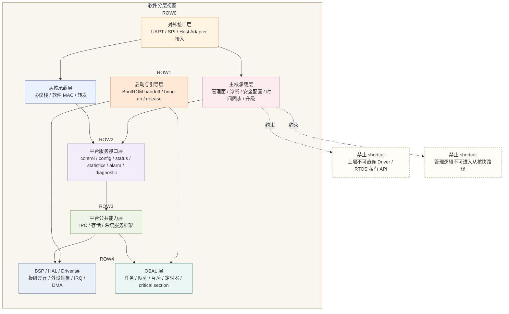

#### 4.1 分层目标

软件分层的目标是为了将启动、平台基础能力、硬件抽象、协议快路径、管理承载和外部适配这些性质完全不同的责任拆开。分层正确后，后续做 RTOS 适配、驱动替换、接口演进、性能优化和故障分析时，影响面才能被限制在合理范围内。

#### 4.2 分层总览

结合当前总体架构图，系统建议划分为以下层次：

1. 启动与引导层  
   负责 BootROM 交接、主核早期初始化、从核释放与 bring-up。

2. 平台硬件抽象层  
   由 BSP、HAL、Driver 组成，负责板级配置、寄存器抽象和外设访问。

3. OS 抽象层  
   由 OSAL 组成，负责任务、同步、时间、ISR-safe 边界和 RTOS 可移植性。

4. 共享基础服务层  
   由 IPC、存储服务和系统服务框架组成，负责跨核消息、持久化能力和平台运行时组织。

5. 平台服务接口层  
   负责向上暴露统一的平台能力边界，屏蔽下方实现细节。

6. 业务承载层  
   主核承载管理类能力域，从核承载协议栈和转发快路径。

7. 对外接口层  
   负责外部 Host Adapter、CLI、网管接口和数据收发接口的边界收敛。

#### 4.3 各层职责定义

##### 4.3.1 启动与引导层

该层只负责系统从 reset 进入可运行状态的初始化链路，包括：

- 主核启动入口建立。
- 时钟、复位、基础内存初始化。
- 从核镜像定位、ILM 放置和从核释放。
- per-core runtime 和 scheduler 启动前置条件建立。

该层不承载业务控制策略，也不直接暴露为外部运行时接口。

##### 4.3.2 BSP / HAL / Driver 层

该层面向硬件，分为三个责任层次：

- BSP：板级资源、pinmux、板级时钟与布线信息。
- HAL：芯片级寄存器抽象、中断、DMA、时钟复位等硬件抽象。
- Driver：面向功能的外设访问接口，如 SPI、UART、Flash、Timer 等。

该层允许被平台服务接口、从核快路径和少量平台基础模块依赖，但不允许被外部适配逻辑直接跨层访问。

##### 4.3.3 OSAL 层

OSAL 是 RTOS 差异隔离层，负责：

- 抽象 task、queue、mutex、semaphore、timer、time 等能力。
- 区分 task-context 与 ISR-safe 使用语义。
- 为 FreeRTOS 与未来 NuttX 适配提供边界。

OSAL 解决的是 RTOS 差异，而不是硬件差异，因此它与 HAL 是不同维度的抽象边界，不应把 OSAL 简单挂在 HAL 下面。

##### 4.3.4 IPC / 存储 / 系统服务框架层

这三类能力共同组成共享基础服务层：

- IPC 负责跨核通信。
- 存储服务负责 Flash 访问、配置持久化、回滚元数据、关键持久标记。
- 系统服务框架负责平台内部的生命周期组织、事件分发、公共定时、统计汇聚和配置调度。

该层是“平台可运行起来并可被上层复用”的基础，不应与业务能力域混写。

##### 4.3.5 平台服务接口层

平台服务接口是对上统一能力契约层。其责任不是实现所有功能，而是把控制、配置、状态、统计、告警、诊断等能力，以稳定接口方式暴露给上层能力域和对外接口层。它应屏蔽：

- 驱动内部对象
- RTOS 私有结构
- IPC 私有消息布局
- 存储实现细节

##### 4.3.6 业务承载层

业务承载层根据核心职责分为两类：

- 主核业务承载：网络管理、诊断监控、安全配置、时间同步、升级管理。
- 从核业务承载：UTB 协议栈、分片、重组、转发和快路径状态机。

业务承载层可以调用平台服务接口，但不应绕过平台接口直接侵入不属于自己的基础层实现。

##### 4.3.7 对外接口层

对外接口层位于外部系统与内部业务承载层之间，是接口隔离层。它的责任是：

- 承接外部 MCU 域和第三方网管系统的访问。
- 分类管理请求、诊断请求、CLI 请求和数据通道输入。
- 将外部请求路由到合适的内部执行域。

该层不应直接承载主业务逻辑，只负责入口规范化和边界隔离。

#### 4.4 依赖规则

当前建议采用以下依赖规则：

- 上层业务承载允许依赖平台服务接口，不允许直接依赖驱动内部实现。
- 平台服务接口允许依赖 IPC、存储、OSAL、HAL。
- 系统服务框架允许依赖 OSAL、IPC、存储，但不应反向依赖上层业务策略。
- 从核快路径允许通过受限接口依赖 HAL，但不应依赖管理面框架。
- 对外接口层允许依赖主核管理面承载或从核数据入口，不应跨层直连 RTOS 或私有驱动对象。

#### 4.5 禁止的跨层 shortcut

为防止后续实现侵蚀架构，以下 shortcut 明确禁止：

- 外部接口层直接调用 HAL、Driver 或 RTOS 私有 API。
- 主核业务能力域直接修改从核私有快路径对象。
- 从核快路径直接耦合日志/告警策略和复杂配置语义。
- 上层能力域绕过平台服务接口，直接依赖 IPC 私有消息结构。
- 把系统服务框架当成业务逻辑容器，混入不具备平台共性的业务策略。

#### 4.6 核本地层与共享层划分

为了防止“共享层无限膨胀”，建议明确以下归属：

- 主核本地层：管理面承载框架、网络管理、诊断监控、安全配置、时间同步、升级管理、UART 管理入口。
- 从核本地层：SPI 数据入口、UTB 协议栈、分片/重组/软转发、ILM 快路径对象。
- 共享层：IPC、存储服务、OSAL、HAL/BSP/Driver、系统服务框架、平台服务接口。

需要注意的是，“共享层”不代表“两个核都可以自由改写”，而是表示该层能力为两个核所复用，其内部仍需按照 owner 模型管理资源。

#### 4.7 层次扩展原则

后续新增功能时，优先判断其性质属于以下哪类：

- 硬件能力抽象：落到 BSP/HAL/Driver。
- RTOS 可移植性：落到 OSAL。
- 跨核消息与持久化基础能力：落到 IPC/存储/系统服务框架。
- 对上统一能力契约：落到平台服务接口。
- 管理策略与运维能力：落到主核业务承载。
- 快路径逐包处理：落到从核业务承载。
- 外部接入与协议适配：落到对外接口层。

采用这套规则，可以保证后续设计文档从第 5 章开始展开时，不会因为层次模糊而造成职责漂移。

#### 本章对外接口

软件分层上的对外接口统一收口到平台服务接口层。主核承载层、从核承载层、对外接口层只能通过平台服务接口访问 IPC、存储、系统服务框架、HAL 和 OSAL，不允许越层直接访问 driver 私有入口或 RTOS 私有 API。本章建议所有上层模块通过 capability 风格 API 获取平台能力，而不是直接持有底层对象指针。

推荐暴露的分层接口包括：

- `utb_platform_ctrl_*()`：控制类接口。
- `utb_platform_cfg_*()`：配置类接口。
- `utb_platform_status_*()`：状态查询接口。
- `utb_platform_stats_*()`：统计接口。
- `utb_platform_alarm_*()`：事件与告警接口。

#### 本章代码示例

```c
int utb_platform_cfg_set(uint16_t key, const void *buf, uint16_t len);
int utb_platform_cfg_apply(uint32_t timeout_ms);
int utb_platform_status_get(uint16_t key, void *buf, uint16_t *len);

void mgmt_apply_example(void)
{
    utb_platform_cfg_set(UTB_CFG_NODE_ID, &g_node_id, sizeof(g_node_id));
    utb_platform_cfg_apply(200);
}
```

### 5. BootROM 启动链路与从核 ILM Bring-up

启动时，BootROM 首先启动主核，并完成以下工作：

#### Fig-05 BootROM 与从核 Bring-up 时序图

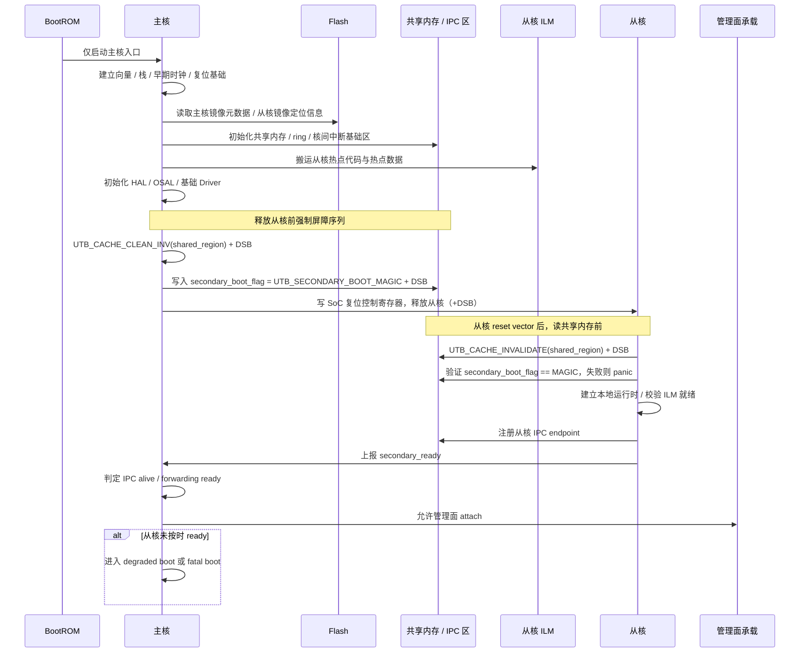

#### 5.1 启动设计目标

本章定义系统从复位进入稳定运行态的启动链路。设计目标不是单纯描述“谁先跳到哪里”，而是明确从 BootROM 到主核、从主核到从核、再到双核运行态之间的 owner、前置条件、内存可见性和失败行为。当前系统启动设计遵循以下前提：

- BootROM 默认只负责主核启动。
- 主核完成系统早期初始化后负责释放从核。
- 从核 ILM 硬件容量为 `64 KB`（热点放置预算 `48 KB`），由主核在从核启动前完成热点对象装载或搬移。
- 从核允许直接访问 Flash，但启动期镜像定位和 ILM 放置仍由主核统筹。

#### 5.2 启动链路总览

系统启动链路建议分为以下九个阶段：

1. Reset / BootROM 入口建立  
2. 主核早期初始化  
3. 时钟/复位/基础内存就绪  
4. 启动介质与镜像定位  
5. 共享资源区与 IPC 基础区建立  
6. 从核镜像准备与 ILM 放置  
7. 从核释放与从核早期运行时建立  
8. 主核/从核 RTOS 基础运行时启动  
9. 平台服务与上层模块 attach

这样拆分的目的，是把“主核能启动”与“系统已可运行”明确分开，把“从核已释放”与“从核已 ready”明确分开。

#### 5.3 BootROM 与主核早期初始化

BootROM 完成最小可启动动作后，将控制权交给主核启动入口。主核在该阶段负责：

- 建立主核早期栈和异常/中断最小上下文。
- 初始化最基本的时钟、复位和片上内存访问条件。
- 建立对启动介质和镜像布局的访问能力。
- 判断当前启动模式，例如正常启动、升级恢复、异常回滚或诊断模式。

此阶段禁止引入复杂平台服务、动态资源管理和上层业务模块 attach。其目标是把系统推进到“可安全初始化共享资源和从核镜像”的状态。

#### 5.4 从核释放前必须满足的条件

从核不能被视为一个“简单跳转即可运行”的执行体。在释放从核之前，主核必须确认以下条件满足：

- 主核已完成关键时钟与复位域初始化。
- 从核所在复位域和中断路由配置完成。
- 共享内存区域已建立，且 cacheability 属性已明确。
- IPC 共享内存 / ring / 核间中断基础区已具备最小可用条件。
- 从核入口地址、向量表、初始栈位置已确定。
- 从核热点代码和热点数据已放置到 ILM 或完成可见性准备。

若以上条件任一未满足，则从核不得释放。否则将出现”从核已运行但看不到共享资源”或”从核运行后立刻进入异常”的问题。

##### 5.4.1 从核释放操作序列

从核释放必须严格按以下操作序列执行，缺少任何一步都可能导致从核启动后看到主核的旧数据：

```c
/* 主核：释放从核前 */

/* 步骤 1：完成全部共享内存初始化（IPC ring、boot metadata、IPC 基础区） */
utb_shared_region_init();

/* 步骤 2：刷全部共享区到物理内存，确保从核可见 */
UTB_CACHE_CLEAN_INV(UTB_SHARED_BASE, UTB_SHARED_SIZE);
UTB_DSB();

/* 步骤 3：写入从核 boot flag */
g_shared_ctrl->secondary_boot_flag = UTB_SECONDARY_BOOT_MAGIC;
UTB_DSB();   /* 确保 flag 写入已提交到物理内存 */

/* 步骤 4：写 SoC 特定复位控制寄存器，释放从核 */
utb_soc_release_secondary();
UTB_DSB();
```

```c
/* 从核：reset vector 后，读共享内存前 */

/* 步骤 1：丢弃从核 cache 中的旧数据 */
UTB_CACHE_INVALIDATE(UTB_SHARED_BASE, UTB_SHARED_SIZE);
UTB_DSB();

/* 步骤 2：读取 boot flag 并验证 */
if (g_shared_ctrl->secondary_boot_flag != UTB_SECONDARY_BOOT_MAGIC) {
    utb_panic(UTB_PANIC_BOOT_FLAG_INVALID);
}

/* 步骤 3：读取全部 boot metadata，推进初始化 */
```

若共享内存区域已通过 MPU 配置为 non-cacheable，则上述 `UTB_CACHE_*` 操作可省略，但 `UTB_DSB()` 仍为必须。

##### 5.4.2 从核释放屏障时序图

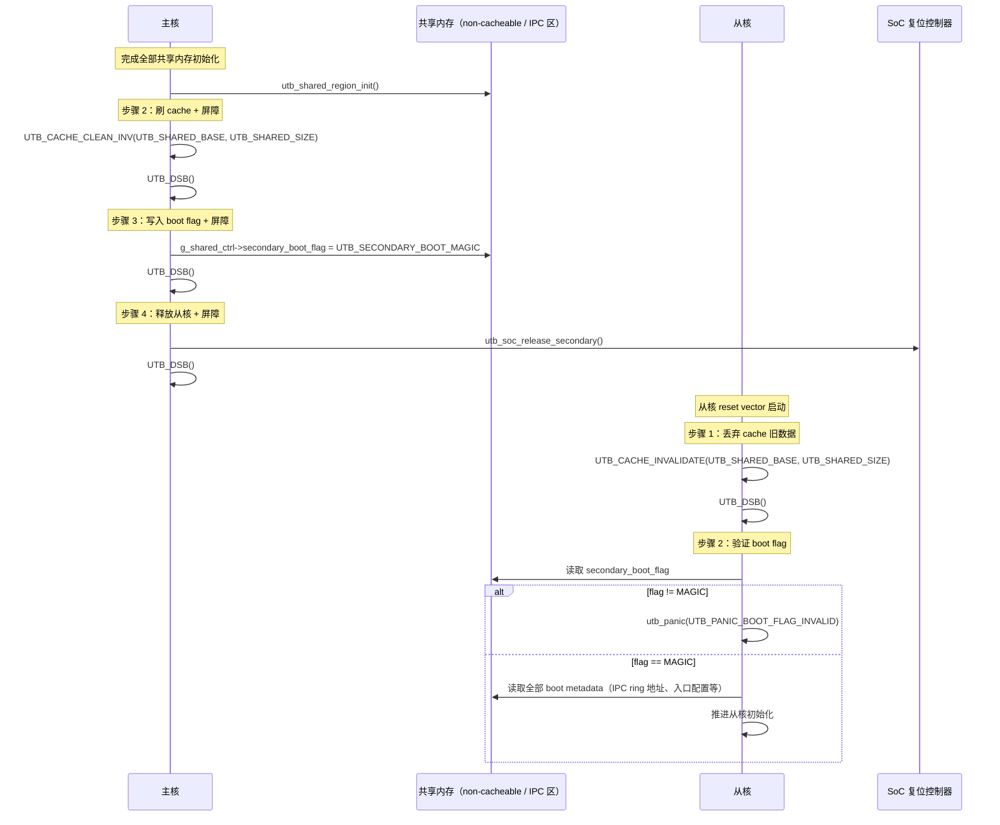

#### 5.5 从核镜像与 ILM 放置策略

从核镜像的启动策略建议采用“主核统筹定位 + 主核主导搬移 + 从核按既定入口启动”的模式。具体建议如下：

- 从核完整镜像存放在其专属 Flash 分区。
- 启动期由主核负责读取从核镜像元数据，识别需要进入 ILM 的段。
- 热点代码段、热点数据段和极低时延访问对象搬移到 ILM。
- 非热点代码、低频配置对象和大块数据不放入 ILM。
- 从核启动入口固定在主核准备好的入口地址，不在运行时临时搜索。

##### 5.5.1 ILM 放置工具链实现

ILM 放置不是自动的，需要显式的链接脚本支持：

```ld
/* 从核链接脚本中的 ILM section 定义 */
MEMORY
{
    ILM   (rwx) : ORIGIN = 0x09000000, LENGTH = 64K   /* 从核 ILM，硬件 64KB */
    DLM   (rwx) : ORIGIN = 0x09010000, LENGTH = 32K   /* 从核 DLM */
    FLASH (rx)  : ORIGIN = 0x20000000, LENGTH = 256M   /* Flash XIP */
    SRAM  (rwx) : ORIGIN = 0x30000000, LENGTH = 128K   /* 外部 SRAM0（从核数据区）*/
}

SECTIONS
{
    .ilm_text : ALIGN(4)
    {
        *(.ilm_text*)
        *(.ilm_rodata*)
    } > ILM

    .ilm_data : ALIGN(4)
    {
        *(.ilm_data*)
    } > ILM AT > FLASH   /* LMA 在 Flash，VMA 在 ILM，启动期由主核搬运 */
}

/* 构建时强制检查 ILM 大小，防止溢出 */
ASSERT(SIZEOF(.ilm_text) + SIZEOF(.ilm_data) <= 49152,
       "ERROR: ILM hot-path sections exceed 48 KB budget — reduce ILM-placed objects")
```

C 代码中将函数/数据标记为 ILM 对象：

```c
/* 标记热点函数进入 ILM */
__attribute__((section(".ilm_text")))
static void utb_fwd_slice_process(utb_reasm_slot_t *slot);

/* 标记热点数据进入 ILM */
__attribute__((section(".ilm_data"), aligned(32)))
static utb_reasm_slot_t g_reasm_slots[UTB_REASM_SLOT_COUNT];
```

从核 crt0 中的 `.ilm_data` 搬运序列：

```c
extern uint32_t _ilm_data_load;    /* LMA: Flash 中的加载地址 */
extern uint32_t _ilm_data_start;   /* VMA: ILM 中的运行地址 */
extern uint32_t _ilm_data_end;     /* VMA: ILM 段结束地址 */

uint32_t *src = &_ilm_data_load;
uint32_t *dst = &_ilm_data_start;
while (dst < &_ilm_data_end) { *dst++ = *src++; }

UTB_DSB();   /* 确保搬运完成 */
UTB_ISB();   /* 若搬运了可执行代码，必须刷新指令 pipeline */
```

Bring-up 验证项：确认 ILM section 实际使用率不超过 `80%`（从 map 文件读取 `.ilm_text` 和 `.ilm_data` 的 size）。

从核 ILM 硬件容量 `64 KB`，热点预算控制在 `48 KB` 以内。ILM 不适合作为通用内存池，应优先保留给快路径关键代码、重组热点状态、关键描述符缓存等对象。其余通用数据可利用从核 DLM（`32 KB`@`0x09010000`）或外部 SRAM。

#### 5.6 主核启动职责

在整个启动链路中，主核是唯一的启动总控 owner。其启动职责包括：

- 接收 BootROM 控制权。
- 建立基础硬件运行条件。
- 解析并定位主核/从核镜像。
- 初始化共享基础区、IPC 基础区和必要的平台底座。
- 决定何时释放从核。
- 负责系统级启动失败判定和 degraded boot 裁决。

主核可以把某些低级初始化工作交给平台层实现，但不能放弃启动链路的 authoritative owner 身份。

#### 5.7 从核启动职责

从核在被主核释放后，仅负责建立本地运行时并进入快路径 ready 状态。其职责包括：

- 建立从核本地栈、向量和最小上下文。
- 初始化从核本地快路径对象和 ILM 内热点对象引用。
- 建立数据面所需最小 HAL/Driver 上下文。
- 进行从核 ready 上报。

从核不负责重新初始化共享资源，不负责判定主核管理面是否 ready，也不应在启动期重复建立主核已经 owning 的全局状态。

#### 5.8 启动风险与防护

当前启动链路中最主要的风险包括：

- 过早释放从核，导致共享资源不可见。
- ILM 放置错误，导致从核热点对象落在高时延区域。
- 主核和从核对共享资源重复初始化。
- cache clean / invalidate / barrier 缺失，导致从核看见旧数据。
- 从核入口地址、向量表或栈设置错误，导致启动即异常。

为降低这些风险，建议在启动链路中设置明确阶段 marker、错误码和 ready 上报，并在 bring-up 阶段保留关键调试观测点。

#### 5.9 Bring-up 验证要点

本章对应的 bring-up 验证建议至少覆盖以下内容：

- BootROM 是否稳定进入主核启动入口。
- 主核是否只在满足条件后释放从核。
- ILM 是否按预期装入热点段。
- 从核 ready 上报是否发生在 IPC 可用之后。
- 共享资源在主核与从核之间是否满足可见性约束。
- 启动失败时是否能区分 fatal stop 与 degraded boot。

#### 本章对外接口

启动链路相关接口只应暴露给主核启动路径和 bring-up 管理代码，不应暴露为业务层可调用接口。外部可见接口重点是镜像定位、从核释放、阶段状态上报和 fatal/degraded boot 判定结果。外部上层模块只应看到 `boot_ready`、`secondary_ready`、`ipc_ready` 等阶段状态，不应直接参与向量表、ILM 搬运和复位控制。

建议的启动接口包括：

- `utb_boot_locate_secondary_image()`
- `utb_boot_load_secondary_ilm()`
- `utb_boot_release_secondary()`
- `utb_boot_get_stage()`

#### 本章代码示例

```c
int utb_boot_bringup_secondary(void)
{
    int rc;

    rc = utb_boot_locate_secondary_image();
    if (rc != 0) return rc;

    rc = utb_boot_load_secondary_ilm();
    if (rc != 0) return rc;

    return utb_boot_release_secondary();
}
```

### 6. 初始化阶段模型、依赖矩阵与就绪规则

启动链路中，初始化阶段与就绪条件之间存在依赖关系，且存在多个就绪条件。

#### Fig-06 初始化 phase 与 readiness 图

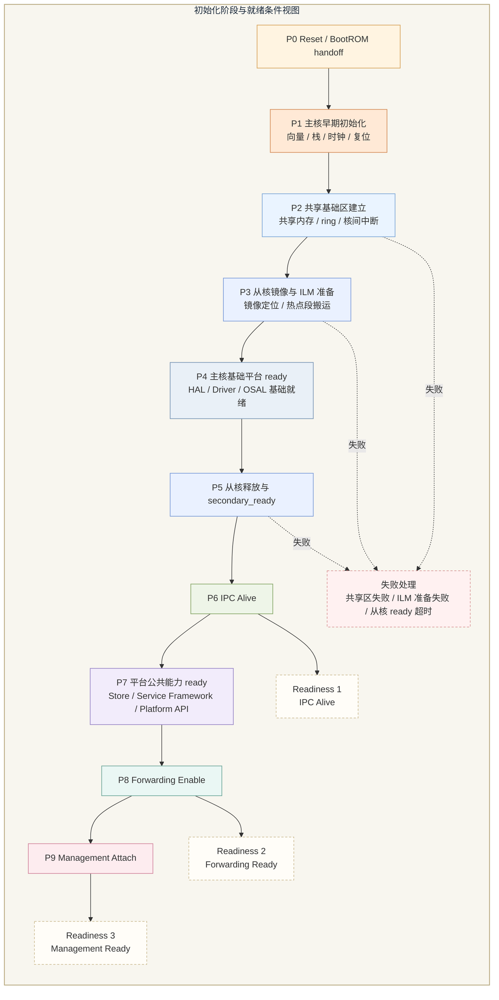

#### 6.1 初始化设计目标

初始化是架构的一部分，而不是实现细节。当前系统的初始化设计目标，是把“系统从可启动”推进到“平台可承载、从核可转发、管理可 attach”的全过程拆成阶段化模型，并为每个阶段定义 owner、依赖、输出和失败行为。

#### 6.2 初始化 phase 模型

建议采用如下 phase 模型：

| Phase | 目标                            | owner        | 关键输出                 | 失败行为             |
| ----- | ----------------------------- | ------------ | -------------------- | ---------------- |
| P0    | Reset / BootROM handoff       | BootROM / 主核 | 主核启动入口有效             | fatal            |
| P1    | 主核早期初始化                       | 主核           | 时钟/复位/基础内存可用         | fatal            |
| P2    | 平台基础区建立                       | 主核           | 共享内存、IPC 基础区、启动元数据可用 | fatal            |
| P3    | 从核镜像与 ILM 准备                  | 主核           | 从核入口、ILM 热点对象准备完成    | fatal            |
| P4    | 从核释放与从核 early runtime         | 主核 / 从核      | 从核 ready 上报          | fatal 或管理存活但转发关闭 |
| P5    | 基础驱动与 OSAL 运行时建立              | 主核 / 从核      | HAL、Driver、OSAL 基础可用 | 视模块而定            |
| P6    | IPC alive 与共享服务 ready         | 主核 / 从核      | IPC 双向通信可用           | fatal 对转发/管理均敏感  |
| P7    | 存储、系统服务框架、平台服务接口 ready        | 主核           | 上层 attach 入口可用       | 可 degraded       |
| P8    | 上层能力域 attach 与 runtime enable | 主核 / 从核      | 管理面 attach、转发 enable | 可 degraded 或局部关闭 |

该模型的关键不是 phase 数量，而是每个 phase 都必须具备“进入条件、完成证据、失败动作”。

#### 6.3 关键依赖关系

初始化中有三组关键依赖必须显式化：

##### 6.3.1 从核释放前依赖

以下条件必须先满足，才能从 P3 进入 P4：

- 从核入口和 ILM 搬移完成。
- 共享内存和 IPC 基础区 ready。
- 中断路由与必要外设时钟可用。
- 主核已建立从核可见的启动元数据。

##### 6.3.2 forwarding enable 前依赖

以下条件必须先满足，才能允许从核真正开启数据转发：

- 从核本地快路径对象和 HAL 子集 ready。
- IPC alive，允许主核向从核下发必要配置。
- 快路径所需配置已下发并通过最小一致性检查。
- SPI 数据接入路径和从核数据面状态均为 ready。

##### 6.3.3 management attach 前依赖

以下条件必须先满足，才能允许主核管理面 attach：

- 主核管理面承载框架 ready。
- 平台服务接口、系统服务框架和存储服务 ready。
- IPC alive，以便管理面获取从核状态与统计。
- 日志、告警、诊断至少具备基础可用能力。

#### 6.4 就绪规则

当前建议将系统就绪规则定义为四级状态：

- `Platform Basic Ready`：主核和基础平台可用，但上层未 attach。
- `IPC Alive`：双核通信可用，但业务能力未必全部 attach。
- `Forwarding Ready`：从核允许处理数据面业务。
- `Management Ready`：主核允许承接配置、诊断、CLI 和统计请求。

时间同步、安全配置、升级管理、诊断监控等上层能力域不必在 `Platform Basic Ready` 时全部启动，但必须在 `Management Ready` 之前建立 attach 判断条件。

#### 6.4.1 任务与栈预算基线

为避免第 6 章只停留在 phase 描述、而没有运行期预算，建议冻结一版任务/栈基线，供后续实现和评审使用。当前建议采用 `0~7` 的任务优先级编号，数值越大优先级越高；若实际 `FreeRTOS` 配置不同，应保持相对高低关系不变。以下栈预算使用 `KB` 表示；若实现以 word 为单位配置栈深，需按目标编译器字长换算。

| 核心  | 任务                   | 主要职责                             | 建议优先级 | 建议栈预算    |
| --- | -------------------- | -------------------------------- | ----- | -------- |
| 主核  | `p_boot_init_task`   | 启动后期编排、phase 推进、从核释放、恢复协调        | `7`   | `2 KB`   |
| 主核  | `p_ipc_service_task` | IPC request/response、状态快照读取、事件消费 | `6`   | `2 KB`   |
| 主核  | `p_mgmt_host_task`   | 管理面宿主、配置入口、CLI/北向请求承接            | `5`   | `3 KB`   |
| 主核  | `p_store_cfg_task`   | 配置持久化、回滚标记、Flash 服务              | `4`   | `2 KB`   |
| 主核  | `p_diag_log_task`    | 日志汇聚、告警整理、诊断输出                   | `3`   | `2 KB`   |
| 主核  | `p_timer_wdg_task`   | 周期监控、watchdog 协调、超时处理            | `3`   | `1 KB`   |
| 从核  | `s_fwd_rx_task`      | 下行切片解析、重组、检查、SPI 发送编排            | `7`   | `2 KB`   |
| 从核  | `s_fwd_tx_task`      | 上行封装、调度、切片、symbol 构建             | `7`   | `2 KB`   |
| 从核  | `s_ipc_service_task` | 从核 IPC 请求处理、状态/统计发布              | `5`   | `1.5 KB` |
| 从核  | `s_reasm_gc_task`    | 重组超时扫描、槽位回收、慢路径清理                | `4`   | `1 KB`   |
| 从核  | `s_fault_stat_task`  | 故障汇总、统计归并、低频维护                   | `3`   | `1 KB`   |

建议再额外预留以下运行期栈余量：

- 主核：`4 KB` 作为 `Idle/Timer task`、ISR 栈和异常处理公共余量。
- 从核：`2.5 KB` 作为 `Idle/Timer task`、ISR 栈和异常处理公共余量。

按上述基线，主核任务栈总预算约 `16 KB`，从核任务栈总预算约 `10 KB`。SDK 确认两核各有 `32 KB` DLM（主核 `0x08010000`、从核 `0x09010000`），可充分容纳任务栈和本地控制状态。要求：

- 从核快路径任务只保存控制状态和短生命周期局部变量，不允许把大数组、大报文对象放到任务栈上。
- 主核日志、诊断和配置处理必须使用池化缓冲，不允许用大栈临时拼装长报文。
- `p_boot_init_task` 在 `P8` 后可退出或降为休眠态，其栈可由实现决定是否复用。

##### 6.4.1.1 任务栈深度分析

任务栈预算不是拍脑袋的经验值，必须以"最深调用链 + RTOS 上下文开销"为基础。

**各任务最深调用链估算**

| 任务                   | 估算最深调用链                                                | 局部最大帧  | 最深栈深估算             | 已分配预算  |
| -------------------- | ------------------------------------------------------ | ------ | ------------------ | ------ |
| `p_boot_init_task`   | `boot_init → shared_init → ILM_copy → soc_release`     | ~256 B | ~512 B + 136 B ctx | 2 KB ✓ |
| `p_ipc_service_task` | `ipc_svc → msg_dispatch → handler → rsp_send`          | ~128 B | ~400 B + 136 B ctx | 2 KB ✓ |
| `p_mgmt_host_task`   | `mgmt_host → cfg_apply → parse → validate → store`     | ~512 B | ~768 B + 136 B ctx | 3 KB ✓ |
| `s_fwd_rx_task`      | `rx_task → slice_recv → reasm_push → check → spi_send` | ~256 B | ~512 B + 64 B ctx  | 2 KB ✓ |
| `s_fwd_tx_task`      | `tx_task → sched → slice → symbol_build → desc_submit` | ~256 B | ~512 B + 64 B ctx  | 2 KB ✓ |
| `s_reasm_gc_task`    | `gc_task → scan_slots → timeout_drop → stats_update`   | ~128 B | ~256 B + 64 B ctx  | 1 KB ✓ |

> 备注：上表调用链深度和局部帧大小为估算值。实现阶段必须使用编译器 `-fstack-usage` 输出或静态分析工具（如 PC-lint、StackAnalyzer）对关键任务做精确分析，结果不符则调整预算。

**`configISR_STACK_SIZE_WORDS` 配置**

FreeRTOS  使用独立 ISR 栈（MSP），须配置：

```c
/* FreeRTOSConfig.h */
#define configISR_STACK_SIZE_WORDS   256   /* 1 KB ISR 栈，数据面 ISR 最深调用链不超过 512 B */
```

ISR 栈大小应覆盖最深中断嵌套路径：`ISR → xQueueSendFromISR → portYIELD_FROM_ISR` 约需 ~128 B；预留 2× 余量到 1 KB。

**高水位验证强制要求**

```c
/* 集成测试阶段，在 p_diag_log_task 或专用诊断任务中定期执行 */
void utb_stack_watermark_check(void)
{
    UBaseType_t wm;
    wm = uxTaskGetStackHighWaterMark(h_p_mgmt_host_task);
    UTB_ASSERT(wm >= (3 * 1024 / 4) * 0.2);   /* 余量不低于 20% */

    wm = uxTaskGetStackHighWaterMark(h_s_fwd_rx_task);
    UTB_ASSERT(wm >= (2 * 1024 / 4) * 0.2);
    /* ... 对所有任务重复 ... */
}
```

验收规则：**所有任务在满载场景（31 路重组 + 25 Mbps 吞吐压力）跑完后，`uxTaskGetStackHighWaterMark()` 返回值不低于分配栈深的 20%（即用水位不超过 80%）**。若任一任务触碰此红线，则在提测前必须扩栈或缩减调用链。

#### 6.4.2 FreeRTOS 优先级约束与 configMAX_PRIORITIES 配置

FreeRTOS 调度器对优先级编号有强制约束，必须在任务表设计中遵守：

- **Idle Task 固定占用优先级 0**，任何业务任务不得使用优先级 0，否则与 Idle Task 产生冲突。
- **Timer Task 优先级**由 `configTIMER_TASK_PRIORITY` 配置，建议设为 `configMAX_PRIORITIES - 1`（即最高优先级），确保软件定时器回调及时执行。
- **业务任务可用范围**：`1 ~ configMAX_PRIORITIES - 2`，当前基线使用 `1~7`，需设置 `configMAX_PRIORITIES = 9`（0=Idle，8=Timer，1~7=业务任务）。
- **ISR 硬件中断优先级**与 FreeRTOS 任务优先级是两个独立维度。只有硬件优先级数值 **>= `configLIBRARY_MAX_SYSCALL_INTERRUPT_PRIORITY`** 的 ISR，才允许调用 FreeRTOS API（`xQueueSendFromISR` 等 `FromISR` 变体）；数值更低（硬件优先级更高）的 ISR 不得调用任何 FreeRTOS API。
- **`portYIELD_FROM_ISR` 规则**：在 ISR 中调用任何 `FromISR` 变体后，必须检查 `xHigherPriorityTaskWoken`，并在 ISR 末尾调用 `portYIELD_FROM_ISR(xHigherPriorityTaskWoken)`，否则任务切换会延迟到下一个 OS tick。
- **栈溢出检测**：必须在 `FreeRTOSConfig.h` 中设置 `configCHECK_FOR_STACK_OVERFLOW = 2`，并实现 `vApplicationStackOverflowHook`：

```c
void vApplicationStackOverflowHook(TaskHandle_t xTask, char *pcTaskName)
{
    utb_panic(UTB_PANIC_STACK_OVERFLOW);
}
```

建议的 `FreeRTOSConfig.h` 关键配置基线如下：

| 配置项                                | 主核     | 从核     | 说明                        |
| ---------------------------------- | ------ | ------ | ------------------------- |
| `configMAX_PRIORITIES`             | `9`    | `9`    | 0=Idle，8=Timer，1~7 业务任务   |
| `configTIMER_TASK_PRIORITY`        | `8`    | `8`    | 高于所有业务任务                  |
| `configTICK_RATE_HZ`               | `1000` | `1000` | 1ms tick                  |
| `configUSE_TICKLESS_IDLE`          | `0`    | `0`    | 数据面不能进入低功耗睡眠              |
| `configSUPPORT_STATIC_ALLOCATION`  | `1`    | `1`    | 任务/队列使用静态分配               |
| `configSUPPORT_DYNAMIC_ALLOCATION` | `0`    | `0`    | 关闭动态分配，彻底防止快路径误用 `malloc` |
| `configCHECK_FOR_STACK_OVERFLOW`   | `2`    | `2`    | 方法 2 提供最佳覆盖               |
| `configGENERATE_RUN_TIME_STATS`    | `1`    | `1`    | 集成测试阶段 CPU 占用分析           |
| `configUSE_MALLOC_FAILED_HOOK`     | `1`    | `1`    | 捕获所有分配失败                  |

#### 6.5 失败行为与 degraded mode

初始化失败不应统一处理为“全部停机”，建议分为三类：

- fatal failure：基础时钟、基础内存、从核入口准备、IPC 核心不可用等，系统不得进入运行态。
- forwarding-disabled degraded：主核管理可存活，但从核快路径未达到 ready，禁止 forwarding enable。
- management-limited degraded：转发面可运行，但某些管理扩展功能、日志增强或诊断钩子未完全 ready。

在当前项目约束下，若出现 IPC 不可用、从核核心启动失败、关键共享资源不可见等问题，建议判定为 fatal 或 forwarding-disabled，而不是勉强进入可转发态。

#### 6.6 attach 规则

各上层能力域 attach 建议如下：

- 网络管理：在管理面承载框架、平台服务接口、IPC 和基础存储 ready 后 attach。
- 诊断监控：在日志汇聚、最小告警通路和基础状态采集 ready 后 attach。
- 安全配置：在配置 authoritative owner、存储服务、回滚元数据策略 ready 后 attach。
- 时间同步：在基础时间源、从核状态可获取后 attach。
- 升级管理：在镜像元数据、存储写策略和回滚策略 ready 后 attach。

#### 6.7 启动可观测性

为了降低 bring-up 和集成风险，建议在初始化过程中显式提供：

- phase marker
- phase 完成时间戳
- 失败错误码
- 从核 ready 上报码
- IPC alive 标志
- forwarding enable / management ready 状态标志

这些观测点在后续验证章节中将直接作为 pass/fail 依据之一。

#### 本章对外接口

初始化模型对外暴露的是 readiness 查询和 attach 门槛，而不是内部 phase 实现细节。上层模块只允许通过 readiness 接口查询 `ipc alive`、`forwarding ready`、`management ready`，并通过 attach 接口在满足前置条件后完成注册。初始化失败信息应通过统一错误码和告警事件暴露，而不是让调用方读取内部 phase 状态变量。

建议的初始化接口包括：

- `utb_init_get_phase()`
- `utb_ready_is_ipc_alive()`
- `utb_ready_is_forwarding_ready()`
- `utb_attach_wait_ready()`

#### 本章代码示例

```c
int diag_attach_after_ready(void)
{
    if (!utb_ready_is_ipc_alive()) {
        return UTB_ERR_NOT_READY;
    }

    return utb_attach_wait_ready(UTB_READY_MANAGEMENT, 500);
}
```

### 7. 内存架构、ILM 放置与缓冲/描述符设计

1. **主核本地 SRAM**：主核软件可用 SRAM 32K，用于软件运行，任务栈，控制块，管理面状态，配置镜像，日志缓冲。
- #### Fig-07 内存/ILM/缓冲布局图

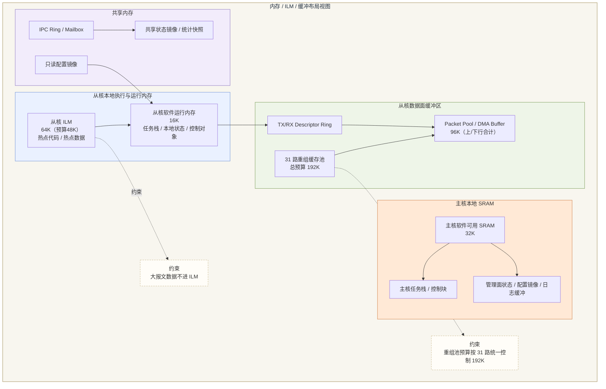

#### 7.1 设计目标

内存与缓冲设计的目标，是在双核 AMP 前提下把“本地内存”“共享内存”“ILM 热点区”“DMA/描述符资源”彻底分开，避免为了实现方便把所有对象堆到共享内存或普通 RAM 中。当前设计需同时满足以下目标：

- 支持从核 ILM（硬件 `64 KB`，热点预算 `48 KB`）的精准使用。
- 支持 `31` 节点场景下运行内存占用不超过 `192 KB` 的验收约束。
- 支持数据面与管理面的内存隔离、owner 明确和一致性可控。

#### 7.2 内存区域分类

建议将系统运行期内存分为以下类别：

| 区域         | owner                | 主要内容                    | 访问特点              |
| ---------- | -------------------- | ----------------------- | ----------------- |
| 主核本地代码/数据区 | 主核                   | 管理面、配置、日志、控制状态          | 主核高频访问            |
| 从核 ILM 区   | 从核                   | 快路径热点代码、热点数据            | 从核超高频、低时延         |
| 从核本地 RAM 区 | 从核                   | 协议栈状态、转发上下文、重组状态        | 从核高频访问            |
| 共享内存区      | 明确单 owner 写          | IPC ring、核间中断状态位、共享状态镜像 | 双核可见、受一致性约束       |
| DMA 缓冲区    | 外设 owner             | 报文收发缓冲                  | DMA 可见、cache 策略敏感 |
| 描述符环区      | producer/consumer 分离 | TX/RX descriptor、队列元数据  | 高频更新              |
| 管理缓冲区      | 主核                   | 配置请求、诊断输出、CLI 输入输出      | 主核中频              |
| 日志/遥测缓冲区   | 主核                   | 运行日志、统计、审计事件            | 可批量汇聚             |

#### 7.3 ILM 放置策略

ILM 是性能工具，不是普通存储补充区。当前建议的 ILM 放置策略如下：

- 应放入 ILM：快路径热点代码、重组热点状态、关键描述符缓存、超高频访问的小型查找状态。
- 可以评估放入 ILM：小型、固定大小、访问高度集中且时延敏感的辅助状态。
- 不应放入 ILM：大块报文缓存、低频配置对象、日志缓冲、管理状态、可延迟访问的数据结构。

热数据允许进入 ILM，但需要满足两个条件：其一是对象体积受控，其二是访问局部性足够高，确实能换来确定性收益。从核 ILM 硬件容量 `64 KB`，热点预算控制在 `48 KB` 以内（75%），建议优先划分给”上行切片/拼 symbol 热点代码、下行切片解析与 31 路重组状态机、关键描述符辅助对象、小型热点查找表”，不把大块缓冲和可延迟访问数据塞入 ILM。其余通用数据可利用从核 DLM（`32 KB`@`0x09010000`）或外部 SRAM。

#### 7.4 共享内存策略

共享内存不应被视为“默认可放任何对象的公用区”，而只应用于必须双核可见且有明确 owner/consumer 模式的对象。建议规则如下：

- 使用单方向 ring、快照区和核间中断状态位承载双核消息，不使用共享可写复杂结构体。
- 使用 owner 写、consumer 读模型。
- 共享状态尽量以镜像、快照或消息形式暴露，不直接共享活跃私有状态。

共享内存、DMA buffer 和 descriptor ring 统一采用“单 owner + 按传输方向维护 cache”的一致性协议，不能只停留在“需要 clean/invalidate/barrier”的泛化描述。建议冻结以下实现规范：

| 对象类别                                         | 推荐 cache 属性                            | owner / consumer                 | 一致性动作                                                                                                                                                               |
| -------------------------------------------- | -------------------------------------- | -------------------------------- | ------------------------------------------------------------------------------------------------------------------------------------------------------------------- |
| 核间中断状态位、descriptor ring 控制字                  | 优先 non-cacheable；若受限必须 cacheable，则严格维护 | producer 写，consumer 读            | producer 完成字段写入后执行 `cache clean(range)`，再执行 `DMB/DSB`，最后更新 valid bit / producer index / irq cause；consumer 观察到索引或 valid 后，先执行 `invalidate(range)` 与 `DMB/DSB`，再读取内容 |
| TX packet / symbol buffer（CPU -> DMA / 硬MAC） | 可 cacheable                            | CPU owner -> DMA / 硬MAC consumer | CPU 完成 payload、UTB MAC、PHY Header 填充后执行 `cache clean(range)`，再执行 `DSB`，最后提交 descriptor ownership；在 clean 和 barrier 完成前，不允许 DMA 取数                                   |
| RX packet / symbol buffer（DMA / 硬MAC -> CPU） | 可 cacheable                            | DMA / 硬MAC owner -> CPU consumer | 缓冲交给 DMA 前不得保留脏 cache line；DMA 完成后 CPU 读取前执行 `invalidate(range)` 与 `DSB`，之后才允许软件 MAC 解析切片和重组                                                                        |
| 共享状态镜像 / 统计快照                                | 可 cacheable，但仅允许快照式共享                  | producer 写，consumer 读            | producer 写完整个快照后 clean 并发布序号；consumer 先读取序号，再 invalidate 对应范围并以 acquire 语义读取，不允许直接共享活跃私有状态                                                                          |

为避免实现歧义，所有 cache 维护操作必须通过以下平台宏执行，禁止在模块代码中直接内联汇编：

```c
/* 定义于 utb_cache.h，全平台统一使用 */
#define UTB_CACHE_CLEAN(addr, size)      /* flush dirty lines to PoC */
#define UTB_CACHE_INVALIDATE(addr, size) /* discard cached lines */
#define UTB_CACHE_CLEAN_INV(addr, size)  /* clean then invalidate */
#define UTB_DSB()  __asm volatile(“dsb sy” ::: “memory”)
#define UTB_DMB()  __asm volatile(“dmb sy” ::: “memory”)
#define UTB_ISB()  __asm volatile(“isb sy” ::: “memory”)
```

`addr` 和 `size` 必须按 cache line 对齐（当前基线：至少 `32B`，以实际芯片手册为准）。

各场景的精确操作序列如下：

| 场景                   | 精确操作序列                                                                                                               |
| -------------------- | -------------------------------------------------------------------------------------------------------------------- |
| CPU → DMA TX 提交      | 填充 payload → `UTB_CACHE_CLEAN(buf, len)` → `UTB_DSB()` → 写 descriptor ownership bit                                  |
| DMA RX → CPU 读取      | 交给 DMA 前：`UTB_CACHE_CLEAN_INV(buf, len)` → `UTB_DSB()`；DMA 完成后 CPU 读前：`UTB_CACHE_INVALIDATE(buf, len)` → `UTB_DSB()` |
| IPC ring producer 提交 | 写 payload → `UTB_CACHE_CLEAN(slot, size)` → `UTB_DSB()` → 写 valid/tail index → `UTB_DSB()` → 触发核间中断                  |
| IPC ring consumer 消费 | 读 tail index → `UTB_CACHE_INVALIDATE(slot, size)` → `UTB_DMB()` → 读 payload → 处理 → 推进 head index                     |
| 状态快照 producer 发布     | 写完整快照所有字段 → `UTB_CACHE_CLEAN(snapshot, size)` → `UTB_DSB()` → 递增 generation 序号                                       |
| 状态快照 consumer 读取     | 读 generation 序号 → `UTB_CACHE_INVALIDATE(snapshot, size)` → `UTB_DSB()` → 读所有字段                                       |
| ILM 代码/数据加载          | 复制完成 → `UTB_DSB()` → `UTB_ISB()`（执行代码时必须）                                                                            |

进一步约束如下：

- cache 维护范围必须按 cache line 对齐；`32B` 为当前基线，以实际 cache line 大小为准。
- descriptor、核间中断状态位和高频 ring 元数据至少 `32B` 对齐，单次 ownership 变更前后只有一个写 owner。
- DMA RX 缓冲提交前必须保证 CPU 没有未刷新的脏数据；DMA TX 缓冲提交后 CPU 不再写入同一范围，直到 ownership 回收。
- 双核共享对象只允许”owner 写、consumer 读”，禁止双写、禁止写后不发布屏障、禁止 consumer 在 `invalidate` 前直接读取。

##### 7.4.1 MPU 区域配置表

每个内存区域的 cache 属性必须通过 MPU 显式配置，不能只在正文中以文字描述。当前建议的 MPU 区域基线如下（物理地址 TBD，以芯片手册为准）：

| 区域                            | cache 属性                      | 两核可见性 | 说明                             |
| ----------------------------- | ----------------------------- | ----- | ------------------------------ |
| IPC ring 控制字（head/tail/valid） | **Non-cacheable**             | 双核共享  | 避免 cache 同步开销，控制字体积小           |
| IPC ring payload 槽            | Cacheable，显式 clean/invalidate | 双核共享  | 遵循 §7.4 producer/consumer 操作序列 |
| DMA TX/RX buffer              | Cacheable，显式 clean/invalidate | 外设可见  | 遵循 TX/RX 操作序列                  |
| 共享状态快照 / 统计快照                 | Cacheable，显式 clean/invalidate | 双核共享  | 采用 generation 序号 + 完整快照模式      |
| 核间中断状态位 / Boot flag           | **Non-cacheable**             | 双核共享  | 最小体积，频率低，non-cacheable 最安全     |
| 从核 ILM                        | Cacheable，从核独占                | 从核私有  | 从核高速本地存储，主核仅在加载期访问             |
| 主核本地 SRAM                     | Cacheable，主核独占                | 主核私有  | 管理面状态、任务栈                      |
| 从核本地 SRAM                     | Cacheable，从核独占                | 从核私有  | 转发面状态、任务栈、重组控制块                |

#### 7.5 缓冲、报文池与描述符设计

数据面相关缓冲建议拆为以下几类：

- RX/TX DMA buffer：由外设 owner 和 DMA 模型约束。
- descriptor ring：由 producer/consumer 明确分工。
- packet pool：用于普通报文承载。
- reassembly pool：用于分片重组上下文，不与普通包池混用；当前按 `31` 路节点并发重组冻结总预算 `192 KB`。
- control buffer：用于主核配置、诊断、CLI 请求与返回。

对于从核转发面，建议尽量减少 copy 次数和跨池转换次数，避免重组上下文与普通数据包在生命周期上相互污染。

#### 7.6 栈、堆与总内存预算策略

在当前阶段，建议：

- 管理面任务栈按“功能域最小独立预算”方式分配，不使用过大的统一保守值。
- 从核快路径任务栈严格控制，避免用大栈掩盖数据结构设计问题。
- 动态堆仅允许用于非快路径、低频对象或启动期一次性对象。
- 快路径关键对象优先使用静态池、固定大小块或预分配 ring/descriptor 结构。

##### 7.6.0 Heap 模型选型

FreeRTOS 提供多种 heap 实现，当前系统建议如下：

| 核心     | 建议 heap 实现 | `configSUPPORT_DYNAMIC_ALLOCATION` | 理由                                      |
| ------ | ---------- | ---------------------------------- | --------------------------------------- |
| **从核** | `heap_1`   | **0（禁用）**                          | 所有对象静态预分配，彻底排除快路径误用 `pvPortMalloc()`    |
| **主核** | `heap_4`   | 可选为 `1`                            | `heap_4` 支持 free + coalesce，适合管理面低频动态需求 |

若 SRAM 物理上非连续（需要跨 bank 管理），则主核改用 `heap_5`，并在早期初始化时调用：

```c
static const HeapRegion_t xHeapRegions[] = {
    { (uint8_t *)PRIMARY_HEAP_BASE,  PRIMARY_HEAP_SIZE  },
    { NULL, 0 }
};
vPortDefineHeapRegions(xHeapRegions); /* 必须在首次 pvPortMalloc 前调用 */
```

禁止使用 `heap_2`（已废弃，存在碎片化问题）。

在 `31` 节点内存占用 `<=192 KB` 约束下，正文详细设计阶段需给出每类对象的 worst-case 预算，而不是只给平均值。结合当前硬件条件，建议把 `384 KB SRAM` 和 `1 MB Flash` 预算冻结如下：

| 区域           | 建议容量         | owner     | 物理位置 | 主要内容                                                      | 说明                                                |
| ------------ | ------------ | --------- | ------ | --------------------------------------------------------- | ------------------------------------------------- |
| 从核重组缓存池      | `128 KB`     | 从核        | SRAM0 @ `0x30000000` | `31` 路重组 payload、分片拼接空间                                   | 冻结预算，不被日志/管理缓冲挤占                                  |
| 从核数据面收发缓冲区   | `128 KB`     | 从核        | SRAM1 @ `0x30020000` | 上/下行 symbol buffer、SPI staging、DMA buffer、descriptor ring | 支持”硬件在飞、软件并行处理”的双缓冲/多缓冲                           |
| 主核本地运行区      | `64 KB`      | 主核        | SRAM2 @ `0x30040000` | 管理面状态、配置镜像、日志控制块、FreeRTOS heap                          | 主核 DLM `32 KB` 放任务栈+快速数据，SRAM2 放 heap+大块缓冲        |
| 共享内存 / IPC 区 | `64 KB`      | 单 owner 写 | SRAM3 @ `0x30060000` | ring、核间中断状态位、状态快照、只读配置镜像                                  | 只放跨核必须可见对象；比原设计（16KB）宽裕很多          |
| **外部 SRAM 合计** | **`384 KB`** |           |        |                                                           |                                                   |

> **与原设计的关键差异**：SDK 确认两核均有独立 ILM（`64 KB`）+ DLM（`32 KB`）。主核本地高频数据（任务栈、控制状态）可放在主核 DLM（`32 KB`@`0x08010000`）；从核本地数据（任务栈、协议控制对象）可放在从核 DLM（`32 KB`@`0x09010000`）。因此外部 SRAM 不再需要承载”从核本地运行区 16KB”和”系统保留区 32KB”——这些职责由各核 DLM 承担。外部 `384 KB` SRAM 全部用于大块数据缓冲、重组池和共享区。

上述预算按 SDK 确认的硬件事实冻结：
- **主核**：ILM `64 KB`@`0x08000000`（运行代码，Flash XIP 模式下不使用）+ DLM `32 KB`@`0x08010000`（栈、快速数据）+ SRAM2 `64 KB`（heap、大块缓冲）
- **从核**：ILM `64 KB`@`0x09000000`（热点代码预算 `48 KB`）+ DLM `32 KB`@`0x09010000`（栈、协议状态）+ SRAM0~1 `256 KB`（重组池、收发缓冲）
- **共享**：SRAM3 `64 KB`@`0x30060000`
- 从核 I-Cache `32 KB`、主核 I-Cache `16 KB` 不计入上述 SRAM 预算。
- 运行代码默认以 Flash XIP（`0x20000000`）为主，仅把从核热点代码/热点数据搬移到从核 ILM。

##### 7.6.1 192 KB 重组缓存池推导

`192 KB` 并非经验值，而是按以下路径推导得出：

**步骤 1：单路最大重组 payload**

- `frag_id >= 46` 的切片视为非法丢弃，因此单路最多重组 `46` 个分片（`frag_id 0~45`）。
- `frag_id < 46` 约束来源：切片序号 `frag_id` 使用 6 位字段（值域 `0~63`），但协议规定单报文分片数上限为 `46`，超出则属协议异常。
- 单个分片的有效 payload 字节数 = `symbol_len - sizeof(PHY_Header)`（以芯片 PHY 参数为准，待协议规格确认后填入）。
- 单路最大重组 payload = `46 × (symbol_len - PHY_hdr_size)`。

**步骤 2：31 路并发计算**

```
payload_total = 31路 × 46片 × (symbol_len - PHY_hdr_size)
```

以当前协议设计参数为基准（`symbol_len` 和 `PHY_hdr_size` 待协议规格冻结后填入具体字节数）：

| 参数              | 值（TBD，待协议规格确认）                           | 说明                  |
| --------------- | ---------------------------------------- | ------------------- |
| `symbol_len`    | TBD bytes                                | 以芯片 PHY 规格为准        |
| `PHY_hdr_size`  | TBD bytes                                | 每切片固定 PHY Header 大小 |
| 单路最大 payload    | `46 × (symbol_len - PHY_hdr_size)` bytes |                     |
| 31 路 payload 合计 | `31 × 单路最大 payload` bytes                |                     |

**步骤 3：控制元数据开销**

每路重组槽 `utb_reasm_slot_t` 包含：`state`、`chnid`、`expected_frag_id`、`assembled_len`、`buffer_ptr`、`last_update_time`、统计计数等，估算约 `64 bytes`（需实现对齐后确认）。

```
metadata_total = 31 × sizeof(utb_reasm_slot_t) ≈ 31 × 64B = 1984B ≈ 2 KB
```

**步骤 4：对齐到 192 KB 的依据**

当前 `192 KB = 3 × 64 KB`，其设定依据：

- 31 路 payload 合计 + 2 KB 元数据 ≤ 192 KB；
- 剩余余量（`192 KB - payload_total - 2 KB`）不少于 `10%`，用于吸收重组过程中的 buffer 对齐、临时 staging 和未来小幅协议扩展；
- `192 KB` 上边界应在协议规格冻结后重新验算，若单路 payload 超出预期则须重新评估预算或收紧 `frag_id` 上限。

> **行动项**：协议规格冻结时，以实际 `symbol_len` 和 `PHY_hdr_size` 代入上式重新验算，确认 `192 KB` 上限仍有 ≥10% 余量；若不满足则应在此处更新预算并通知架构评审。

#### 7.7 内存风险

当前需要重点防范的风险包括：

- ILM 被过度挤占，导致热点对象无法稳定放入。
- 共享内存对象缺乏 owner，导致 cache 一致性失控。
- 描述符环和报文池未分开设计，导致生命周期混乱。
- 为赶进度使用大量动态分配，导致峰值内存失控。
- 在 `31` 节点场景下，诊断/日志缓冲把重组池、descriptor 和数据面 staging 预算挤掉。

因此，内存详细设计必须以“worst-case + owner 模型 + 一致性规则”为核心，而不是停留在区域名罗列。

#### 本章对外接口

内存设计相关对外接口应只暴露“申请、释放、映射、快照”这类受控能力，不允许上层直接依赖具体物理地址布局。主核侧只应看到管理面缓冲和共享快照接口；从核侧只应看到 descriptor、packet pool、reassembly context 的受控管理接口。ILM 的具体放置策略只应在平台内部可见。

建议暴露的资源接口包括：

- `utb_desc_alloc()` / `utb_desc_free()`
- `utb_pkt_alloc_dma()` / `utb_pkt_free_dma()`
- `utb_reasm_ctx_acquire()` / `utb_reasm_ctx_release()`
- `utb_shared_status_snapshot_get()`

#### 本章代码示例

```c
utb_reasm_ctx_t *ctx = utb_reasm_ctx_acquire(flow_id);
if (ctx == NULL) {
    return UTB_ERR_NO_RESOURCE;
}

desc = utb_desc_alloc();
pkt  = utb_pkt_alloc_dma(pkt_len);
```

### 8. Flash/存储布局、镜像规划与持久化模型

#### Fig-08 Flash 分区与执行放置图

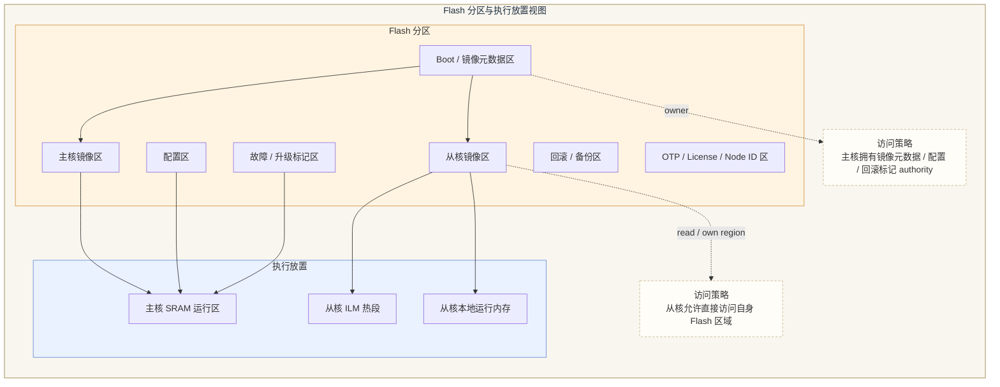

#### 8.1 设计目标

Flash/存储设计的目标，是在支持主核启动、从核镜像独立分区、配置持久化、升级回滚和关键标记持久化的同时，保持 owner 清晰、掉电行为可控、升级路径可恢复。当前系统已确认：

- Flash 划分成主核区域和从核区域。
- 从核允许直接访问 Flash。

因此，本章重点不再是“能不能直接访问”，而是“访问什么、在什么边界内访问、谁拥有最终裁决权”。

#### 8.2 Flash 内容分类

当前建议将 Flash 内容划分为以下类别：

- Boot 相关信息区：BootROM 可见或主核早期启动必需的镜像元数据。
- 主核镜像区：主核运行镜像及其版本信息。
- 从核镜像区：从核运行镜像及其版本信息。
- 配置区：持久化配置、版本化结构、配置生效状态。
- 回滚/备份区：升级回退、双镜像或恢复信息。
- 制造数据区：出厂校准、板级标识等。
- OTP / License / Node ID 区：受保护的设备身份和许可信息。
- 关键持久标记区：崩溃 breadcrumbs、升级状态标记、关键审计事件。

#### 8.3 分区布局原则

当前建议的分区布局原则如下：

- Boot 相关元数据放在主核早期即可读取的位置。
- 主核镜像区与从核镜像区物理分离，分别维护版本和校验信息。
- 配置区与升级回滚区分离，避免配置更新和镜像升级互相影响。
- OTP / License / Node ID 独立于普通配置区，采用更严格的访问约束。
- 从核专属 Flash 分区与主核配置/升级元数据区逻辑隔离，避免越界修改。

本阶段不建议在正文中先写死具体地址，而应先锁定“分区类别、owner、访问约束、增长预留”。

#### 8.3.1 `1 MB` Flash 建议预算

在当前 `1 MB Flash` 约束下，建议先冻结分区预算，再在后续地址规划表中落具体地址。推荐预算如下：

| 分区            | 建议容量          | owner        | 主要内容                                |
| ------------- | ------------- | ------------ | ----------------------------------- |
| 启动元数据 / 恢复标记区 | `64 KB`       | 主核           | Boot 参数、镜像校验信息、恢复标记、关键启动摘要          |
| 主核镜像区         | `320 KB`      | 主核           | 主核运行镜像、管理面和公共平台层代码                  |
| 从核镜像区         | `256 KB`      | 从核镜像、主核启动期管理 | 从核运行镜像、软件 MAC / 转发面代码               |
| 配置 / 制造数据区    | `128 KB`      | 主核           | 持久化配置、制造数据、License / Node ID、关键审计标记 |
| 升级 / 回滚预留区    | `256 KB`      | 主核           | 升级包缓冲、回滚镜像、异常恢复预留                   |
| **合计**        | **`1024 KB`** |              |                                     |

该预算默认主从核冷代码以 Flash XIP（`0x20000000`）为主，只有从核 ILM 热点段（预算 `48 KB`，硬件 `64 KB`）在启动期搬移。若后续镜像评估表明主核镜像或升级预留区需要更大空间，应优先在”主核镜像区”和”升级/回滚预留区”之间调节，而不是侵蚀配置/制造数据区。

#### 8.4 执行放置策略

执行放置建议如下：

- 主核常规代码以 Flash XIP 为主，仅在中断入口、极短关键路径或启动期必须对象上搬移到 SRAM。
- 从核镜像长期存放在从核专属 Flash 分区。
- 从核热点代码与热点数据在启动期搬移到从核 ILM（预算 `48 KB` / 硬件 `64 KB`@`0x09000000`）。
- 非热点从核代码或低频对象保留在 Flash XIP 或从核本地 RAM 对应区域，不占用 ILM 和重组池预算。

该策略的核心是：性能敏感对象由 ILM 驱动放置，启动可见性由 Boot/主核早期可读性驱动放置，持久化对象由一致性与 owner 驱动放置。

#### 8.5 访问 ownership 与直接访问策略

虽然从核允许直接访问 Flash，但当前建议仍采用分层 ownership：

- 主核 owning 配置 authoritative state、升级元数据、回滚决策和关键持久标记。
- 从核 owning 从核镜像相关本地访问和受限专属分区访问。
- OTP / License / Node ID 建议由主核统一管理，对从核只暴露必要只读结果。

换句话说，“允许从核直接访问 Flash”不等于“从核可直接写任意持久化对象”。从核直接访问应被限制在其专属数据或只读查询范围内。

#### 8.6 掉电一致性与版本迁移

对于配置和关键持久对象，建议采用以下策略：

- 使用版本字段和结构头保证迁移兼容性。
- 使用双缓冲、状态位或提交标记保证配置写入原子性。
- 升级状态和回滚标记单独持久化，避免与普通运行日志共区。
- 崩溃 breadcrumbs 仅保留关键故障摘要，不写普通运行日志。

这样可以在掉电或异常重启后，尽快恢复到“可判定是否升级成功、可判定是否需要回滚、可判定是否存在关键故障”的状态。

#### 8.7 风险与约束

当前 Flash/存储设计需要关注以下风险：

- 从核直接访问 Flash 若没有严格分区约束，容易破坏主核 owning 的配置或升级元数据。
- 配置区和回滚区混放，可能导致掉电后既看不清配置状态，也看不清升级状态。
- 为方便调试把普通日志落 Flash，会快速消耗擦写寿命并放大时延风险。
- 过早在正文中固化地址值，可能在容量预算未收敛时造成后续大范围改动。

因此，建议先在详细设计中锁定分区模型、ownership、掉电策略和版本语义，再在后续地址规划表中固化具体容量与地址。

#### 本章对外接口

Flash 和存储接口应按分区和 authority 暴露，避免调用方绕过持久化策略。主核可暴露镜像定位、配置读写、回滚标记管理、制造数据读取等接口；从核仅允许通过受控接口读取自身镜像区或运行所需只读数据。配置提交必须通过 commit/apply 流程完成，不能对 raw flash 直接写入。

建议暴露的存储接口包括：

- `utb_flash_read_partition()`
- `utb_store_cfg_get()` / `utb_store_cfg_set()`
- `utb_store_cfg_commit()`
- `utb_store_mark_rollback_pending()`

#### 本章代码示例

```c
int cfg_update_example(const void *buf, uint16_t len)
{
    int rc;

    rc = utb_store_cfg_set(UTB_CFG_TIMESYNC, buf, len);
    if (rc != 0) return rc;

    return utb_store_cfg_commit();
}
```

### 9. HAL/BSP/Driver 架构与外设 Ownership

本章描述外设的 HAL/BSP/Driver 架构，并建议外设的 ownership。

#### Fig-09 BSP/HAL/Driver 与外设 ownership 图

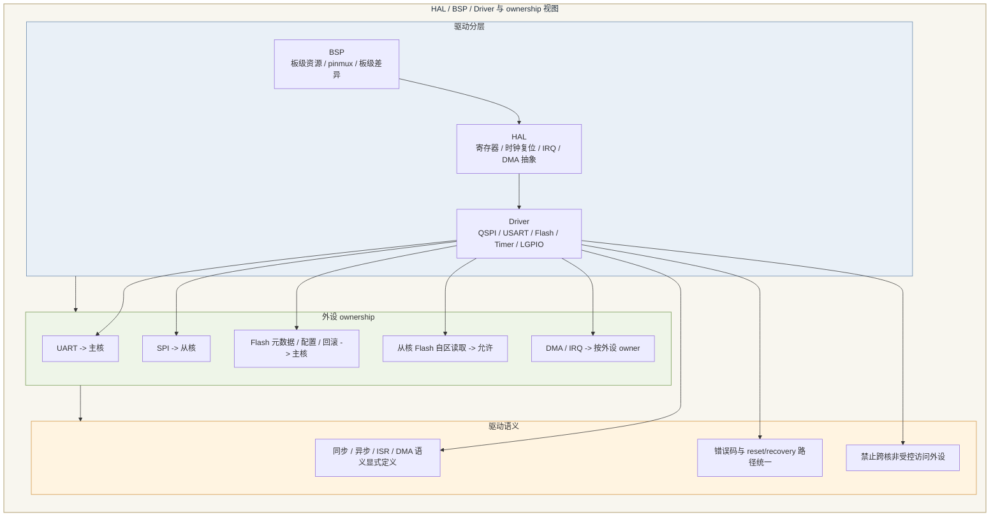

#### 9.1 设计目标

HAL / BSP / Driver 架构的目标，是建立一套能支撑双核 AMP 平台长期演进的硬件访问体系。该体系必须同时满足以下要求：

- 板级信息、芯片寄存器抽象和功能型驱动访问三者明确分层。
- 外设 ownership 清晰，避免双核无约束并发访问。
- 报文快路径可以通过受限接口高效调用硬件能力。
- 管理面和对外接口层不需要感知底层驱动私有实现。
- 错误码、状态机、回调和恢复语义保持统一。

#### 9.2 分层边界

##### 9.2.1 BSP

BSP 负责板级资源描述和上电基础配置，包括：

- 板级 pinmux、时钟源、复位域、外设连接关系。
- 板级供电、板级差异配置和引脚复用。
- 板级实例与芯片内部功能模块之间的绑定关系。

BSP 不负责直接暴露复杂功能型 API，也不承载应用策略。

##### 9.2.2 HAL

HAL 负责芯片级硬件抽象，包括：

- 寄存器级读写封装。
- 中断控制、DMA 通道抽象、时钟复位控制。
- 对具体外设控制器的统一寄存器语义映射。

HAL 面向的是芯片能力，不面向上层业务语义。它不应嵌入“网管策略”“转发策略”之类的上层判断。

##### 9.2.3 Driver

Driver 负责面向功能的设备访问契约，包括：

- `QSPI`、`USART`、`Flash`、`Timer`、`UDMA helper` 等设备访问接口（SDK 已提供完整驱动：`ns_qspi.c`、`ns_usart.c`、`ns_qspi_xip.c`、`ns_basic_timer.c`、`ns_udma.c` 等）。
- `open/init/start/stop/reset` 等生命周期操作。
- `tx/rx`、同步/异步回调、错误上报、超时语义。

Driver 应当是协议无关的功能访问层，而不是某个业务模块的私有封装。

#### 9.3 外设 ownership 模型

结合当前总体架构和已冻结输入，建议采用以下 ownership：

| 外设/资源           | SDK 驱动    | owner     | 访问模式      | 说明            |
| --------------- | --------- | --------- | --------- | ------------- |
| USART 管理接入（USART0~4）| `ns_usart.c` | 主核        | 主核独占      | 面向管理/CLI/诊断（SDK 使用 USART 而非 UART）|
| QSPI 数据接入（QSPI1~3）| `ns_qspi.c` | 从核        | 从核独占      | 面向数据面报文收发（SDK 使用 QSPI 而非 SPI）|
| Flash 控制（QSPI XIP0）| `ns_qspi_xip.c` | 主核        | 主核 owning | 配置、升级、回滚由主核裁决 |
| 从核专属 Flash 分区访问 | `ns_qspi_xip.c` | 从核受限      | 受分区限制     | 仅允许访问从核专属区    |
| 时钟/复位控制         | `system_ns.c` | 主核        | 主核主导      | 启动和恢复统一管理     |
| LGPIO（LGPIO0~3）  | `ns_lgpio.c` | 按引脚分配     | 单 owner   | 状态指示、调试辅助（SDK 使用 LGPIO 而非 GPIO）|
| I2C（I2C0~1）      | `ns_i2c.c` | 主核        | 主核独占      | 传感器/管理总线      |
| WWDG（WWDG0~1）    | `ns_wwdg.c` | 主核        | 主核独占      | 系统级恢复裁决       |
| XKAN（XKAN0~1）    | `ns_xkan.c` | 从核        | 从核独占      | 自定义指令加速器      |
| IRQ 路由控制        | — | 按外设 owner | 单 owner   | 避免跨核共享中断入口（128 个 ECLIC 中断）|
| UDMA 通道（8 CH）   | `ns_udma.c` / `ns_pa2m_udma.c` | 按外设 owner | 单 owner   | 由所属外设驱动管理     |

若后续存在共享外设需求，必须显式设计仲裁机制，不能默认让两个核共同访问。

#### 9.4 中断与 DMA 模型

中断和 DMA 是驱动架构中最容易被模糊化的部分，当前建议如下：

- 中断入口按外设 owner 绑定到对应核心。
- ISR 只做最小必要处理，不在 ISR 中承载复杂业务逻辑。
- ISR 与任务上下文的协同通过 OSAL 的 ISR-safe 接口完成。
- DMA 提交、完成和异常回收由对应外设驱动 owning。
- 从核快路径允许通过受限 HAL/Driver 子集直接提交 DMA。

对于 `SPI` 和数据面相关通道，建议优先采用 DMA 驱动模型，以减少 CPU 逐字节搬运和不可控中断负担。

##### 9.4.1 外设中断分配表

芯莱 SDK 已冻结芯片物理中断号（定义在 `SoC/ns_core0/Common/Include/ns.h`）。以下表格将平台逻辑 IRQ 映射到 SDK 实际中断号。两核共享同一套 ECLIC 中断号空间（128 个），owner、优先级和处理上下文应保持一致。

| SDK IRQ 号 | 中断源                      | owner 核心 | 建议优先级 | 下半部/处理任务             | 说明                                |
| -------- | ------------------------ | -------- | ----- | -------------------- | --------------------------------- |
| `QSPI1_IRQn(29)` | QSPI1 DMA RX 完成         | 从核       | `高`   | `s_fwd_tx_task`      | 客户报文上行接入（SDK 使用 QSPI 而非 SPI）     |
| `QSPI2_IRQn(30)` | QSPI2 DMA TX 完成         | 从核       | `高`   | `s_fwd_rx_task`      | 下行经 QSPI 发出完成                     |
| 待分配 | `硬MAC RX`                | 从核       | `高`   | `s_fwd_rx_task`      | 有效 symbol / fragment 到达           |
| 待分配 | `硬MAC TX`                | 从核       | `高`   | `s_fwd_tx_task`      | symbol 发送完成、descriptor 回收         |
| `UDMA0_IRQn(20)` | UDMA DMA 异常              | 从核       | `高`   | `s_fault_stat_task`  | 数据面关键 DMA 异常（SDK 使用 UDMA/PA2M_UDMA）|
| `INTER_CORE_IRQn(19)` | `核间中断 P↔S`           | 双核       | `中高`  | `s/p_ipc_service_task` | 控制/配置 request；response/event（SDK IDU 驱动）|
| `QSPI_XIP0_IRQn(28)` | Flash 完成/异常            | 主核       | `中`   | `p_store_cfg_task`   | 配置写入、回滚标记（SDK 使用 QSPI XIP）        |
| `USART0_IRQn(21)` | USART0 管理接口             | 主核       | `中`   | `p_mgmt_host_task`   | 北向管理/CLI 主接口（SDK 使用 USART 而非 UART）|
| `USART1_IRQn(22)` | USART1 调试/日志            | 主核       | `低`   | `p_diag_log_task`    | 调试串口、现场日志                         |
| `USART2_IRQn(23)` | USART2                   | 主核       | `低`   | `p_mgmt_host_task`   | 预留                                |
| `USART3_IRQn(24)` | USART3                   | 主核       | `低`   | `p_mgmt_host_task`   | 预留                                |
| `USART4_IRQn(25)` | USART4                   | 主核       | `低`   | `p_mgmt_host_task`   | 预留                                |
| `I2C0_IRQn(26)` | I2C0                     | 主核       | `低`   | `p_store_cfg_task`   | 外围管理器件/板级控制                       |
| `I2C1_IRQn(27)` | I2C1                     | 主核       | `低`   | `p_store_cfg_task`   | 预留                                |
| `XKAN0_IRQn(51)` | XKAN0 加速器               | 从核       | `中`   | `s_fwd_tx_task`      | 自定义指令加速器（SDK 特有外设）                |
| `XKAN1_IRQn(52)` | XKAN1 加速器               | 从核       | `中`   | `s_fwd_rx_task`      | 预留                                |
| `SysTimer_IRQn(7)` | System Timer 系统节拍      | 各核私有    | `高`   | `RTOS 内核`            | OS tick（SDK `CFG_TMR_PRIVATE=1`）   |
| `BASIC_TIMER0_IRQn(36)` | BASIC_TIMER0 watchdog | 主核       | `中`   | `p_timer_wdg_task`   | 监控、心跳                             |
| `BASIC_TIMER1_IRQn(37)` | BASIC_TIMER1 重组扫描    | 从核       | `中`   | `s_reasm_gc_task`    | 重组超时扫描、低频统计                       |

> **SDK 外设命名对照**：SDK 使用 USART（非 UART）、QSPI（非 SPI）、LGPIO（非 GPIO）、XKAN（非 CAN）、UDMA/PA2M_UDMA（非通用 DMA）。本文档的业务描述中仍可使用通用名称（如”UART 管理口”、”SPI 数据口”），但代码实现和 IRQ 配置应使用 SDK 定义的枚举名。

中断优先级建议按三档收敛：

- `高`：数据面关键收发、OS tick、关键 DMA 异常。
- `中高`：核间中断和对转发路径有影响的控制类通知。
- `中/低`：管理外设、日志、诊断、非关键外设。

##### 9.4.2 DMA 通道规划

当前硬件提供 `8` 个 DMA channel，建议优先保证从核数据面 owner 和通道固定绑定，避免运行期争用。推荐规划如下：

SDK 提供 UDMA（`ns_udma.c`）和 PA2M UDMA（`ns_pa2m_udma.c`），共 8 个 PA2M DMA 通道（CH0~CH7，基址定义在 `ns.h`）。建议规划如下：

| DMA 通道 | owner | 传输方向                    | 绑定外设/用途        | 说明           |
| ------ | ----- | ----------------------- | -------------- | ------------ |
| `CH0`  | 从核    | `QSPI RX -> SRAM`       | 客户报文上行接入       | 对应上行 ingress（SDK QSPI 驱动）|
| `CH1`  | 从核    | `SRAM -> QSPI TX`       | 下行 QSPI 发出     | 对应下行 egress  |
| `CH2`  | 从核    | `硬MAC RX -> SRAM`       | PHY/硬MAC 下行接收  | 有效 symbol 接入 |
| `CH3`  | 从核    | `SRAM -> 硬MAC TX`       | 上行 symbol 发出   | 软件 MAC 构建后提交 |
| `CH4`  | 主核    | `Flash <-> SRAM`        | 配置/镜像/回滚访问     | 主核 owning（SDK QSPI XIP 驱动）|
| `CH5`  | 主核    | `USART0 TX/RX <-> SRAM` | 管理口 DMA        | CLI/北向高负载时启用（SDK USART 驱动）|
| `CH6`  | 主核    | `QSPI/XKAN 扩展`          | 预留管理/维护高速搬运    | 默认预留，不占用数据面  |
| `CH7`  | 平台保留  | `动态分配但需静态登记`            | 故障恢复、诊断抓取、升级窗口 | 默认空闲，避免常态抢占  |

DMA 通道使用规则建议明确如下：

- `CH0~CH3` 固定留给从核数据面，不允许主核临时借用。
- `CH4~CH5` 固定留给主核管理面和存储服务。
- `CH6~CH7` 只允许在启动期、升级期或诊断窗口按受控流程启用，启用前必须登记 owner。
- 所有 DMA 完成与异常中断都由对应 channel owner 处理，不允许跨核直接清中断。
- 对于 `CH7` 这类保留通道，若后续量产版本需要常态业务绑定，必须在正文表格中冻结，不允许实现私下复用。

#### 9.5 驱动契约约定

为保证不同驱动风格一致，建议统一以下契约：

- `init/open/start/stop/reset/close` 生命周期语义固定。
- `tx/rx` 明确区分同步调用、异步提交、回调完成。
- 明确 timeout 语义，避免上层误以为所有调用都可无限阻塞。
- 明确哪些 API 可在 ISR 上下文触发，哪些只能在 task 上下文调用。
- 回调和完成通知不泄漏底层私有结构。

对于从核快路径调用的驱动接口，建议专门定义“快路径专用接口子集”，而不是复用面向管理面的重型通用接口。

#### 9.6 错误码与恢复语义

当前建议建立统一错误分类：

- 参数错误
- 状态错误
- 超时错误
- 硬件故障
- DMA 故障
- 总线故障
- 资源耗尽
- 不可恢复错误

同时对每个驱动定义最小恢复动作：

- 可重试
- 需要 reset 外设
- 需要重新初始化驱动
- 需要上报上层并禁止继续服务

这样管理面和验证章节才能统一理解“错误发生后系统会做什么”。

#### 9.7 跨核访问禁止模式

以下模式应在 HAL/BSP/Driver 层明确禁止：

- 两个核直接同时操作同一外设控制器寄存器。
- 主核通过调试便利路径直接进入从核 `SPI` 数据驱动内部状态。
- 从核为了方便直接写主核 owning 的配置/升级元数据区。
- 上层业务模块依赖驱动的隐藏 side effect。

#### 9.8 设计收敛建议

后续详细设计阶段，应补充物理 IRQ 向量号到本章逻辑 IRQ 号的映射表、各驱动状态机、同步/异步 API 列表和恢复流程图。只有这些约束稳定后，第 12 章转发面和第 13 章管理面承载设计才能真正闭合。

#### 本章对外接口

本章对外接口应以 HAL 能力边界和 driver 契约为主，避免把寄存器细节直接暴露给上层。上层只能看见同步/异步、DMA/ISR、blocking/non-blocking 语义明确的接口，不应看见 pinmux 细节、寄存器位定义或中断清除实现。跨核共享外设应通过 owner 核统一暴露代理入口。

建议暴露的 HAL/Driver 接口包括：

- `utb_hal_uart_write()`
- `utb_hal_spi_xfer_async()`
- `utb_hal_flash_read()`
- `utb_hal_irq_register()`

#### 本章代码示例

```c
int utb_hal_spi_xfer_async(const void *tx, void *rx, uint16_t len,
                           utb_hal_done_cb_t cb, void *arg);

static void spi_done_cb(int status, void *arg)
{
    (void)arg;
    utb_diag_counter_add(UTB_DIAG_SPI_DONE, status == 0);
}
```

### 10. OSAL 与 RTOS 适配模型

适配模型建议按如下图所示：

#### Fig-10 OSAL 与 RTOS 适配边界图

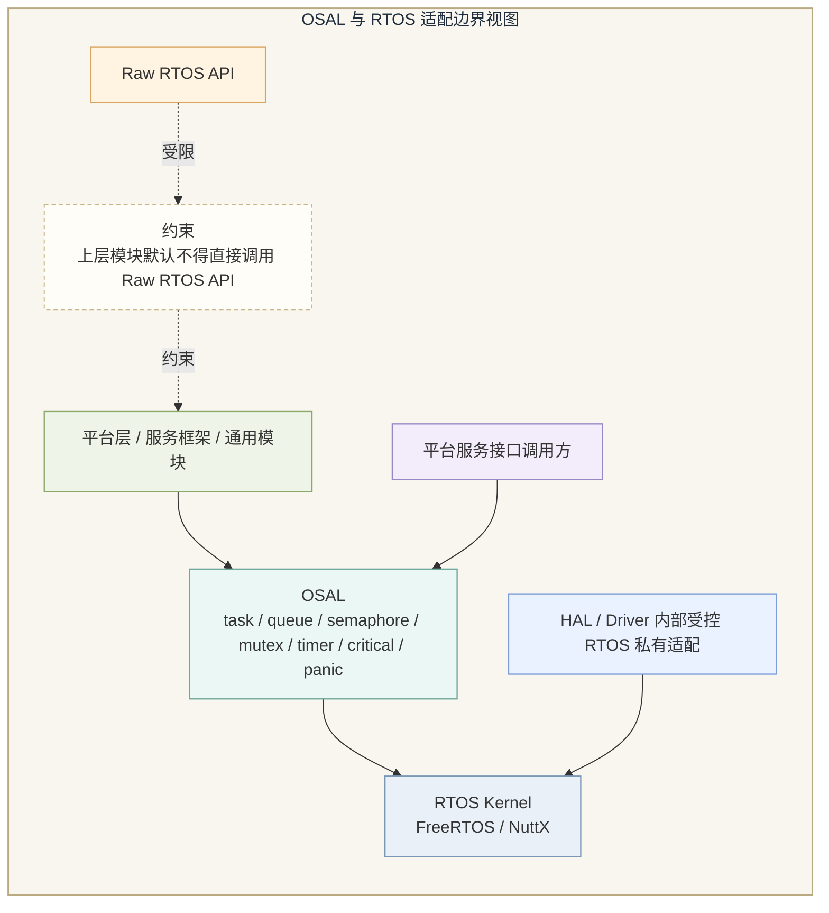

#### 10.1 设计目标与非目标

OSAL 的目标，是为平台层、系统服务框架和大部分上层公共模块提供统一的 RTOS 抽象边界，使当前基于 FreeRTOS 的实现未来可以平滑迁移到 NuttX 或其他 RTOS。OSAL 的非目标同样需要明确：

- OSAL 不是为了机械封装所有 RTOS API。
- OSAL 不负责抽象跨核 IPC。
- OSAL 不负责隐藏 ISR 与 task 上下文差异。

当前建议冻结的范围是：平台层、服务框架、通用模块必须走 OSAL；性能敏感 HAL/Driver 内部允许少量 RTOS 私有适配，但不得向上扩散。

#### 10.2 OSAL 抽象覆盖范围

建议 OSAL 覆盖以下 API family：

- 任务生命周期：create/start/stop/suspend/resume/query
- 同步原语：mutex、semaphore、event
- 队列/消息：queue、mailbox-like local wrapper
- 时间能力：sleep、delay、monotonic time、tick/time conversion
- 定时器：one-shot、periodic timer
- 临界区：enter/exit critical section
- ISR handoff：ISR-safe signal / deferred work trigger
- 断言与异常：assert、panic、fatal hook

若后续上层需要统一的内存服务入口，也可在 OSAL 中定义 memory service entry，但不建议在当前阶段过早抽象复杂堆分配策略。

#### 10.3 API 设计原则

OSAL API 应保持“足够稳定但不掩盖关键语义”的平衡，建议遵循以下原则：

- API 名称能体现上下文限制，例如 task-context only 与 ISR-safe variant 分开。
- blocking 语义必须显式，不能把潜在阻塞接口伪装成无害 helper。
- timeout 语义统一，以毫秒或统一时间基准表达。
- 错误返回值使用统一平台错误码，而不是直接泄漏 RTOS 原生错误值。

#### 10.4 ISR 与 task-context 规则

双核 AMP 系统中，ISR 与 task-context 的区分尤为重要。当前建议：

- 任何可能阻塞的 OSAL API 仅允许在 task-context 调用。
- ISR-safe API 只允许做最小通知、队列投递或 deferred execution trigger。
- ISR 不得直接承担跨核消息协议编排，也不得承担复杂配置处理。
- 快路径相关 ISR 与普通管理面 ISR 的后续工作应通过不同任务上下文隔离。

这样可以避免系统在 bring-up 后期出现“接口看起来一样，但不同上下文下语义完全不同”的问题。

#### 10.5 双核下的 OSAL 适用边界

OSAL 在本系统中是两个核共享的方法学边界，但不是跨核消息总线。建议明确：

- OSAL 是 per-core local runtime abstraction。
- IPC 是 inter-core communication subsystem。
- OSAL queue/semaphore/event 不得被误当成跨核通信原语。

**FreeRTOS 对象句柄跨核使用绝对禁止**：FreeRTOS 的 queue handle、semaphore handle、event group handle、task handle 均为所在核的调度器私有对象。两个核运行完全独立的调度器实例，不共享 ready list、不共享 heap、不共享对象表。将一个核创建的 FreeRTOS 对象句柄传递给另一个核并在该核调用 `xQueueSend()`、`xSemaphoreGive()` 等操作，结果是未定义行为（内存损坏、hard fault 或静默数据丢失），且极难复现和定位。

任何跨核通信需求，必须且只能通过 IPC 子系统（共享内存 + 核间中断）实现，不得通过 OSAL 原语实现。OSAL 的 `utb_osal_task_create()` 应在接口文档中明确标注："此接口创建的任务归属当前核，句柄不得跨核传递。"

主核与从核都可复用同一套 OSAL 设计原则，但其具体底层实例、任务表、同步对象和调度上下文仍然是 per-core local 的。

#### 10.6 哪些模块必须走 OSAL

建议以下模块必须通过 OSAL 使用 RTOS 能力：

- 系统服务框架
- 主核管理面承载框架
- 日志、诊断、统计等通用模块
- 非快路径的公共平台服务模块

建议以下模块可以在受控前提下使用少量 RTOS 私有适配：

- HAL/Driver 内部
- 从核快路径中的极少量性能敏感路径

但即便在例外场景下，也不应把 RTOS 私有类型和语义向上传递给平台服务接口或业务层。

#### 10.7 可观测性与调试能力

OSAL 应提供最小可观测钩子，至少包括：

- 任务名与任务 ID
- 栈水位查询
- 队列深度查询
- 定时与时间戳能力
- assert / panic hook

这些能力并不只是为了调试方便，而是后续验证章节中 CPU 占用、堆栈水位、队列峰值等指标的基础支撑。

#### 10.8 NuttX 适配策略

当前 NuttX 适配范围尚未冻结，因此建议采取“接口先稳定、实现后扩展”的策略：

- 先保证当前 FreeRTOS 落地时不泄漏过多 FreeRTOS 私有语义。
- 在详细设计中显式标注哪些 OSAL API 对未来 NuttX 适配敏感。
- 暂不承诺二进制兼容，只承诺源码级接口边界稳定。

这样可以在不提前过度设计的情况下，为未来迁移保留足够空间。

#### 本章对外接口

OSAL 对外接口应体现执行上下文、超时语义和 ISR-safe 边界。平台层、服务框架和通用模块应使用 OSAL 暴露的任务、队列、信号量、互斥锁、定时器、临界区和 panic 接口；只有性能敏感的 HAL/Driver 内部才允许在受控范围内使用 RTOS 私有 API。所有 OSAL 接口都必须显式说明是否允许在 ISR 中调用。

建议暴露的 OSAL 接口包括：

- `utb_osal_task_create()`
- `utb_osal_queue_send()` / `utb_osal_queue_recv()`
- `utb_osal_mutex_lock()` / `utb_osal_mutex_unlock()`
- `utb_osal_timer_start()`

#### 本章代码示例

```c
utb_osal_queue_t q;
utb_osal_task_t  task;

utb_osal_queue_create(&q, 16, sizeof(utb_ipc_evt_t));
utb_osal_task_create(&task, "ipc_worker", ipc_worker_entry, &q, 2048, 5);
```

### 11. 核间通信 IPC 架构与消息契约

IPC 架构

- IPC 通道分类图
- 消息格式图
- 通知时序图
  
  #### Fig-11 IPC 通道与消息分类图

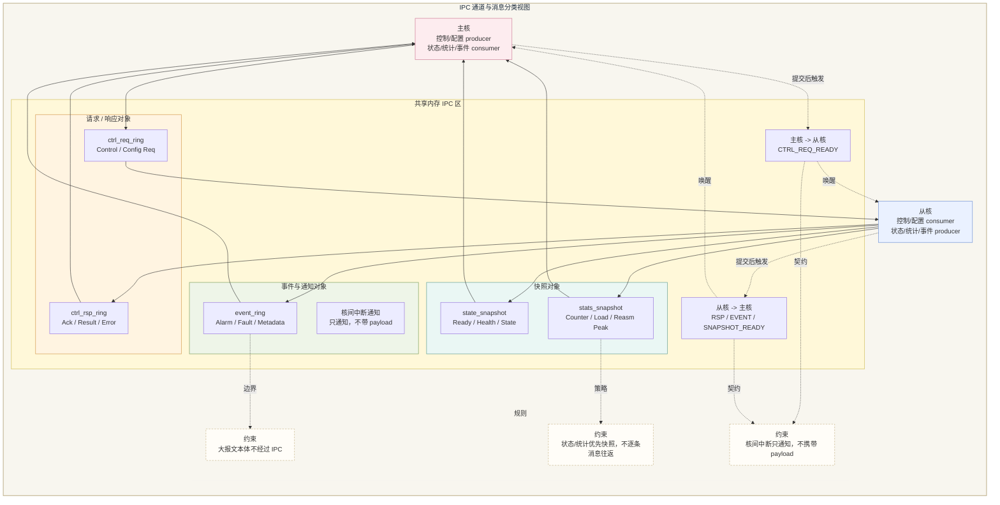

#### 11.1 设计目标

IPC 在本系统中不是辅助模块，而是主核管理面与从核数据面协同的正式系统层。其设计目标包括：

- 用低开销方式承载双核间必要消息。
- 明确区分控制、配置、状态、统计、告警和故障流量。
- 为共享内存、ring 和核间中断建立统一 owner 与同步规则。
- 保证出问题时可诊断、可恢复、可统计。

#### 11.2 流量分类

建议将 IPC 流量分为以下几类，而不是使用一个“万能消息队列”：

| 流量类         | 方向                | 频率  | 延迟敏感度 | 可靠性要求 | 说明                                           |
| ----------- | ----------------- | --- | ----- | ----- | -------------------------------------------- |
| 控制命令        | 主核 -> 从核          | 低到中 | 中     | 高     | 启停、模式切换、局部动作                                 |
| 配置下发        | 主核 -> 从核          | 低   | 中     | 高     | 已校验配置、策略参数                                   |
| 状态同步        | 从核 -> 主核          | 中   | 中     | 中到高   | 运行状态、ready、健康度                               |
| 统计上报        | 从核 -> 主核          | 中到高 | 低     | 中     | 周期统计、计数器                                     |
| 告警/事件       | 从核 -> 主核          | 低到中 | 高     | 高     | 异常事件、阈值告警                                    |
| 故障/异常       | 从核 -> 主核          | 低   | 高     | 高     | 错误、超时、不可恢复状态                                 |
| 少量 metadata | 双向                | 视场景 | 中     | 中     | 不含大报文本体                                      |
| 主从节点间管理帧上送  | 从核 -> 主核（片内 punt） | 低   | 高     | 高     | 从核识别管理帧后 punt，独立 `mgmt_ring`，不经 `event_ring` |

当前建议 IPC 不承载大报文数据本体，只承载少量 metadata 和控制类消息。

#### 11.3 原语选型

结合当前硬件条件，当前 IPC 原语冻结为“共享内存 + 核间中断”，不引入独立 mailbox 硬件。建议采用如下组合：

- shared memory：承载 ring、状态快照区、统计快照区和少量 metadata 区。
- shared-memory ring：承载控制/配置 request、response 以及告警/故障事件。
- 核间中断：只承载“共享内存有新对象可读/可回收”的通知，不携带业务 payload。
- request/response 模型：用于控制和配置类事务。
- one-way event 模型：用于告警、故障和 ready 变化通知。
- snapshot 模型：用于状态和统计快照，避免高频小消息往返。

这样既能保持确定性，也更符合当前”只有核间中断 + 共享内存”的实现边界。

此外，**FreeRTOS 的 queue、semaphore、event group 等 RTOS 原语不得用于跨核通信**。这些对象是所在核调度器的私有资源，在另一个核上调用其操作函数会导致未定义行为。跨核通信的唯一合法机制是共享内存 + 核间硬件中断。

共享内存 ring 建议采用 **SPSC（Single Producer Single Consumer）lock-free ring** 模式：

- Head（consumer 读指针）只由 consumer 更新；Tail（producer 写指针）只由 producer 更新。
- 两个指针通过 `volatile` 访问，不使用 mutex 或 spinlock。
- producer/consumer 之间的同步完全依赖 §7.4 定义的 cache 操作序列和 barrier。

#### 11.4 共享内存与 ownership 规则

IPC 共享区必须采用 producer/consumer 分离的 ownership 规则。当前建议：

- 共享内存中固定划分 `ctrl_req_ring`、`ctrl_rsp_ring`、`event_ring`、`state_snapshot`、`stats_snapshot` 五类对象。
- 单个 ring 只允许一个 producer 和一个 consumer；快照区只允许一个 writer 和一个 reader。
- producer 负责分配写入槽、填写消息头和 payload、提交 producer index。
- consumer 负责读取、校验、消费并推进 consumer index；不允许越权回写对端私有字段。
- 状态/统计快照区采用“完整写入 -> 发布序号 -> 触发中断”的顺序，不允许写半包状态后提前通知。
- 核间中断只作为 notify，不作为数据存储区；中断处理只做最小唤醒，不直接编排复杂协议。
- 提交和消费动作都必须带明确的 barrier/caching 规则。

在文档正文中，后续应把这些规则和第 7 章共享内存一致性策略保持一致。

各 ring 的建议深度和满时行为如下：

| Ring 名称         | 建议深度（槽位数） | Ring 满时 producer 行为               | 说明              |
| --------------- | --------- | --------------------------------- | --------------- |
| `ctrl_req_ring` | `8`       | 等待 + 超时返回 `UTB_ERR_TIMEOUT`       | 控制命令低频，超时说明从核异常 |
| `ctrl_rsp_ring` | `8`       | 等待 + 超时返回错误                       | 与 req 一一对应      |
| `event_ring`    | `16`      | 丢弃最旧非 `URGENT` 事件，`URGENT` 事件不可丢弃 | 告警/故障需优先保留      |

ring 深度不应设置得过大（浪费共享内存），也不应过小（导致正常负载下频繁溢出）。上述值为基线，后续根据实测调整。

#### 11.5 消息契约

建议 IPC 消息统一采用“公共头 + 流量类 payload”的结构，而不是只定义一个抽象消息头。共享内存中建议固定以下公共头：

```c
typedef struct {
    uint16_t magic;
    uint8_t  version;
    uint8_t  msg_type;
    uint16_t hdr_len;
    uint16_t payload_len;
    uint32_t seq;
    uint16_t txn_id;
    uint8_t  src_core;
    uint8_t  dst_core;
    uint16_t flags;
    int32_t  result;
} utb_ipc_msg_hdr_t;
```

字段定义建议冻结如下：

| 字段                  | 含义                                        |
| ------------------- | ----------------------------------------- |
| `magic`             | 消息魔数，用于快速识别非法槽位                           |
| `version`           | IPC 契约版本                                  |
| `msg_type`          | 消息类型，决定 payload 结构                        |
| `hdr_len`           | 头长度，支持后续扩展                                |
| `payload_len`       | payload 实际长度                              |
| `seq`               | 发送序号，用于统计、调试和丢包定位                         |
| `txn_id`            | request/response 事务关联号；单向事件填 `0`          |
| `src_core/dst_core` | 源核/目的核标识                                  |
| `flags`             | `ACK_REQ`、`SNAPSHOT`、`URGENT`、`RETRY` 等标志 |
| `result`            | response 或 fault 的错误码/结果码                 |

在此基础上，各流量类建议使用以下具体结构体：

```c
typedef struct {
    utb_ipc_msg_hdr_t hdr;
    uint16_t cmd_id;
    uint16_t arg_len;
    uint32_t arg0;
    uint32_t arg1;
    uint32_t arg2;
} utb_ipc_ctrl_req_t;

typedef struct {
    utb_ipc_msg_hdr_t hdr;
    uint16_t cfg_id;
    uint16_t action;
    uint32_t cfg_ver;
    uint16_t data_len;
    uint16_t data_off;
} utb_ipc_cfg_req_t;

typedef struct {
    utb_ipc_msg_hdr_t hdr;
    uint16_t state_id;
    uint16_t health;
    uint32_t state_bitmap;
    uint32_t uptime_ms;
    uint32_t detail0;
    uint32_t detail1;
} utb_ipc_state_evt_t;

typedef struct {
    utb_ipc_msg_hdr_t hdr;
    uint32_t period_ms;
    uint32_t rx_pkt;
    uint32_t tx_pkt;
    uint32_t drop_pkt;
    uint32_t reasm_active;
    uint32_t reasm_drop;
    uint32_t spi_busy;
} utb_ipc_stats_evt_t;

typedef struct {
    utb_ipc_msg_hdr_t hdr;
    uint16_t alarm_id;
    uint8_t  severity;
    uint8_t  module_id;
    uint32_t alarm_info0;
    uint32_t alarm_info1;
    uint32_t ts_ms;
} utb_ipc_alarm_evt_t;

typedef struct {
    utb_ipc_msg_hdr_t hdr;
    uint16_t fault_id;
    uint8_t  fatal;
    uint8_t  module_id;
    uint32_t recovery_action;
    uint32_t fault_info0;
    uint32_t fault_info1;
    uint32_t ts_ms;
} utb_ipc_fault_evt_t;

typedef struct {
    utb_ipc_msg_hdr_t hdr;
    uint16_t meta_type;
    uint16_t obj_id;
    uint32_t shm_off;
    uint32_t shm_len;
    uint32_t generation;
} utb_ipc_meta_evt_t;
```

为降低实现复杂度，建议进一步收敛成以下共享内存对象模型：

| 流量类         | 共享对象                              | 方向                  | 模式                                 |
| ----------- | --------------------------------- | ------------------- | ---------------------------------- |
| 控制命令        | `ctrl_req_ring` + `ctrl_rsp_ring` | 主核 -> 从核 / 从核 -> 主核 | request/response                   |
| 配置下发        | `ctrl_req_ring` + `ctrl_rsp_ring` | 主核 -> 从核 / 从核 -> 主核 | request/response                   |
| 状态同步        | `state_snapshot`                  | 从核 -> 主核            | overwrite snapshot + 中断通知          |
| 统计上报        | `stats_snapshot`                  | 从核 -> 主核            | overwrite snapshot，允许批量读           |
| 告警/事件       | `event_ring`                      | 从核 -> 主核            | one-way event                      |
| 故障/异常       | `event_ring`                      | 从核 -> 主核            | one-way event，`URGENT` 置位          |
| 少量 metadata | `event_ring` 或专用共享块               | 双向                  | 事件或偏移量通知                           |
| 主从节点管理帧     | `mgmt_ring`                       | 从核 -> 主核（片内 punt）   | one-way punt，高优先级，独立于 `event_ring` |

控制类和配置类消息必须支持 request/response 对应关系；告警和故障类消息支持单向事件上报与最小确认；状态和统计优先采用快照区，避免高频细粒度消息往返。

#### 11.6 通知与同步模型

建议采用“共享内存对象 + 核间中断通知”模式：

- producer 完成 ring 槽或 snapshot 写入后触发对应核间中断。
- consumer 在中断下半部或 IPC 任务中读取共享对象，不在 ISR 中直接解析复杂 payload。
- 控制/配置 request、response、event 分别使用独立中断原因位或共享中断状态位区分。
- 在高频统计场景下，允许“只更新快照不每次打中断”，由主核受控轮询或批量读取。

不建议依赖长时间 busy polling 作为默认机制，除非在个别极端性能场景下经过明确论证。

#### 11.7 timeout、重试与反压

不同流量类不应使用同一套 timeout/retry 策略。建议：

- 控制/配置类消息使用明确 timeout 和有限次重试。
- 告警/故障类消息优先保证可见性，可采用更高优先级通道。
- 统计类消息允许在反压时丢弃旧快照或合并上报，但要保留 drop 计数。
- 若 ring 满，应记录 backpressure 计数和溢出计数，不可静默覆盖。

#### 11.8 reset / recovery 行为

IPC 设计必须考虑核心局部重启或局部失效场景。建议：

- 一旦检测到对端重启，当前未完成事务进入 fail 并上报。
- ring、共享快照区和核间中断状态位的恢复顺序需在初始化章节中与 phase 模型对齐。
- 重新建立 IPC 后，应支持重新同步 ready 状态和基础能力状态。

#### 11.9 可观测性

IPC 至少应提供以下计数器：

- queue depth / ring depth
- timeout count
- retry count
- invalid message count
- drop / overflow count
- recovery count

这些计数器一方面用于现场诊断，另一方面也是第 15 章验证章节的重要观测基础。

#### 本章对外接口

IPC 对外接口应按 traffic class 分类暴露，至少区分 control/config、status/statistics、alarm/fault、optional metadata。调用方不应直接操作共享内存地址、producer/consumer index 和缓存同步细节，而应通过受控入口使用 IPC。当前实现基线是“共享内存对象 + 核间中断”，因此接口层必须把共享内存布局、index 推进和中断触发封装起来。

建议暴露的 IPC 接口包括：

- `utb_ipc_ctrl_request()`
- `utb_ipc_ctrl_respond()`
- `utb_ipc_event_post()`
- `utb_ipc_state_publish()`
- `utb_ipc_stats_publish()`
- `utb_ipc_irq_kick_peer()`

#### 本章代码示例

```c
typedef struct {
    uint16_t magic;
    uint8_t  version;
    uint8_t  msg_type;
    uint16_t hdr_len;
    uint16_t payload_len;
    uint32_t seq;
    uint16_t txn_id;
    uint8_t  src_core;
    uint8_t  dst_core;
    uint16_t flags;
    int32_t  result;
} utb_ipc_msg_hdr_t;

int utb_ipc_ctrl_request(uint16_t cmd_id, const void *payload, uint16_t len)
{
    utb_ipc_ctrl_req_t req = {0};

    req.hdr.magic = 0x4950;
    req.hdr.version = 1;
    req.hdr.msg_type = UTB_IPC_MSG_CTRL_REQ;
    req.hdr.hdr_len = sizeof(req);
    req.hdr.payload_len = len;
    req.hdr.seq = utb_ipc_next_seq();
    req.hdr.txn_id = utb_ipc_next_txn();
    req.hdr.src_core = UTB_CORE_PRIMARY;
    req.hdr.dst_core = UTB_CORE_SECONDARY;
    req.hdr.flags = UTB_IPC_F_ACK_REQ;
    req.cmd_id = cmd_id;
    req.arg_len = len;

    return utb_ipc_ring_push_ctrl_req(&req, payload, len);
}
```

### 12. 从核转发面详细设计

- 上行 TX 流水线图
- 下行 RX 流水线图
- symbol 拼包场景图
- `31` 路重组槽状态图
- 拷贝与缓冲预算表

#### 12.1 设计目标

从核转发面的设计目标是：在双核 AMP 约束下，以从核为唯一数据面 owner，构建“硬MAC + 软件MAC”协同的数据面实现，使原本复杂 MAC 中与封装、调度、切片、重组、校验、拆包相关的能力由软件在从核侧完成，同时维持高吞吐、低拷贝、可预测时延和可验证的行为边界。

- 从核转发吞吐不低于 `25 Mbps`
- `31` 节点场景下整体内存占用不超过 `192 KB`
- 目标工况下不允许丢包

除上述冻结门槛外，软件 MAC 的能力设计还应满足：

- 上行支持按 `mng/pri` 调度、按 `symbol_len` 切片、按规则拼满 symbol。
- 下行支持最多 `31` 路并发重组。
- 在硬件传输进行期间，软件侧必须持续推进下一阶段工作，不得采用 stop-and-wait 式串行处理。
- 主数据路径尽量保持单次有效 copy，不在快路径引入通用堆分配和大范围数据搬移。

#### 12.2 组件边界与职责划分

当前从核转发面由 `硬MAC`、`软件MAC`、`SPI DMA`、`PHY`、buffer pool 和 descriptor/ring 共同构成。其职责边界如下：

| 组件        | 主要职责                                                    | 不负责的职责                  |
| --------- | ------------------------------------------------------- | ----------------------- |
| `硬MAC`    | 对接 `PHY`，承接物理侧收发，完成空包/错包/异常片的硬件级过滤，将有效 symbol 或切片交给软件   | 不负责软件切片、重组、拆包、调度        |
| `软件MAC`   | 上行封装、调度、切片、拼 symbol；下行重组、长度检查、`sync data` 检查、小包拆解和转 SPI | 不负责物理层解调、扰码处理、基础 CRC 判定 |
| `SPI DMA` | 客户报文收发、`SPI Header` 剥离后的数据搬运、`SRAM -> SPI FIFO` 发送      | 不负责协议解析                 |
| `PHY`     | 物理层调制解调、校验、编码解码、去扰                                      | 不负责 MAC 层缓存和调度          |

在该边界下，逐包主路径完全在从核执行，主核只接收结果性信息和受控统计，不参与单报文决策。

#### 12.3 上行 TX 路径设计

上行路径是“客户报文进入从核后，经软件 MAC 封装、调度、切片和拼 symbol，再交由硬MAC 发往 PHY”的过程。该路径的重点不是单纯发包，而是保证在高吞吐约束下持续填充 symbol、减少等待、避免多余拷贝。

##### 12.3.1 上行数据路径总览

建议的数据路径如下：

1. `SPI DMA RX` 收到客户报文。
2. 去 `SPI Header`，执行可选 `CRC` 校验。
3. 在软件中构造 `UTB MAC Header`。
4. 按 `mng/pri` 将报文送入优先级队列。
5. 软件 MAC 调度器选择当前最高优先级报文。
6. 对报文按 `symbol_len` 切片，并为每个切片生成 `PHY Header`。
7. 按规则将多个切片拼入当前 symbol buffer。
8. 对当前 symbol 剩余空间执行 `padding 0`。
9. 将完整 symbol buffer 提交给硬MAC，再送往 `PHY`。

#### Fig-12-01 上行 TX 流水线图

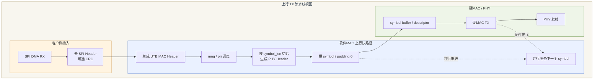

##### 12.3.2 UTB MAC Header 生成规则

上行封装阶段不依赖复杂硬件头部生成逻辑，`UTB MAC Header` 由软件生成。其组成如下：

- `basic` 头：长度由 `utb_mac_basic_len` 指定，内容由 `utb_mac_basic_data` 指定。
- `utb hdr`：固定 `2` 字节，由软件按规则构造。

当前典型配置下，`UTB MAC Header` 长度为 `16` 字节，但协议上应保留“`basic` 头可配置 + `utb hdr` 固定 `2` 字节”的设计表达，不把 `16` 字节写死为永远不变的协议常量。

`utb hdr` 的生成规则如下：

- `utb_hdr.len = pkt_header.len - sync_data_len`
- `utb_hdr.pri = pkt_header.pri`
- 其他字段清零

其中 `sync_data_len` 为固定值。上行进入切片阶段时，报文格式应视为：

`UTB MAC Header + payload + sync data`

##### 12.3.3 上行优先级调度规则

软件 MAC 应按报文优先级对待切片报文进行调度。调度规则如下：

- 管理报文优先级最高，视为逻辑优先级 `4`。
- 数据报文使用 `pri=0~3`，其中 `3` 最高、`0` 最低。
- 调度器每次选择当前最高优先级非空队列的队首报文。
- 形成调度顺序后，取包和拼接应按该顺序连续推进，不做间隔取包。
- 同一报文一旦开始切片，在其尾片落定前，不允许被其他报文插入。

因此，调度器应优先保证“当前已开启切片的报文连续续片”，其次才是从其他优先级队列开启新的报文。

调度器实现方式建议冻结为“任务上下文中的严格优先级多队列 + 同优先级轮询”，而不是 ISR 内抢占式调度。具体建议如下：

- 软件 MAC 在 `s_fwd_tx_task` 中执行调度，ISR 只负责 DMA/硬MAC 完成通知和队列唤醒。
- 按 `pri=4/3/2/1/0` 维护 `5` 条发送就绪队列，其中 `4` 为管理报文专用队列。
- 调度器每轮先检查“当前正在切片的活动报文”是否未完成；若未完成，则继续续片，不重新选包。
- 仅当当前活动报文完成或因拼包开关/剩余空间阈值终止后，才从最高优先级非空队列重新选取新报文。
- 同一优先级内部采用轮询(`round-robin`) 选择队首报文，避免单一源长期独占。
- 队列选择是非抢占式的：已经开始构建的当前 symbol 不因后续新到高优先级报文被中途打断；新的高优先级报文在下一 symbol 选择点生效。

这样做的目的，是把“协议优先级”与“硬件在飞期间的流水线稳定性”兼顾起来，避免为追求绝对抢占而破坏切片连续性和 symbol 装箱效率。

##### 12.3.4 symbol 切片与拼包规则

symbol 构建是上行吞吐的关键热点路径。软件 MAC 应满足以下规则：

- 每个切片前添加 `PHY Header`。
- 必须满足 `切片数据长度 + PHY Header 长度 <= symbol_len`。
- 支持一个 symbol 内携带多个切片。
- 允许的组合包括：单整包、单长包的首片/中间片/尾片、尾片加一个或多个整包、尾片加多个整包再加下一个报文首片。
- 同一报文的分片必须连续，不允许被其他报文打断。
- 当后续仍有报文可取且当前 symbol 剩余空间小于 `32` 字节时，当前 symbol 不再放置新的切片。
- 当前 symbol 未使用空间必须统一 `padding 0`。
- 支持拼包开关；开关关闭时，当前报文尾片落入 symbol 后即停止继续装入下一报文。
- 在 `symbol_len` 允许范围内，默认策略应尽最大能力填满当前 symbol。

上行路径中应显式区分以下三类对象：

- packet buffer：保存完整待发送报文。
- symbol buffer：保存当前已封装好的 symbol。
- descriptor/ring：保存 DMA/硬MAC 可提交对象。

#### Fig-12-02 symbol 拼包场景图

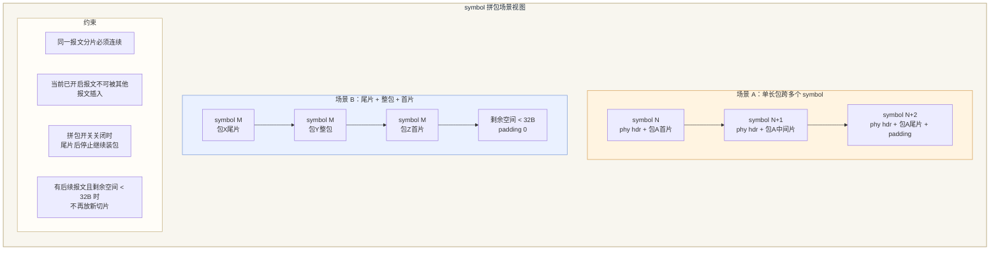

#### 12.4 下行 RX 路径设计

下行路径是“`PHY -> 硬MAC -> 软件MAC -> SPI`”的过程。下行路径的复杂度集中在重组、校验、拆包和后续 SPI 发送。

##### 12.4.1 下行数据路径总览

建议的数据路径如下：

1. `PHY` 将数据送入硬MAC。
2. 硬MAC完成空包、错包、异常片的前置处理，只向软件侧提交有效切片或有效 symbol。
3. 软件 MAC 识别完整包与非完整包。
4. 完整包直接进入后处理路径。
5. 非完整包进入 `31` 路重组模块。
6. 重组完成后执行长度检查。
7. 执行尾部 `sync data` 检查。
8. 对小包拼接报文执行内部拆解。
9. 根据配置剥离 `UTB MAC Header`、添加 `SPI Header`。
10. 通过 `SRAM -> SPI FIFO` 的 DMA 路径发往 `SPI`。

#### Fig-12-03 下行 RX 流水线图

```mermaid
flowchart LR
    subgraph VIEW1203["下行 RX 流水线视图"]
        direction LR

        subgraph PHYIN["PHY / 硬MAC"]
            PHYRX["PHY 输入"]
            HMACRX["硬MAC RX<br/>空包/错包/异常片过滤"]
            RXBUF["RX symbol buffer"]
        end

        subgraph SMACRX["软件MAC 下行快路径"]
            PARSE["识别完整包 / 非完整包"]
            FULL["完整包直通"]
            REASM["31 路重组"]
            LENCHK["长度检查"]
            SYNCCK["sync data 检查"]
            SPLIT["小包拆解"]
            SPIFMT["剥离 UTB MAC / 添加 SPI Header"]
            NEXT2["并行处理上一批完成对象"]
        end

        subgraph OUT["SPI 输出"]
            SPIDMA["SPI TX DMA"]
            SPIFIFO["SPI FIFO"]
        end
    end

    PHYRX --> HMACRX --> RXBUF --> PARSE
    PARSE --> FULL --> LENCHK
    PARSE --> REASM --> LENCHK
    LENCHK --> SYNCCK --> SPLIT --> SPIFMT --> SPIDMA --> SPIFIFO
    HMACRX -.硬件在飞.-> NEXT2
    REASM -.并行推进.-> NEXT2

    style VIEW1203 fill:#F8F6EF,stroke:#B9AA82,stroke-width:1.5px,color:#1F2D3D
    style PHYIN fill:#EEF5E8,stroke:#89A86A,stroke-width:1.2px
    style SMACRX fill:#EAF1FF,stroke:#7E9DD8,stroke-width:1.2px
    style OUT fill:#F2ECFB,stroke:#9986C6,stroke-width:1.2px
```

##### 12.4.2 重组键与并发模型

下行重组模块按 `chnid` 组织重组槽位，最大支持 `31` 路同时重组。其设计规则如下：

- `chnid = 0` 保留给主节点使用，其他节点不使用。
- `chnid = 1~31` 为从节点使用，由软件或协议在启动时分配，分配后固定不变。
- 每个 `chnid` 对应一个独立重组槽。
- `frag_id` 表示该槽内当前报文的连续分片序号。
- 每个槽位同一时刻只维护一个活动报文上下文。

每个重组槽至少需要维护以下状态：

- `state`
- `chnid`
- `expected_frag_id`
- `assembled_len`
- `buffer_ptr`
- `last_update_time`
- 成功包计数和成功字节计数
- 错误统计计数

建议槽位状态至少区分：

- `IDLE`
- `REASSEMBLING`
- `READY`
- `FORWARDING`
- `TIMEOUT_DROP`

#### Fig-12-04 `31` 路重组槽状态图

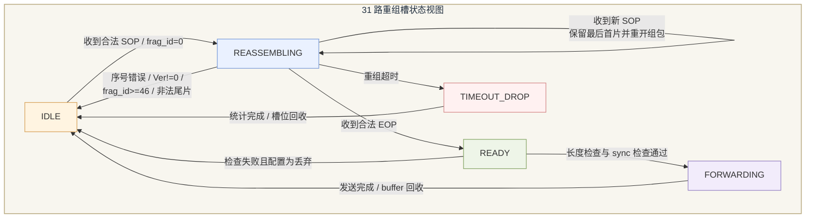

##### 12.4.3 重组一致性检查规则

软件 MAC 在重组阶段应执行如下检查；检查失败时按规则丢弃切片或回收当前槽位，并更新对应统计计数：

- `sop=1` 且 `frag_id != 0`，丢弃当前切片并统计。
- `eop=1`、`sop=0` 且 `frag_id = 0`，丢弃当前槽位已收全部分片并统计。
- 接收的 `frag_id` 与期望值不一致，丢弃当前槽位已收全部分片并统计。
- 首片未收到时收到中间片或尾片，丢弃当前切片并统计。
- 已收到首片但未收到尾片时再次收到首片，保留最后一个首片重新组包，之前已收全部分片丢弃并统计。
- `Ver != 0` 时，收到已有分片全部丢弃并统计。
- `frag_id >= 46` 时，收到已有分片全部丢弃并统计。
- 重组超时后，当前槽位未完成的全部分片丢弃并统计。

其中 `frag_id >= 46` 的约束来源于最坏切片数边界，应在文中明确推导前提，避免被误解为任意常量。

##### 12.4.3.1 GC 任务唤醒策略：事件驱动 + 保底超时

固定 `100 ms` 周期扫描的缺点是：空载时仍消耗 CPU；高密度场景下可能 100ms 才扫一轮，超时响应偏慢。推荐改为以下事件驱动模型：

```c
/* 快路径（s_fwd_rx_task 中，首次将某槽置为 REASSEMBLING 时） */
if (slot->state == SLOT_IDLE && is_sop(frag)) {
    slot->state = SLOT_REASSEMBLING;
    slot->last_update_time = utb_osal_tick_get();
    /* 通知 GC 任务有活跃槽位，使用 FromISR 或普通 Give */
    xSemaphoreGive(g_reasm_gc_sem);   /* 任务上下文，直接 Give */
}
```

```c
/* GC 任务主循环 */
void s_reasm_gc_task(void *arg)
{
    const TickType_t gc_timeout = pdMS_TO_TICKS(200); /* 保底扫描间隔 */
    for (;;) {
        /* 等待快路径激活通知，或 200ms 保底超时 */
        xSemaphoreTake(g_reasm_gc_sem, gc_timeout);

        /* 扫描所有非 IDLE 槽 */
        utb_tick_t now = utb_osal_tick_get();
        for (int i = 0; i < UTB_REASM_SLOT_COUNT; i++) {
            utb_reasm_slot_t *slot = &g_reasm_slots[i];
            if (slot->state == SLOT_IDLE) continue;   /* 跳过空闲槽 */
            if (utb_tick_elapsed(slot->last_update_time, now) >= reasm_timeout_ticks) {
                utb_reasm_slot_timeout_drop(slot);    /* 慢路径回收 */
            }
        }
        /* 扫描完毕再次阻塞，信号量若有积压则立即再次扫描 */
    }
}
```

关键规则：

- `g_reasm_gc_sem` 为二值信号量（binary semaphore），由主核 OSAL 创建（从核本地），**不跨核传递**。
- 快路径只在槽由 `IDLE` 变为 `REASSEMBLING` 时触发 `Give`，不是每片都 Give，避免信号量频繁触发。
- 保底超时设为 `200 ms`（而非固定 100 ms），空载时 GC 任务完全阻塞，不消耗 CPU。
- 若系统负载极低（无活跃槽），GC 任务只靠 200 ms 保底唤醒，比固定 100 ms 周期减少 50% 空载唤醒次数。

重组超时阈值建议在正文中直接冻结为可配置参数，而不是只保留抽象描述。当前推荐如下：

- 重组超时配置范围：`1s ~ 13s`，配置单位为 `1s`。
- 默认值：`3s`。
- 建议值：常规部署使用 `3s`，长线缆或弱信道场景可放宽到 `4s~5s`，不建议超过 `8s` 作为常态值。
- 超时起点：某槽位收到合法首片(`SOP=1, frag_id=0`) 时启动。
- 超时刷新规则：每收到一个合法续片时刷新 `last_update_time`。
- 超时处理动作：槽位转入 `TIMEOUT_DROP`，丢弃当前已收全部分片、累计 `reasm_timeout_cnt`、回收 buffer，并允许同一 `chnid` 重新接收新首片。
- 扫描策略：`s_reasm_gc_task` 采用**事件驱动 + 保底超时**模型（见下），不在快路径每片收包时做全表遍历。

##### 12.4.4 重组成功后的检查与拆包

重组成功后的报文仍需经过后处理检查，顺序建议如下：

1. 剥离各切片的 `PHY Header` 并拼接形成完整报文。
2. 记录拼接后的总长度。
3. 从报文起始偏移 `utb_mac_basic_len` 的位置取出 `utb hdr.len`。
4. 检查 `重组总长度 == utb_hdr.len + sync_data_len_reg`。
5. 若长度检查失败，则统计错包个数，并根据配置决定是否丢弃；默认配置为丢弃。
6. 检查报文尾部 `sync data` 是否与配置值一致。
7. 若 `sync data` 检查失败，则统计错包个数，并根据配置决定是否丢弃；默认配置为丢弃。
8. 对小包拼接形成的复合报文执行内部拆解。
9. 拆解后的内部小包应作为独立报文继续进入后续 `SPI` 发送流程。

#### 12.5 分级流水线设计原则

转发吞吐率压力较大，因此第 `12` 章必须把“分级流水线”作为明确设计原则，而不是实现细节。总原则是：硬件在飞时软件继续工作，软件在处理当前对象时下一批对象已在准备，避免等待式串行流程。

建议流水线分为四级：

| 级别   | 承载主体       | 主要职责                                              | 设计原则                          |
| ---- | ---------- | ------------------------------------------------- | ----------------------------- |
| `L0` | 中断与硬件事件    | `DMA/硬MAC` 完成通知、descriptor 状态推进、doorbell          | 中断最小化，不做切片、重组和拆包              |
| `L1` | DMA 与缓冲接入  | `SPI RX DMA`、`SPI TX DMA`、`PHY/硬MAC RX` 数据搬运      | 只做 ownership handoff，不做复杂协议判断 |
| `L2` | 软件 MAC 快路径 | 上行封装、调度、切片、拼 symbol；下行重组、长度检查、`sync data` 检查、小包拆解 | 这是吞吐热点，优先放入 ILM 和本地 RAM       |
| `L3` | 慢路径与观测     | 统计快照、异常汇总、超时清理、调试输出                               | 不侵入主数据路径，不阻塞 `L2`             |

流水线设计时应特别满足以下要求：

- 硬MAC 正在发送当前 symbol 时，软件 MAC 必须并行准备下一个 symbol。
- 硬MAC 正在接收新 symbol 时，软件 MAC 必须并行推进上一批切片的重组和后处理。
- `SPI DMA` 正在发送当前报文时，软件侧应并行准备后续待发对象，而不是等待发送完成后再启动下一阶段。
- 不允许把“收完一个 symbol 再开始处理，再处理完再开始发”的 stop-and-wait 流程作为主实现。

#### 12.6 缓冲、descriptor 与拷贝预算

为保证吞吐，转发面应采用固定池化的缓冲与 descriptor 模型，不在快路径使用通用堆分配。建议至少区分以下对象：

- `uplink packet buffer pool`
- `uplink symbol buffer pool`
- `downlink symbol buffer pool`
- `31` 路重组 buffer pool
- `SPI TX/RX descriptor ring`
- `硬MAC TX/RX descriptor ring`

每类对象必须显式定义 owner、生命周期和回收条件。尤其需要避免“packet buffer、symbol buffer、重组 buffer 混用导致所有权不清”的实现。

在拷贝预算上，建议按如下目标约束实现：

| 路径   | 目标                                                  | 不允许的低效实现                    |
| ---- | --------------------------------------------------- | --------------------------- |
| 上行   | 主数据尽量 `1` 次有效 copy：`packet buffer -> symbol buffer` | 先拷一次封装包，再拷一次切片，再拷一次发包       |
| 下行   | fragment payload 直接写入最终重组目标 buffer，重组完成后尽量不再整包复制    | 重组到临时 buffer 后再复制到待发 buffer |
| 头部处理 | 优先使用 headroom 或 offset/len，避免整包搬移                   | 为了加头或剥头执行整包 `memmove`       |
| 缓冲管理 | 固定池化、按对象回收                                          | 快路径 `malloc/free`、跨层隐式共享缓冲  |

#### Tab-12-01 拷贝与缓冲预算表

| 对象                        | 建议数量            | 主要用途                           | 所有者                  | 主数据 copy 目标 | 备注                                  |
| ------------------------- | ---------------:| ------------------------------ | -------------------- | -----------:| ----------------------------------- |
| `uplink packet buffer`    | 按 SPI RX 并发深度配置 | 保存去 `SPI Header` 后的完整待发报文      | 软件MAC 上行             | `0`         | 预留 headroom，便于原位生成 `UTB MAC Header` |
| `uplink symbol buffer`    | `2~4` 组         | 保存已切片并待提交给硬MAC 的 symbol        | 软件MAC / 硬MAC 共享交接    | `1`         | 当前 symbol 在飞时，软件并行准备下一 symbol       |
| `硬MAC TX descriptor ring` | 按 symbol 在飞深度配置 | symbol 提交与发送完成回收               | 硬MAC                 | `0`         | 不承载协议逻辑                             |
| `downlink symbol buffer`  | `2~4` 组         | 保存硬MAC 提交给软件的有效 symbol         | 硬MAC / 软件MAC 共享交接    | `0`         | 支持接收与重组并行                           |
| `31` 路重组槽 buffer          | `31` 路固定槽       | 直接写入 fragment payload，形成最终重组报文 | 软件MAC 下行             | `1`         | 避免“临时重组 buffer -> 待发 buffer”二次复制    |
| `SPI TX DMA buffer`       | 按 SPI 发送深度配置    | 保存剥头/加 `SPI Header` 后的待发对象     | 软件MAC / SPI DMA 共享交接 | `0~1`       | 依赖 headroom 和 offset/len 策略         |

因此，本章应把”减少拷贝”写成结构性约束，而不是可选优化项。

##### 12.6.1 headroom 与 scatter-gather 结构性约束

以下两项是减少拷贝的结构性约束，不是可选优化。违反任一项须在 code review 时强制修正：

**1. RX buffer headroom 预留（下行路径）**

下行 symbol buffer 分配时，必须在 buffer 起始处预留 `headroom` 空间，大小不少于 `PHY_hdr_size + UTB_MAC_BASIC_HDR_SIZE`（字节对齐到 4 B）：

```c
/* downlink symbol buffer 布局 */
+--[headroom: PHY_hdr_size + mac_hdr_size, 4B aligned]--+--[payload区]--+
^                                                         ^
buffer_base                                              payload_start
```

- PHY Header 剥离通过推进 `payload_start` 指针（`+= PHY_hdr_size`）完成，**不执行 `memmove`**。
- UTB MAC Basic Header 读取通过绝对 offset 访问，**不拷贝**。
- 若硬件 DMA 不支持 headroom，则在 DMA 完成 ISR 中更新 offset，不在任务上下文中整包搬移。

**2. SPI TX 阶段使用 scatter-gather DMA（上行路径）**

上行发送最终提交给 SPI TX DMA 时，目标是避免将 header 和 payload 合并为连续 buffer 后再提交。若 SPI DMA 控制器支持 scatter-gather（多 descriptor 链），应以如下方式提交：

```c
/* SPI TX scatter-gather descriptor 链（伪代码） */
spi_sg_desc[0].src = header_buf;       /* UTB/SPI header，独立 buffer */
spi_sg_desc[0].len = header_size;
spi_sg_desc[1].src = payload_buf;      /* 原始 payload，无需拷贝到连续 buffer */
spi_sg_desc[1].len = payload_size;
spi_sg_desc[1].flags = SPI_DMA_LAST;
spi_dma_submit_sg(spi_sg_desc, 2);
```

- 若目标 SPI 控制器不支持 scatter-gather，须在架构评审时明确声明，并将 header+payload 合并 copy 纳入拷贝预算计数（Tab-12-01 中标注为 +1 copy）。
- **禁止在快路径中为合并 header+payload 而执行 `memcpy`，除非已确认 SPI 硬件无 scatter-gather 能力且该 copy 已计入拷贝预算**。

> **行动项**：BSP/HAL 实现阶段确认 SPI DMA scatter-gather 能力，结论写入 HAL 接口文档，并在此处更新 Tab-12-01 中”SPI TX DMA buffer”行的 copy 目标值（0 或 1）。

#### 12.7 ILM 与热点对象放置

在转发面中，ILM 应优先放置以下对象：

- 上行切片、拼 symbol、优先级调度的热点代码
- 下行切片解析、`31` 路重组状态推进的热点代码
- 高频访问的小状态对象、索引、短生命周期元数据
- cacheline 对齐的关键 descriptor 辅助对象

不应放入 ILM 的对象包括：

- 大块 packet buffer
- 大块 symbol buffer
- 大块重组数据区
- 慢路径统计快照和低频异常处理逻辑

从核 ILM（硬件 `64 KB`，热点预算 `48 KB`）应被视为快路径执行和热点元数据加速区，而不是通用数据缓存区。其余通用数据可利用从核 DLM（`32 KB`@`0x09010000`）或外部 SRAM。

#### 12.8 快路径允许项与禁止项

快路径允许的动作：

- 去 `SPI Header` 后的最小必要封装
- `UTB MAC Header` 生成
- 按优先级取包和连续续片
- 切片、拼 symbol、`padding 0`
- 重组槽推进、长度检查、`sync data` 检查
- 小包拆解后的最小必要派发
- 必要的 descriptor 提交和最小计数器更新

快路径禁止的动作：

- 复杂日志格式化
- 持久化写入
- 跨核逐包管理往返
- 通用堆动态分配
- 大范围 `memmove`
- 等待当前硬件传输完成后才开始准备下一对象

#### 12.9 性能预算与验证观测

当前正文建议将以下指标纳入转发面设计预算和验证观测：

- 吞吐：`>=25 Mbps`
- 丢包：目标工况 `0`
- 上行 symbol 填充率
- 上行切片平均 copy 次数
- 下行重组槽峰值占用数
- 重组成功包个数和字节数
- 长度检查失败计数
- `sync data` 检查失败计数
- `SPI DMA` 和硬MAC descriptor 峰值深度
- 快路径 CPU 占用、平均处理时延与峰值时延

其中最关键的观测目标不是”是否能跑通”，而是：

- 硬件在飞时软件是否持续并行工作
- symbol 是否被充分填满
- 主数据路径是否出现额外 copy
- `31` 路重组是否在高压场景下仍稳定推进

##### 12.9.1 25 Mbps cycle 级可行性分析

25 Mbps 的吞吐目标需从 cycle 层面验证从核是否有足够的计算余量。以下为分析框架，其中标注 `TBD` 的参数须在芯片规格和协议规格冻结后代入实际值：

**基础参数**

| 参数                | 值                                | 来源     |
| ----------------- | -------------------------------- | ------ |
| 从核时钟频率 `f_core`   | TBD MHz                          | 芯片规格手册 |
| symbol 长度 `S`     | TBD bytes                        | 协议规格   |
| PHY Header 大小 `H` | TBD bytes                        | 协议规格   |
| 单 symbol 净载荷      | `S - H` bytes（上行）/ `S` bytes（下行） |        |

**symbol 速率推导（以 25 Mbps 为目标）**

```
symbol_rate = 25 × 10^6 bit/s ÷ (S × 8 bit/symbol)
            = 25_000_000 / (S × 8)   [symbols/s]

time_per_symbol = 1 / symbol_rate
               = (S × 8) / 25_000_000   [s/symbol]

cycles_per_symbol = f_core × time_per_symbol
                  = f_core[MHz] × S × 8 / 25   [cycles/symbol]
```

示例（参数冻结后替换）：若 `f_core = 200 MHz`，`S = 256 B`：

```
symbol_rate         = 25_000_000 / (256 × 8) ≈ 12,207 symbols/s
cycles_per_symbol   = 200 × 10^6 / 12,207   ≈ 16,384 cycles/symbol
```

**上行 L2 快路径 cycle 预算**

每个 symbol 上行处理包含以下操作：

| 操作                              | 估算 cycle 数           | 备注                |
| ------------------------------- | -------------------- | ----------------- |
| 从调度队列取包（寄存器访问 + cache hit）      | ~20 cycles           | ILM 放置时最优         |
| UTB MAC Header 生成               | ~30 cycles           | 固定长度填充            |
| 切片循环（每片：PHY hdr 填充 + offset 推进） | ~30 × N_frags cycles | `N_frags ≤ 46`    |
| Descriptor 准备与提交                | ~20 cycles           | cache clean + DSB |
| 统计更新（非临界路径）                     | ~10 cycles           |                   |
| **合计（单片场景）**                    | **~110 cycles**      | N_frags=1         |
| **合计（46 片满载场景）**                | **~1500 cycles**     | N_frags=46        |

**判定准则**

```
L2_fast_path_budget ≤ cycles_per_symbol × 0.70
```

（保留 30% 余量给 RTOS 调度、中断响应、IPC 和慢路径）

| 场景                        | `cycles_per_symbol`（示例） | L2 budget (70%) | 估算 L2 消耗 | 判定            |
| ------------------------- | ----------------------- | --------------- | -------- | ------------- |
| 200 MHz，256 B symbol，单片   | 16,384                  | 11,469          | ~110     | ✓ 充裕          |
| 200 MHz，256 B symbol，46 片 | 16,384                  | 11,469          | ~1,500   | ✓ 充裕          |
| 100 MHz，128 B symbol，46 片 | 4,096                   | 2,867           | ~1,500   | ✓ 满足          |
| 100 MHz，64 B symbol，46 片  | 2,048                   | 1,434           | ~1,500   | ⚠ 偏紧，须 ILM 优化 |

> **结论**：在从核时钟 ≥100 MHz、`symbol_len ≥ 128 B` 的条件下，25 Mbps 的 L2 快路径预算具有足够余量。当 `symbol_len < 128 B` 或时钟低于 100 MHz 时，L2 热点代码必须全量放入 ILM，且需实测验证。
> 
> **行动项**：芯片规格和协议规格冻结后，用实际 `f_core` 和 `S` 代入上表重新核算，结果写入验收预算文档，并在集成阶段通过 DWT cycle counter 实测 per-symbol 处理时间与理论值对比。

#### 12.10 主从节点间管理报文配置全景

本节描述主节点芯片通过管理报文配置从节点芯片的完整路径。该路径横跨两片芯片的双核 AMP 架构，是系统级配置下发能力的关键路径。

##### 12.10.1 路径全景

```
外部主机   │ SPI/UART 管理接口
   ▼
主节点 - 主核（管理面）          ← 参数校验，构造管理帧 TLV
   │ IPC ctrl_req_ring（携带管理帧载荷）
   ▼
主节点 - 从核（转发面）          ← 管理帧优先出队，TX 物理路径发出
   │ 无线/有线物理链路 TX
   ▼
从节点 - 从核（转发面）          ← 识别 frame_type=MGMT，punt 给主核
   │ IPC mgmt_ring（片内独立 Ring）
   ▼
从节点 - 主核（管理面）          ← 解析 TLV，应用配置
   │ 若配置影响转发行为：IPC ctrl_req_ring
   ▼
从节点 - 从核（转发面）          ← 更新转发参数，回 ACK
```

##### 12.10.2 管理帧结构与识别

管理报文在 UTB MAC Header 中携带显式 `frame_type` 字段，使 RX 快路径在"PHY Header 剥离"之后、"重组槽查找"之前完成分流，管理帧不占用任何重组资源。

| 字段            | 位宽     | 说明                       |
| ------------- | ------ | ------------------------ |
| `frame_type`  | 4 bit  | `0x0`=数据帧，`0x1`=管理帧，其余保留 |
| `dst_node_id` | 8 bit  | 目标从节点地址                  |
| `seq`         | 16 bit | 请求序列号，用于响应匹配             |
| `payload_len` | 16 bit | 配置 TLV 载荷长度              |

##### 12.10.3 主节点从核发送职责

1. 主节点主核完成参数校验，通过 `ctrl_req_ring` 将管理帧载荷（含 `dst_node_id` + `seq` + TLV）传递给从核。
2. 从核 TX 任务管理帧队列优先于数据帧队列出队，构造完整 UTB MAC Header，按正常切片路径发出。
3. 管理帧不参与拼 symbol 优先级竞争，独立入调度队列。

##### 12.10.4 从节点从核接收分流

```c
/* RX 分流伪码，执行于 PHY Header 剥离后 */
if (utb_mac_hdr->frame_type == UTB_FRAME_TYPE_MGMT) {
    utb_ipc_mgmt_ring_put(&rx_mgmt_frame);          /* punt 给主核 */
    utb_intercore_irq_trigger(CORE_PRIMARY,
                              IRQ_MGMT_FRAME_RDY);   /* 核间中断通知 */
    return;  /* 不进入重组，不进入转发路径 */
}
utb_reasm_rx_process(rx_frame);                     /* 数据帧正常路径 */
```

`mgmt_ring` 为独立共享内存 Ring，与 `event_ring`、`ctrl_req_ring` 物理隔离，建议深度 8 槽。

##### 12.10.5 从节点主核应用配置

1. 从 `mgmt_ring` 读出管理帧，校验 `seq`、`frame_type`、载荷完整性。
2. 解析 TLV，更新 authoritative config state（配置真值始终由主核持有）。
3. 若配置影响从核转发行为（过滤规则、速率参数、重组超时等）：
   - 更新共享内存配置快照：`UTB_CACHE_CLEAN(snapshot) + UTB_DSB()`
   - 通过 `ctrl_req_ring` 发配置生效命令给从核，等待 `ctrl_rsp_ring` 确认。
4. 构造响应帧交给从核回传，携带原始 `seq` 和执行结果。

##### 12.10.6 片间管理配置时序图

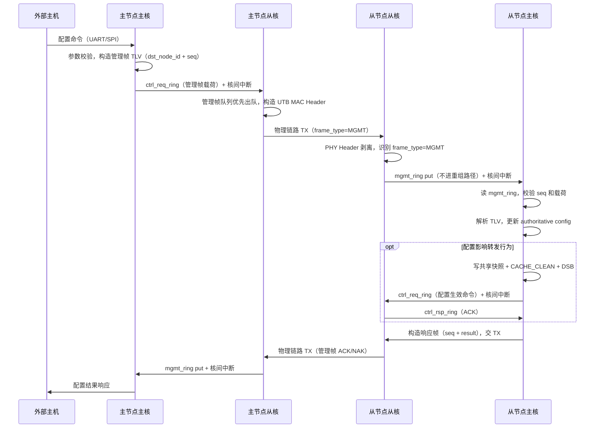

##### 12.10.7 关键约束

| 约束项          | 规则                                   |
| ------------ | ------------------------------------ |
| 管理帧分流时机      | PHY Header 剥离后、重组槽查找前，不得延后           |
| mgmt_ring 隔离 | 与 data ring、event_ring 物理隔离，深度建议 8 槽 |
| 配置真值 owner   | 始终为主核，从核不独立生成或修改全局配置                 |
| 响应可靠性        | 主节点主核管理序列号与超时重传，从节点幂等处理重复命令          |
| 管理帧 TX 优先级   | 从核 TX 侧管理帧队列优先于数据帧队列出队               |
| 跨核配置生效       | 共享内存快照 + `CACHE_CLEAN + DSB`，禁止直接传指针 |

#### 本章对外接口

转发面对外接口应限制在启停控制、统计查询、阈值配置和受控异常观测，不允许上层直接访问快路径私有结构。上层模块不得直接读取重组槽私有状态、descriptor 私有链和 packet pool 内部布局。

建议暴露的 forwarding 接口包括：

- `utb_fwd_enable()`
- `utb_fwd_disable()`
- `utb_fwd_stats_snapshot_get()`
- `utb_fwd_exception_counter_get()`
- `utb_fwd_threshold_cfg_set()`

### 13. 主核管理面承载与上层能力域设计

- 管理面模块图
- 配置生命周期图
- 日志/告警流图
  
  #### Fig-13 主核管理面承载模块图

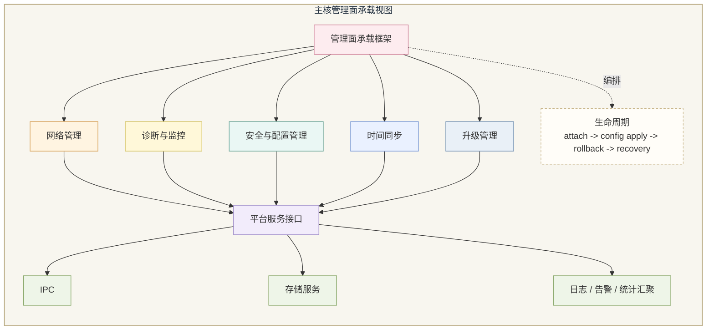

#### 13.1 设计目标

主核管理面承载的目标，是在不破坏从核快路径确定性的前提下，为设备提供可配置、可观测、可升级、可恢复的运维基础。管理面必须“足够丰富”，但不能演变成持续干扰转发面的高频轮询与重型日志容器。

#### 13.2 管理面承载框架

管理面承载框架是主核上层能力域的 hosting 容器，负责：

- 接收来自外部接口层的管理、诊断、CLI 请求。
- 路由到网络管理、诊断监控、安全配置、时间同步、升级管理等能力域。
- 统一使用平台服务接口访问 IPC、存储、OSAL、HAL。
- 组织配置 apply/rollback、日志告警汇聚和恢复动作。

该框架本身不应被写成一个“大一统业务模块”，而应承担宿主与协调职责。

#### 13.3 上层能力域说明

##### 13.3.1 网络管理

负责拓扑、配置、设备状态、参数查询和控制请求。它是主核对外管理能力的主要入口，也是从核配置 authoritative owner 的外部体现者。

##### 13.3.2 诊断与监控

负责日志、审计、统计、故障观察、运行健康检查和问题定位支持。其职责是“帮助定位问题”，而不是把所有内部状态都暴露出去。

##### 13.3.3 安全与配置管理

负责配置合法性校验、配置持久化、Node ID、OTP、License 等对象的管理边界，以及配置的 apply/rollback 控制。

##### 13.3.4 时间同步

负责时间源协调、状态获取和时间相关配置入口，但不应侵入从核快路径主流程。

##### 13.3.5 升级管理

负责镜像状态判断、升级流程组织、回滚标记控制和恢复协调。

#### 13.4 主核对从核的控制边界

主核可以向从核执行以下动作：

- 下发已校验配置
- 请求状态、统计、健康信息
- 请求执行受控动作
- 接收故障、告警和异常事件

主核不应执行以下动作：

- 直接改写从核快路径内部结构
- 逐包参与转发决策
- 用日志/统计采样高频干扰从核执行

#### 13.5 配置生命周期

配置生命周期建议分为：

1. 外部请求接收  
2. 主核参数校验  
3. authoritative config state 更新  
4. 下发到从核或本地模块  
5. apply 成功确认  
6. 失败回滚或局部恢复  

配置 authoritative owner 建议始终保持在主核。从核只执行已下发、已校验的局部配置，不独立生成全局配置真值。

**片间配置路径补充**：当配置来源为对端芯片（主节点通过物理链路下发管理帧）时，从节点主核的配置生命周期在"外部请求接收"阶段由 `mgmt_ring` punt 触发，而非 UART/SPI 直接触发，其余阶段（校验 → authoritative state 更新 → 下发从核 → 确认 → 回传响应）与本地配置路径完全一致。片间配置帧格式和分流规则见 §12.10。

#### 13.6 日志、告警与统计设计

建议主核承担统一汇聚职责：

- 从核只上报必要事件、统计快照和故障摘要。
- 主核完成日志格式化、告警策略、速率限制和对外输出。
- 普通运行日志以内存缓冲为主，不默认落 Flash。

这样可以保证对外可观测性充足，同时避免从核快路径被日志逻辑拖慢。

#### 13.7 watchdog、恢复与 degraded mode

主核应负责系统级 watchdog 协调和恢复决策。当前系统仅有一个硬件 watchdog，由主核 `p_timer_wdg_task` 独占负责喂狗。从核不直接操作硬件 watchdog 寄存器。

**双核心跳机制**：为防止从核死锁时硬件 watchdog 无法触发，采用共享内存心跳计数器：

```c
/* 在 non-cacheable 共享内存中 */
typedef struct {
    volatile uint32_t secondary_alive_counter;  /* 由从核 s_fault_stat_task 递增 */
    volatile uint32_t secondary_last_seen;       /* 由主核记录上次观测值 */
} utb_wdg_heartbeat_t;
```

- 从核 `s_fault_stat_task` 每 `500ms` 递增 `secondary_alive_counter`。
- 主核 `p_timer_wdg_task` 每 `1000ms` 检查：若连续 `2` 次检查计数器未变化，则判定从核失去响应。
- 只有双核均正常时，才喂硬件 watchdog；任一核失响则停止喂狗，允许硬件 watchdog 超时触发系统复位。
- 硬件 watchdog 超时时间建议设为 `5000ms`（> 2 × 检查间隔），避免误触发。
- `wdg_trigger_count` 必须**跨复位持久化**（写入 Flash 关键持久标记区），在 Boot 阶段早期读取，确保现场可获取历史触发记录。

降级模式（degraded mode）建议定义为以下明确状态：

| 状态                    | 转发     | IPC         | 管理面    | 触发条件                  |
| --------------------- | ------ | ----------- | ------ | --------------------- |
| `NORMAL`              | 使能     | alive       | 全功能    | 正常运行                  |
| `FORWARDING_DISABLED` | **停止** | alive / 恢复中 | 全 / 受限 | 从核心跳超时、快路径核心初始化失败     |
| `MANAGEMENT_DEGRADED` | 使能     | alive       | **受限** | 非关键管理模块失败（日志、诊断扩展功能等） |
| `IPC_RECOVERING`      | 停止     | **恢复中**     | 受限     | IPC 重同步进行中            |
| `FATAL_HALT`          | 停止     | N/A         | N/A    | 等待硬件 watchdog 触发复位    |

所有状态转换必须记录时间戳和故障码。

若从核快路径核心能力失效，则进入 `FORWARDING_DISABLED`，允许管理面存活但禁止转发使能。
若主核配置、升级或关键持久化能力失效，根据严重性决定是否允许只保留最小诊断能力（`MANAGEMENT_DEGRADED`）。
若 IPC 不可用、关键时钟/内存基础异常，进入 `FATAL_HALT`，禁止转发使能。

##### 13.7.1 降级模式状态机

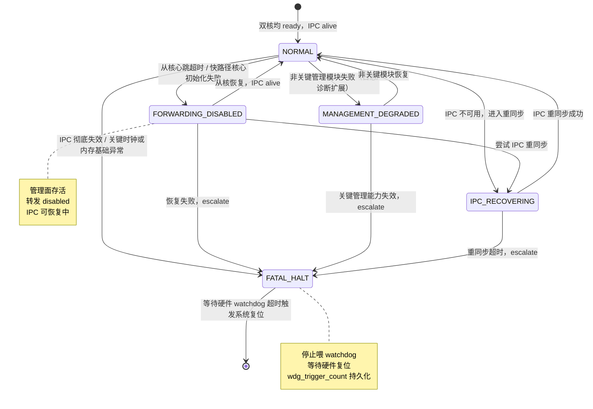

##### 13.7.2 双核心跳与 watchdog 协调时序

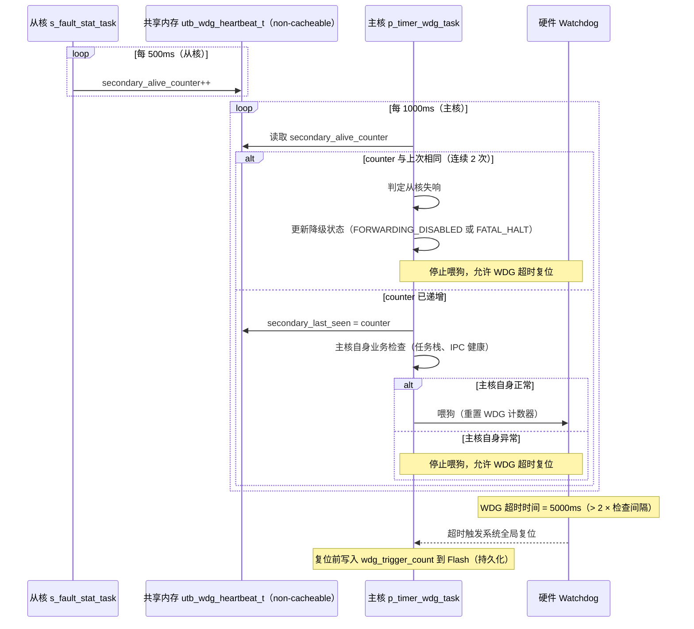

#### 13.8 支撑性观测点

管理面建议至少提供以下支撑性观测点：

- 当前配置版本
- apply/rollback 状态
- 告警计数与告警最近事件
- 统计采样周期与峰值深度
- watchdog 触发历史（`wdg_trigger_count`，**必须跨复位持久化**，写入 Flash 关键持久标记区）
- 从核 ready / fault 状态快照

#### 本章对外接口

管理面承载对外暴露的应是 hosting capability，而不是上层业务私有实现。网络管理、诊断与监控、安全配置、时间同步、升级管理都应通过平台服务接口获取控制、配置、状态、统计、告警和存储能力。外部模块不应直接访问 HAL、OSAL、Flash raw write 或从核私有状态。

建议暴露的管理面接口包括：

- `utb_mgmt_attach()`
- `utb_mgmt_cfg_apply()`
- `utb_mgmt_alarm_subscribe()`
- `utb_mgmt_status_query()`

#### 本章代码示例

```c
int utb_mgmt_cfg_apply(const utb_cfg_blob_t *blob)
{
    int rc;

    rc = utb_platform_cfg_set(UTB_CFG_BLOB, blob, sizeof(*blob));
    if (rc != 0) return rc;

    return utb_platform_cfg_apply(300);
}
```

### 14. 外部适配、对外接口与内部平台服务接口

本章描述外部适配、对外接口与内部平台服务接口。

- 外部接口层图
- 接口分类表
- 请求/响应与事件模型图
  
  #### Fig-14 外部适配与平台服务接口图

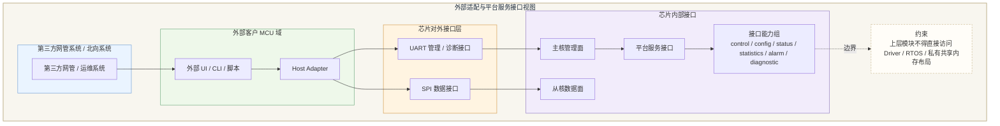

#### 14.1 设计目标

本章目标是定义“外部系统如何接入芯片能力”和“芯片内部上层模块如何稳定调用平台能力”。两类接口边界必须明确区分：

- 外部适配接口：面向 Host Adapter、外部网管、CLI、脚本和客户侧逻辑。
- 内部平台服务接口：面向主核上层能力域和平台内部通用模块。

二者不能混为一个“万能 API”。

#### 14.2 外部 Host Adapter 的角色

外部 Host Adapter 部署在客户 MCU 域中，负责：

- 承接第三方网管系统、外部 UI、外部 CLI、客户逻辑。
- 通过 `UART` 接入主核管理面。
- 通过 `SPI` 接入从核数据面。
- 进行外部协议封装、版本适配和错误码转换。

Host Adapter 不是芯片内部模块，也不应感知内部私有对象布局。

#### 14.3 对外接口分类

当前建议对外接口分为五类：

- 控制/配置接口
- 状态/统计查询接口
- 告警/事件接口
- 诊断/CLI/脚本接口
- 片间管理接口（芯片之间通过物理链路传递管理帧）

其中：

- `UART` 适合承载管理查询、配置、诊断和 CLI。
- `SPI` 适合承载数据收发和轻量控制/metadata 通路。
- 片间管理接口复用物理数据链路，以 UTB MAC Header 中的 `frame_type` 字段区分管理帧与数据帧，接口协议定义见 §12.10。

#### 14.3.1 片间管理接口约定

片间管理接口基于物理链路上的管理帧，其外部接口语义如下：

| 接口属性 | 说明                                                        |
| ---- | --------------------------------------------------------- |
| 承载链路 | 复用数据物理链路，无需独立管理信道                                         |
| 帧识别  | UTB MAC Header `frame_type=0x1`，在接收端 PHY Header 剥离后分流     |
| 方向   | 主节点主核 → 从节点主核（配置下发）；从节点主核 → 主节点主核（结果响应）                   |
| 可靠性  | 序列号 + 超时重传，由主节点主核管理；从节点幂等处理                               |
| 版本协商 | 沿用 §14.6 基础头模型（version + seq + result），TLV payload 内可独立版本 |
| 错误返回 | NAK 帧携带错误码，与 §14.6 错误模型对齐：参数错误、状态错误、超时、不支持                |
| 优先级  | 发送端管理帧队列优先于数据帧队列出队，不参与普通拼 symbol 竞争                       |

#### 14.4 平台服务接口能力分类

平台服务接口对内建议暴露以下能力组：

- `control`：启停、模式切换、局部动作触发
- `config`：get/set/apply/rollback
- `status`：ready、health、topology、runtime state
- `stats`：统计快照、计数器、峰值信息
- `alarm`：告警订阅、事件查询
- `diagnostic`：诊断钩子、故障摘要、观测入口

内部上层模块应通过这些能力访问平台，而不是直接触摸 IPC、驱动私有结构或 RTOS 原生对象。

#### 14.5 sync/async 与跨核语义

接口设计中必须显式说明调用语义：

- 同步请求：适用于本地查询、快速状态读取和可预测控制动作。
- 异步请求：适用于涉及 IPC 往返、设备动作执行、延迟完成的操作。
- 订阅/事件：适用于告警、故障、状态变更通知。

任何跨核语义都不应伪装成“本地瞬时返回”的简单函数。若底层涉及 IPC，必须在接口文档中显式写明 timeout、完成确认和失败返回。

#### 14.6 版本与错误模型

建议 UART/SPI 外部接口统一采用以下基础头模型：

- version
- command / message type
- length
- sequence id
- flags
- result / error code

错误模型建议分为：

- 参数错误
- 状态错误
- 超时错误
- 不支持
- 资源不足
- 执行失败
- 对端未就绪

统一的版本和错误模型，有助于 Host Adapter 在两侧行为一致。

#### 14.7 禁止直接访问的内部对象

以下对象不应直接暴露给上层模块或外部适配逻辑：

- 原始 HAL/Driver 私有对象
- RTOS 原生 task/queue/control block
- IPC 私有消息布局和共享内存地址细节
- 协议栈内部私有结构
- 从核快路径内部活动状态

这样才能保证平台内部可重构，而外部契约仍然稳定。

#### 14.8 集成建议

在接口详细设计阶段，建议为每一类接口补充：

- 调用者
- 同步/异步语义
- request/response 或 event 关系
- timeout 约定
- 错误码表
- 版本字段含义

这将直接服务后续联调和验证章节。

#### 本章对外接口

本章是整份文档中最核心的对外接口章节，应明确区分外部 Host Adapter 接口、芯片对外接口和芯片内部平台服务接口。接口分类至少包括 control、config、status、statistics、alarm、diagnostic 六类，同时必须标明 sync/async、request/response、subscription/event、跨核影响和错误码模型。所有接口都应带版本字段，禁止把内部私有结构体作为长期公共契约。

建议接口原型包括：

- `utb_adapter_req_submit()`
- `utb_adapter_event_subscribe()`
- `utb_platform_status_get()`
- `utb_platform_alarm_poll()`

#### 本章代码示例

```c
typedef struct {
    uint8_t  version;
    uint8_t  category;
    uint16_t cmd;
    uint32_t seq;
    uint16_t payload_len;
} utb_adapter_req_t;

int utb_adapter_req_submit(const utb_adapter_req_t *req,
                           const void *payload,
                           uint32_t timeout_ms);
```

### 15. 集成、验证与验收计划

- 集成路线图
- 验证矩阵
- 故障注入场景图
  
  #### Fig-15 分层集成与验证矩阵图

```mermaid
flowchart TB
    subgraph VIEW15["分层集成与验证矩阵视图"]
        direction TB
        B1["Boot / Bring-up 验证"]
        B2["Per-Core 验证"]
        B3["HAL / OSAL / IPC 验证"]
        B4["Forwarding 验证"]
        B5["Management Hosting 验证"]
        B6["Full-System Integration"]
        B7["Fault Injection / Recovery"]
        B8["Soak / Acceptance"]
        E1["观测项<br/>boot stage / ready 点 / IPC counter / queue depth"]
        E2["观测项<br/>pps / Mbps / latency / drop / CPU 占用"]
        E3["验收门槛<br/>吞吐 >=25Mbps<br/>31 路重组缓存池总预算 192K<br/>0 丢包"]
    end

    B1 --> B2 --> B3 --> B4 --> B5 --> B6 --> B7 --> B8
    B3 --> E1
    B4 --> E2
    B8 --> E3

    style VIEW15 fill:#F8F6EF,stroke:#B9AA82,stroke-width:1.5px,color:#1F2D3D
    style B1 fill:#FFE9D6,stroke:#D58F5C,stroke-width:1.2px
    style B2 fill:#EAF4FF,stroke:#7FA8D8,stroke-width:1.2px
    style B3 fill:#E9F0F7,stroke:#7B97B6,stroke-width:1.2px
    style B4 fill:#EAF1FF,stroke:#7E9DD8,stroke-width:1.2px
    style B5 fill:#FDECEF,stroke:#D38AA0,stroke-width:1.2px
    style B6 fill:#F2ECFB,stroke:#9986C6,stroke-width:1.2px
    style B7 fill:#FFF4E1,stroke:#D8A45D,stroke-width:1.2px
    style B8 fill:#EEF5E8,stroke:#89A86A,stroke-width:1.2px
    style E1 fill:#FFFDF8,stroke:#C7B487,stroke-dasharray: 4 3
    style E2 fill:#FFFDF8,stroke:#C7B487,stroke-dasharray: 4 3
    style E3 fill:#FFFDF8,stroke:#C7B487,stroke-dasharray: 4 3
```

#### 15.1 验证目标

验证计划的目标，是把前文的架构和详细设计转化为可执行的验收路径，而不是停留在“设计看起来合理”。当前验证需要覆盖：

- 启动与 bring-up
- 主核/从核各自单体能力
- IPC
- 转发面
- 管理面
- 完整系统联调
- 故障注入与恢复
- 长稳运行

#### 15.2 分层集成顺序

建议按以下顺序集成：

1. Boot / bring-up  
2. 主核基础平台与从核基础运行时  
3. HAL/BSP/Driver、OSAL  
4. IPC alive  
5. 从核转发面  
6. 主核管理面承载  
7. 外部适配接口  
8. 全系统联调  
9. 长稳与故障恢复

这样可以在每一层建立最小可验证闭环，而不是一次性集成所有模块后再定位问题。

#### 15.3 分层验证矩阵

##### 15.3.1 启动与 bring-up 验证

- 目标：验证 BootROM 到主核、主核到从核的启动链路。
- setup：标准启动镜像、调试观测点、ready 上报码。
- 指标：主核启动成功、从核释放条件满足、从核 ready 上报、ILM 装载正确。
- pass/fail：若从核在条件未满足前释放、或 IPC 基础区不可见，则失败。

##### 15.3.2 per-core 单体验证

- 目标：分别验证主核管理框架和从核基础快路径运行时。
- setup：双核运行，但分别屏蔽非必要业务模块。
- 指标：任务运行、基础驱动、最小接口、状态报告。
- pass/fail：任一核心关键运行时无法建立则失败。

##### 15.3.3 IPC 验证

- 目标：验证 control/config/status/stats/alarm/fault 流量。
- setup：构造 request/response、事件、统计快照和异常场景。
- 指标：timeout、retry、queue depth、drop、invalid message 计数。
- pass/fail：类别消息无法按契约完成或恢复策略错误则失败。

##### 15.3.4 转发面验证

- 目标：验证从核数据路径、分片/重组、HAL TX/RX 交互和性能。
- setup：典型报文场景、31 节点工况、吞吐与丢包统计。
- 指标：吞吐、drop rate、descriptor 峰值、重组状态峰值、CPU 占用。
- pass/fail：吞吐低于 `25 Mbps`、目标工况出现丢包、关键路径内存失控则失败。

##### 15.3.5 管理面验证

- 目标：验证配置 apply/rollback、日志、告警、统计、诊断、升级流程。
- setup：通过 UART/CLI/管理请求模拟外部运维场景。
- 指标：配置成功率、回滚成功率、告警可见性、日志速率控制、状态一致性。
- pass/fail：管理请求破坏转发稳定性或关键回滚失败则失败。

#### 15.4 故障注入与恢复

建议至少覆盖以下负向测试：

- 从核未 ready 时强行请求 forwarding enable
- ring overflow / 核间中断通知异常
- invalid message / version mismatch
- timeout / retry 达上限
- 局部 warm reset
- 主核管理面高负载
- 从核快路径局部失败

恢复验证中，应检查：

- 是否能正确上报告警和故障
- 是否能进入正确 degraded mode
- 是否能禁止 forwarding enable 或局部恢复
- 是否保留必要 breadcrumbs 与关键计数器

#### 15.5 长稳与现场支撑验证

长稳测试建议重点观察：

- 长时间吞吐稳定性
- 内存占用漂移
- descriptor / queue 深度峰值是否失控
- 日志与统计缓冲是否挤占关键资源
- watchdog 是否出现异常触发

现场支撑能力建议验证：

- 日志是否可读
- 计数器是否完整
- 告警是否能定位关键故障
- 崩溃 breadcrumbs 是否保留足够摘要

#### 15.6 验收标准

当前建议将以下指标作为主验收门槛：

- 从核转发吞吐 `>=25 Mbps`
- `31` 节点场景整体内存占用 `<=192 KB`
- 目标工况 `0` 丢包

同时建议把以下指标列为关键观测指标：

- CPU 占用
- queue / ring 峰值深度
- reassembly pool 峰值占用
- 关键超时与重试计数

#### 15.7 验证闭环要求

验证章节不是独立附录，而应反向约束前文设计。若某项指标无法测量，则说明前文缺观测点；若某项失败无法归因，则说明前文缺 owner 或缺错误语义；若某项恢复流程无法执行，则说明前文缺 reset/recovery 契约。后续详细设计与实现应把第 15 章当成收口章节，而不是最后补写的测试列表。

#### 本章对外接口

验证章节需要对外暴露测试入口、状态采集口和结果判定接口，以便 bring-up、集成和回归过程可重复执行。建议统一暴露 boot stage 采集、IPC 计数读取、forwarding 统计获取、告警快照和 fault injection 控制接口。测试工具不应直接操纵内部对象，而应走平台化验证接口。

建议验证接口包括：

- `utb_test_boot_stage_get()`
- `utb_test_ipc_counters_get()`
- `utb_test_fwd_stats_get()`
- `utb_test_fault_inject()`

#### 本章代码示例

```c
int verify_forwarding_acceptance(void)
{
    utb_fwd_stats_t stats;

    utb_test_fwd_stats_get(&stats);
    if (stats.throughput_mbps < 25) return -1;
    if (stats.drop_packets != 0) return -2;
    return 0;
}
```

## 5.1 当前建议默认值

- BootROM/启动：采用“BootROM 启主核，主核初始化后释放从核”的标准 AMP 流程；从核镜像定位与 ILM 搬移由主核负责。
- ILM 使用：从核 ILM 硬件 `64 KB`，热点预算 `48 KB`，优先留给从核快路径热点代码、重组状态热点数据、关键描述符缓存；大块报文缓存和低频控制对象不进入 ILM，可放从核 DLM（`32 KB`）或外部 SRAM。
- Flash 访问：允许从核直接访问其所属 Flash 分区，但禁止跨写主核配置区；配置、升级、回滚元数据仍建议由主核统一裁决。
- 外设 ownership：建议 `UART` 归主核管理面，`SPI 数据收发` 归从核数据面，`Flash 控制器` 归主核 owning、从核受限直读/分区写，`DMA/IRQ` 按外设 owner 绑定，不做跨核共享仲裁。
- `S_FWD -> HAL`：建议限定为快路径专用接口子集，仅保留报文 TX/RX、DMA 提交、必要状态查询，避免通用 HAL API 污染数据面时延。
- 共享内存一致性：建议统一采用“单 owner + 按传输方向维护 cache”的协议；descriptor/核间中断状态位优先 non-cacheable，TX 路径由 producer `clean + barrier` 后再交 DMA/RX consumer，RX 路径由 consumer 在读取前 `invalidate + barrier`，共享快照采用发布序号后再消费的模式。
- IPC 流量：建议 IPC 仅承载控制、配置、状态、统计、告警、故障和少量 metadata；不承载大报文数据本体。
- Host Adapter 协议：建议 UART/SPI 两侧都使用统一版本头、命令字、长度、序列号、返回码模型；UART 偏管理请求/响应，SPI 偏数据流和轻量控制。
- 平台服务接口与系统服务框架：建议前者定义“对上能力契约”，后者定义“平台内部运行时组织与调度能力”，两者在文档中分章说明，不混写。
- 配置 authoritative owner：建议由主核独占 authoritative config owner，从核只执行已下发且已校验的局部配置。
- OSAL 范围：当前先冻结为“平台层、服务框架、通用模块必须走 OSAL；性能敏感驱动/HAL 内部允许少量 RTOS 私有适配”，待未来 NuttX 适配范围明确后再扩展。
- 持久化日志：建议只持久化升级回滚标记、关键故障 breadcrumbs、必要审计事件；普通运行日志和统计计数器以内存缓冲为主。
- degraded boot：建议“管理可存活但转发降级”仅适用于从核业务模块未完全就绪、非关键统计/诊断失败；若 IPC 不可用、关键时钟/内存基础异常、从核快路径核心初始化失败，则禁止 forwarding enable。
- 验收指标：正文中建议明确写死以下门槛：从核转发吞吐 `>=25 Mbps`、`31` 节点内存占用 `<=192 KB`、目标工况 `0` 丢包；并补充 CPU 占用、队列深度、重组缓存峰值作为观测指标而非主验收门槛。

## 8. 附录：统一错误码空间

平台所有模块必须使用以下统一错误码，禁止各模块私自定义相同数值的错误码：

```c
/* utb_errno.h */
#define UTB_ERR_OK               0

/* 参数类：-1 ~ -99 */
#define UTB_ERR_INVALID_PARAM   -1
#define UTB_ERR_NULL_PTR        -2
#define UTB_ERR_OUT_OF_RANGE    -3

/* 状态类：-100 ~ -199 */
#define UTB_ERR_NOT_READY       -100
#define UTB_ERR_BUSY            -101
#define UTB_ERR_NOT_SUPPORTED   -102
#define UTB_ERR_DEGRADED        -103

/* 超时类：-200 ~ -299 */
#define UTB_ERR_TIMEOUT         -200

/* 资源类：-300 ~ -399 */
#define UTB_ERR_NO_RESOURCE     -300
#define UTB_ERR_NO_MEM          -301
#define UTB_ERR_POOL_EMPTY      -302

/* IPC 类：-400 ~ -499 */
#define UTB_ERR_IPC_OVERFLOW    -400
#define UTB_ERR_IPC_INVALID     -401
#define UTB_ERR_IPC_PEER_DOWN   -402

/* 硬件/驱动类：-500 ~ -599 */
#define UTB_ERR_HW_FAULT        -500
#define UTB_ERR_DMA_ERR         -501
#define UTB_ERR_BUS_ERR         -502

/* 存储类：-600 ~ -699 */
#define UTB_ERR_FLASH_ERR       -600
#define UTB_ERR_CFG_CORRUPT     -601
#define UTB_ERR_ROLLBACK_FAIL   -602

/* 系统 panic 码（用于 utb_panic() 入参） */
#define UTB_PANIC_STACK_OVERFLOW   0x01
#define UTB_PANIC_MALLOC_FAILED    0x02
#define UTB_PANIC_BOOT_FLAG_INVALID 0x03
#define UTB_PANIC_ASSERT_FAIL      0x04
```

## 9. 附录：崩溃 Breadcrumb 结构

崩溃 breadcrumb 写入 Flash 关键持久标记区，固定大小，用于在复位后还原故障现场：

```c
/* 固定大小，禁止使用变长字段 */
typedef struct {
    uint32_t magic;             /* 固定哨兵值 0xUTB0DEAD */
    uint32_t fault_code;        /* 故障码或 panic 码 */
    uint32_t fault_pc;          /* 故障发生时的 PC */
    uint32_t fault_lr;          /* 故障发生时的 LR */
    uint32_t fault_sp;          /* 故障发生时的 SP */
    uint8_t  task_name[16];     /* 故障任务名（FreeRTOS pcTaskName） */
    uint8_t  boot_phase;        /* 故障时的 boot phase 编号 */
    uint8_t  core_id;           /* 0=主核，1=从核 */
    uint8_t  reserved[2];
    uint32_t rx_pkt_count;      /* 故障时的关键计数器快照 */
    uint32_t drop_count;
    uint32_t ipc_overflow_count;
    uint32_t wdg_trigger_count; /* 包含本次的累计触发次数 */
    uint32_t timestamp_ms;      /* 系统运行时间（ms） */
} utb_crash_breadcrumb_t;       /* sizeof = 64 bytes */
```

Breadcrumb 写入时机：在 HardFault handler 或 `utb_panic()` 中，在触发任何复位操作之前写入。

## 7. 配图附录：Mermaid 配图清单与源码骨架

### 7.1 配图清单

| 章节     | 图号     | 图名                             | 图类型               | 用途                                            |
| ------ | ------ | ------------------------------ | ----------------- | --------------------------------------------- |
| 第 1 章  | Fig-01 | 文档范围与边界图                       | `flowchart`       | 说明本文覆盖范围、设计输入与非目标                             |
| 第 2 章  | Fig-02 | 系统总体架构图                        | `flowchart`       | 说明外部域、主核、从核、公共平台层关系                           |
| 第 3 章  | Fig-03 | 主从核职责与共享资源图                    | `flowchart`       | 说明 owner 模型与跨核边界                              |
| 第 4 章  | Fig-04 | 软件分层与依赖规则图                     | `flowchart`       | 说明层次结构和 allowed dependency                    |
| 第 5 章  | Fig-05 | BootROM 与从核 Bring-up 时序图       | `sequenceDiagram` | 说明主核启动、从核释放、ILM 准备                            |
| 第 6 章  | Fig-06 | 初始化 phase 与 readiness 图        | `flowchart`       | 说明 phase、依赖和 attach 条件                        |
| 第 7 章  | Fig-07 | 内存/ILM/缓冲布局图                   | `flowchart`       | 说明 SRAM/ILM/共享内存/重组池预算                        |
| 第 8 章  | Fig-08 | Flash 分区与执行放置图                 | `flowchart`       | 说明主从核分区、配置区、回滚区                               |
| 第 9 章  | Fig-09 | BSP/HAL/Driver 与外设 ownership 图 | `flowchart`       | 说明分层边界和外设 owner                               |
| 第 10 章 | Fig-10 | OSAL 与 RTOS 适配边界图              | `flowchart`       | 说明 OSAL 覆盖范围和上下文规则                            |
| 第 11 章 | Fig-11 | IPC 通道与消息分类图                   | `flowchart`       | 说明 control/config/status/stats/alarm/fault 通路 |
| 第 12 章 | Fig-12 | 从核转发数据路径图                      | `flowchart`       | 说明 ingress 到 egress 的快路径阶段                    |
| 第 13 章 | Fig-13 | 主核管理面承载模块图                     | `flowchart`       | 说明管理面框架与能力域关系                                 |
| 第 14 章 | Fig-14 | 外部适配与平台服务接口图                   | `flowchart`       | 说明 Host Adapter、对外接口、内部平台 API                 |
| 第 15 章 | Fig-15 | 分层集成与验证矩阵图                     | `flowchart`       | 说明验证层次和验收闭环                                   |

### 7.2 Mermaid 源码定稿

#### Fig-01 文档范围与边界图

```mermaid
flowchart LR
    subgraph DOCVIEW["文档范围与边界视图"]
        direction LR

        subgraph IN["设计输入"]
            A1["AGENTS.md 约束"]
            A2["总体架构基线图"]
            A3["冻结设计输入<br/>BootROM 仅启动主核<br/>从核 ILM 64K（预算48K）"]
            A4["资源约束<br/>系统 SRAM 384K<br/>31 路重组缓存 192K<br/>1MB Flash XIP + ILM 热搬移"]
        end

        subgraph SCOPE["本文档覆盖范围"]
            B1["双核 AMP 总体架构"]
            B2["启动 / Bring-up / 初始化依赖"]
            B3["内存 / Flash / ILM / 共享内存"]
            B4["HAL / BSP / Driver / OSAL / IPC"]
            B5["转发面 / 管理面 / 接口 / 验证"]
        end

        subgraph OUT["默认不展开范围"]
            C1["第三方网管业务策略"]
            C2["客户侧业务逻辑细节"]
            C3["Linux 基线实现复刻"]
        end

        subgraph DELIVER["设计输出"]
            D1["概要设计 + 详细设计"]
            D2["正式 Mermaid 配图"]
            D3["接口 / 生命周期 / 验证依据"]
        end
    end

    IN --> SCOPE --> DELIVER
    SCOPE -.明确排除.-> OUT

    style DOCVIEW fill:#F8F6EF,stroke:#B9AA82,stroke-width:1.5px,color:#1F2D3D
    style IN fill:#EAF4FF,stroke:#7FA8D8,stroke-width:1.2px
    style SCOPE fill:#EEF8EA,stroke:#7DB38B,stroke-width:1.2px
    style OUT fill:#FFF4E1,stroke:#D8A45D,stroke-width:1.2px
    style DELIVER fill:#F2ECFB,stroke:#9986C6,stroke-width:1.2px
```

#### Fig-03 主从核职责与共享资源图

```mermaid
%%{init: {'theme':'base', 'themeVariables': { 'fontSize': '22px' }, 'flowchart': { 'nodeSpacing': 28, 'rankSpacing': 36 }}}%%
flowchart TB
    subgraph VIEW03["主从核职责与共享资源视图"]
        direction TB

        subgraph CORE["职责域与共享边界"]
            direction TB

            subgraph OWN["主从核 owner 划分"]
                direction LR

                subgraph P["主核 authoritative owner"]
                    direction TB
                    P1["BootROM 交接后<br/>早期初始化"]
                    P2["启动阶段编排"]
                    P3["管理面承载<br/>上层 attach"]
                    P4["配置 authoritative owner"]
                    P5["日志 / 告警<br/>升级恢复协调"]
                end

                subgraph S["从核 authoritative owner"]
                    direction TB
                    S1["UTB 协议栈<br/>快路径"]
                    S2["分片 / 重组"]
                    S3["转发执行<br/>报文收发"]
                    S4["热状态与<br/>性能敏感数据"]
                end
            end

            subgraph SH["共享资源"]
                direction LR
                SH1["IPC Ring / Mailbox"]
                SH2["共享状态镜像"]
                SH3["共享描述符 / 元数据"]
                SH4["只读配置镜像"]
            end
        end

        subgraph RULE03["允许交互与禁止项"]
            direction LR
            CMD["允许: 主核下发<br/>已校验配置 / 控制命令"]
            RPT["允许: 从核上报<br/>状态统计 / 告警故障"]
            BAN1["禁止: 主核直接改写<br/>从核快路径私有状态"]
            BAN2["禁止: 从核改写<br/>authoritative 配置状态"]
        end
    end

    P2 --> SH1
    P3 --> SH2
    P4 --> SH4
    S1 --> SH1
    S3 --> SH3
    S4 --> SH2

    P3 -.-> CMD -.-> S1
    S3 -.-> RPT -.-> P3
    P4 -.-> BAN1
    S4 -.-> BAN2

    style VIEW03 fill:#F8F6EF,stroke:#B9AA82,stroke-width:1.5px,color:#1F2D3D
    style CORE fill:#F8F6EF,stroke:#F8F6EF
    style OWN fill:#F8F6EF,stroke:#F8F6EF
    style RULE03 fill:#F8F6EF,stroke:#F8F6EF
    style P fill:#FDECEF,stroke:#D38AA0,stroke-width:1.2px
    style SH fill:#EEF5E8,stroke:#89A86A,stroke-width:1.2px
    style S fill:#EAF1FF,stroke:#7E9DD8,stroke-width:1.2px
    style CMD fill:#FFF4E1,stroke:#D8A45D,stroke-dasharray: 4 3
    style RPT fill:#FFF4E1,stroke:#D8A45D,stroke-dasharray: 4 3
    style BAN1 fill:#FFFDF8,stroke:#C7B487,stroke-dasharray: 4 3
    style BAN2 fill:#FFFDF8,stroke:#C7B487,stroke-dasharray: 4 3
```

#### Fig-04 软件分层与依赖规则图

```mermaid
flowchart TB
    subgraph SW["软件分层视图"]
        direction TB

        subgraph ROW0
            direction LR
            L7["对外接口层<br/>UART / SPI / Host Adapter 接入"]
        end

        subgraph ROW1
            direction LR
            L1["启动与引导层<br/>BootROM handoff / bring-up / release"]
            L6A["主核承载层<br/>管理面 / 诊断 / 安全配置 / 时间同步 / 升级"]
            L6B["从核承载层<br/>协议栈 / 软件 MAC / 转发"]
        end

        subgraph ROW2
            direction LR
            L5["平台服务接口层<br/>control / config / status / statistics / alarm / diagnostic"]
        end

        subgraph ROW3
            direction LR
            L4["平台公共能力层<br/>IPC / 存储 / 系统服务框架"]
        end

        subgraph ROW4
            direction LR
            L2["BSP / HAL / Driver 层<br/>板级差异 / 外设抽象 / IRQ / DMA"]
            L3["OSAL 层<br/>任务 / 队列 / 互斥 / 定时器 / critical section"]
        end
    end

    L7 --> L6A
    L7 --> L6B
    L1 --> L2
    L1 --> L3
    L6A --> L5
    L6B --> L5
    L5 --> L4
    L4 --> L2
    L4 --> L3

    X1["禁止 shortcut<br/>上层不可直连 Driver / RTOS 私有 API"]
    X2["禁止 shortcut<br/>管理逻辑不可进入从核快路径"]
    L6A -.约束.-> X1
    L6A -.约束.-> X2

    style SW fill:#F8F6EF,stroke:#B9AA82,stroke-width:1.5px,color:#1F2D3D
    style ROW0 fill:#F8F6EF,stroke:#F8F6EF
    style ROW1 fill:#F8F6EF,stroke:#F8F6EF
    style ROW2 fill:#F8F6EF,stroke:#F8F6EF
    style ROW3 fill:#F8F6EF,stroke:#F8F6EF
    style ROW4 fill:#F8F6EF,stroke:#F8F6EF

    style L7 fill:#FFF4E1,stroke:#D8A45D,stroke-width:1.2px
    style L1 fill:#FFE9D6,stroke:#D58F5C,stroke-width:1.2px
    style L6A fill:#FDECEF,stroke:#D38AA0,stroke-width:1.2px
    style L6B fill:#EAF1FF,stroke:#7E9DD8,stroke-width:1.2px
    style L5 fill:#F2ECFB,stroke:#9986C6,stroke-width:1.2px
    style L4 fill:#EEF5E8,stroke:#89A86A,stroke-width:1.2px
    style L2 fill:#E9F0F7,stroke:#7B97B6,stroke-width:1.2px
    style L3 fill:#EAF7F4,stroke:#70A89B,stroke-width:1.2px
    style X1 fill:#FFFDF8,stroke:#C7B487,stroke-dasharray: 4 3
    style X2 fill:#FFFDF8,stroke:#C7B487,stroke-dasharray: 4 3
```

#### Fig-05 BootROM 与从核 Bring-up 时序图

```mermaid
sequenceDiagram
    participant BR as BootROM
    participant P as 主核
    participant F as Flash
    participant SH as 共享内存 / IPC 区
    participant ILM as 从核 ILM
    participant S as 从核
    participant M as 管理面承载

    BR->>P: 仅启动主核入口
    P->>P: 建立向量 / 栈 / 早期时钟 / 复位基础
    P->>F: 读取主核镜像元数据 / 从核镜像定位信息
    P->>SH: 初始化共享内存 / ring / 核间中断基础区
    P->>ILM: 搬运从核热点代码与热点数据
    P->>P: 初始化 HAL / OSAL / 基础 Driver
    Note over P,SH: 释放从核前强制屏障序列
    P->>P: UTB_CACHE_CLEAN_INV(shared_region) + DSB
    P->>SH: 写入 secondary_boot_flag = UTB_SECONDARY_BOOT_MAGIC + DSB
    P->>S: 写 SoC 复位控制寄存器，释放从核（+DSB）
    Note over S,SH: 从核 reset vector 后，读共享内存前
    S->>SH: UTB_CACHE_INVALIDATE(shared_region) + DSB
    S->>SH: 验证 secondary_boot_flag == MAGIC，失败则 panic
    S->>S: 建立本地运行时 / 校验 ILM 就绪
    S->>SH: 注册从核 IPC endpoint
    S->>P: 上报 secondary_ready
    P->>P: 判定 IPC alive / forwarding ready
    P->>M: 允许管理面 attach

    alt 从核未按时 ready
        P->>P: 进入 degraded boot 或 fatal boot
    end
```

#### Fig-06 初始化 phase 与 readiness 图

```mermaid
flowchart TD
    subgraph VIEW06["初始化阶段与就绪条件视图"]
        direction TB
        P0["P0 Reset / BootROM handoff"]
        P1["P1 主核早期初始化<br/>向量 / 栈 / 时钟 / 复位"]
        P2["P2 共享基础区建立<br/>共享内存 / ring / 核间中断"]
        P3["P3 从核镜像与 ILM 准备<br/>镜像定位 / 热点段搬运"]
        P4["P4 主核基础平台 ready<br/>HAL / Driver / OSAL 基础就绪"]
        P5["P5 从核释放与 secondary_ready"]
        P6["P6 IPC Alive"]
        P7["P7 平台公共能力 ready<br/>Store / Service Framework / Platform API"]
        P8["P8 Forwarding Enable"]
        P9["P9 Management Attach"]
        R1["Readiness 1<br/>IPC Alive"]
        R2["Readiness 2<br/>Forwarding Ready"]
        R3["Readiness 3<br/>Management Ready"]
        F1["失败处理<br/>共享区失败 / ILM 准备失败 / 从核 ready 超时"]
    end

    P0 --> P1 --> P2 --> P3 --> P4 --> P5 --> P6 --> P7 --> P8 --> P9
    P6 --> R1
    P8 --> R2
    P9 --> R3
    P2 -.失败.-> F1
    P3 -.失败.-> F1
    P5 -.失败.-> F1

    style VIEW06 fill:#F8F6EF,stroke:#B9AA82,stroke-width:1.5px,color:#1F2D3D
    style P0 fill:#FFF4E1,stroke:#D8A45D,stroke-width:1.2px
    style P1 fill:#FFE9D6,stroke:#D58F5C,stroke-width:1.2px
    style P2 fill:#EAF4FF,stroke:#7FA8D8,stroke-width:1.2px
    style P3 fill:#EAF1FF,stroke:#7E9DD8,stroke-width:1.2px
    style P4 fill:#E9F0F7,stroke:#7B97B6,stroke-width:1.2px
    style P5 fill:#EAF1FF,stroke:#7E9DD8,stroke-width:1.2px
    style P6 fill:#EEF5E8,stroke:#89A86A,stroke-width:1.2px
    style P7 fill:#F2ECFB,stroke:#9986C6,stroke-width:1.2px
    style P8 fill:#EAF7F4,stroke:#70A89B,stroke-width:1.2px
    style P9 fill:#FDECEF,stroke:#D38AA0,stroke-width:1.2px
    style R1 fill:#FFFDF8,stroke:#C7B487,stroke-dasharray: 4 3
    style R2 fill:#FFFDF8,stroke:#C7B487,stroke-dasharray: 4 3
    style R3 fill:#FFFDF8,stroke:#C7B487,stroke-dasharray: 4 3
    style F1 fill:#FFF1F1,stroke:#D58C8C,stroke-dasharray: 4 3
```

#### Fig-07 内存/ILM/缓冲布局图

```mermaid
flowchart LR
    subgraph VIEW07["内存 / ILM / 缓冲布局视图"]
        direction LR

        subgraph PMEM["主核本地 SRAM"]
            PSRAM["主核软件可用 SRAM<br/>32K"]
            PSTACK["主核任务栈 / 控制块"]
            PMGMT["管理面状态 / 配置镜像 / 日志缓冲"]
        end

        subgraph SMEM["从核本地执行与运行内存"]
            SILM["从核 ILM<br/>64K（预算48K）<br/>热点代码 / 热点数据"]
            SRUN["从核软件运行内存<br/>16K<br/>任务栈 / 本地状态 / 控制对象"]
        end

        subgraph DPBUF["从核数据面缓冲区"]
            REASM["31 路重组缓存池<br/>总预算 192K"]
            DESC["TX/RX Descriptor Ring"]
            PKT["Packet Pool / DMA Buffer<br/>96K（上/下行合计）"]
        end

        subgraph SHMEM["共享内存"]
            IPCR["IPC Ring / Mailbox"]
            STAT["共享状态镜像 / 统计快照"]
            CFGM["只读配置镜像"]
        end

        O1["约束<br/>大报文数据不进 ILM"]
        O2["约束<br/>重组池预算按 31 路统一控制 192K"]
    end

    PSRAM --> PSTACK
    PSRAM --> PMGMT
    SILM --> SRUN
    SRUN --> DESC
    DESC --> PKT
    REASM --> PKT
    IPCR --> STAT
    CFGM --> SRUN
    SILM -.约束.-> O1
    REASM -.预算.-> O2

    style VIEW07 fill:#F8F6EF,stroke:#B9AA82,stroke-width:1.5px,color:#1F2D3D
    style PMEM fill:#FFE9D6,stroke:#D58F5C,stroke-width:1.2px
    style SMEM fill:#EAF1FF,stroke:#7E9DD8,stroke-width:1.2px
    style DPBUF fill:#EEF5E8,stroke:#89A86A,stroke-width:1.2px
    style SHMEM fill:#F2ECFB,stroke:#9986C6,stroke-width:1.2px
    style O1 fill:#FFFDF8,stroke:#C7B487,stroke-dasharray: 4 3
    style O2 fill:#FFFDF8,stroke:#C7B487,stroke-dasharray: 4 3
```

#### Fig-08 Flash 分区与执行放置图

```mermaid
flowchart TB
    subgraph VIEW08["Flash 分区与执行放置视图"]
        direction TB

        subgraph F["Flash 分区"]
            META["Boot / 镜像元数据区"]
            PIMG["主核镜像区"]
            SIMG["从核镜像区"]
            CFG["配置区"]
            ROLLBACK["回滚 / 备份区"]
            SEC["OTP / License / Node ID 区"]
            MARK["故障 / 升级标记区"]
        end

        subgraph E["执行放置"]
            PSRAM["主核 SRAM 运行区"]
            SILM["从核 ILM 热段"]
            SRUN["从核本地运行内存"]
        end

        A1["访问策略<br/>主核拥有镜像元数据 / 配置 / 回滚标记 authority"]
        A2["访问策略<br/>从核允许直接访问自身 Flash 区域"]
    end

    META --> PIMG
    META --> SIMG
    PIMG --> PSRAM
    SIMG --> SILM
    SIMG --> SRUN
    CFG --> PSRAM
    MARK --> PSRAM
    META -.owner.-> A1
    SIMG -.read / own region.-> A2

    style VIEW08 fill:#F8F6EF,stroke:#B9AA82,stroke-width:1.5px,color:#1F2D3D
    style F fill:#FFF4E1,stroke:#D8A45D,stroke-width:1.2px
    style E fill:#EAF1FF,stroke:#7E9DD8,stroke-width:1.2px
    style A1 fill:#FFFDF8,stroke:#C7B487,stroke-dasharray: 4 3
    style A2 fill:#FFFDF8,stroke:#C7B487,stroke-dasharray: 4 3
```

#### Fig-09 BSP/HAL/Driver 与外设 ownership 图

```mermaid
flowchart LR
    subgraph VIEW09["HAL / BSP / Driver 与 ownership 视图"]
        direction TB

        subgraph LAYER["驱动分层"]
            direction LR
            BSP["BSP<br/>板级资源 / pinmux / 板级差异"]
            HAL["HAL<br/>寄存器 / 时钟复位 / IRQ / DMA 抽象"]
            DRV["Driver<br/>QSPI / USART / Flash / Timer / LGPIO"]
        end

        subgraph OWN["外设 ownership"]
            direction LR
            U["UART -> 主核"]
            S["SPI -> 从核"]
            F["Flash 元数据 / 配置 / 回滚 -> 主核"]
            R["从核 Flash 自区读取 -> 允许"]
            D["DMA / IRQ -> 按外设 owner"]
        end

        subgraph SEM["驱动语义"]
            direction LR
            S1["同步 / 异步 / ISR / DMA 语义显式定义"]
            S2["错误码与 reset/recovery 路径统一"]
            S3["禁止跨核非受控访问外设"]
        end
    end

    LAYER --> OWN
    OWN --> SEM

    BSP --> HAL --> DRV
    DRV --> U
    DRV --> S
    DRV --> F
    DRV --> R
    DRV --> D
    DRV --> S1
    DRV --> S2
    DRV --> S3

    style VIEW09 fill:#F8F6EF,stroke:#B9AA82,stroke-width:1.5px,color:#1F2D3D
    style LAYER fill:#E9F0F7,stroke:#7B97B6,stroke-width:1.2px
    style OWN fill:#EEF5E8,stroke:#89A86A,stroke-width:1.2px
    style SEM fill:#FFF4E1,stroke:#D8A45D,stroke-width:1.2px
```

#### Fig-10 OSAL 与 RTOS 适配边界图

```mermaid
flowchart TB
    subgraph VIEW10["OSAL 与 RTOS 适配边界视图"]
        direction TB
        UPPER["平台层 / 服务框架 / 通用模块"]
        APPAPI["平台服务接口调用方"]
        OSAL["OSAL<br/>task / queue / semaphore / mutex / timer / critical / panic"]
        RTOS["RTOS Kernel<br/>FreeRTOS / NuttX"]
        HALDRV["HAL / Driver 内部受控 RTOS 私有适配"]
        RAW["Raw RTOS API"]
        X["约束<br/>上层模块默认不得直接调用 Raw RTOS API"]
    end

    UPPER --> OSAL
    APPAPI --> OSAL
    OSAL --> RTOS
    HALDRV --> RTOS
    RAW -.受限.-> X
    X -.约束.-> UPPER

    style VIEW10 fill:#F8F6EF,stroke:#B9AA82,stroke-width:1.5px,color:#1F2D3D
    style UPPER fill:#EEF5E8,stroke:#89A86A,stroke-width:1.2px
    style APPAPI fill:#F2ECFB,stroke:#9986C6,stroke-width:1.2px
    style OSAL fill:#EAF7F4,stroke:#70A89B,stroke-width:1.2px
    style RTOS fill:#E9F0F7,stroke:#7B97B6,stroke-width:1.2px
    style HALDRV fill:#EAF1FF,stroke:#7E9DD8,stroke-width:1.2px
    style RAW fill:#FFF4E1,stroke:#D8A45D,stroke-width:1.2px
    style X fill:#FFFDF8,stroke:#C7B487,stroke-dasharray: 4 3
```

#### Fig-11 IPC 通道与消息分类图

```mermaid
flowchart TB
    subgraph VIEW11["IPC 通道与消息分类视图"]
        direction TB

        P["主核<br/>控制/配置 producer<br/>状态/统计/事件 consumer"]

        subgraph IPC["共享内存 IPC 区"]
            direction TB

            subgraph RQ["请求 / 响应对象"]
                direction LR
                CR["ctrl_req_ring<br/>Control / Config Req"]
                CP["ctrl_rsp_ring<br/>Ack / Result / Error"]
            end

            subgraph SNAP["快照对象"]
                direction LR
                SS["state_snapshot<br/>Ready / Health / State"]
                ST["stats_snapshot<br/>Counter / Load / Reasm Peak"]
            end

            subgraph EVT["事件与通知对象"]
                direction LR
                EV["event_ring<br/>Alarm / Fault / Metadata"]
                META["核间中断通知<br/>只通知，不带 payload"]
            end

            I1["主核 -> 从核<br/>CTRL_REQ_READY"]
            I2["从核 -> 主核<br/>RSP / EVENT / SNAPSHOT_READY"]
        end

        S["从核<br/>控制/配置 consumer<br/>状态/统计/事件 producer"]

        subgraph RULE["规则"]
            direction LR
            O1["约束<br/>大报文本体不经过 IPC"]
            O2["约束<br/>状态/统计优先快照，不逐条消息往返"]
            O3["约束<br/>核间中断只通知，不携带 payload"]
        end
    end

    P --> CR --> S
    S --> CP --> P
    S --> SS --> P
    S --> ST --> P
    S --> EV --> P

    P -.提交后触发.-> I1 -.唤醒.-> S
    S -.提交后触发.-> I2 -.唤醒.-> P

    EV -.边界.-> O1
    ST -.策略.-> O2
    I1 -.契约.-> O3
    I2 -.契约.-> O3

    style VIEW11 fill:#F8F6EF,stroke:#B9AA82,stroke-width:1.5px,color:#1F2D3D
    style P fill:#FDECEF,stroke:#D38AA0,stroke-width:1.2px
    style IPC fill:#FFF8D9,stroke:#D6C46A,stroke-width:1.2px
    style RQ fill:#FFF4E1,stroke:#D8A45D,stroke-width:1.2px
    style SNAP fill:#EAF7F4,stroke:#70A89B,stroke-width:1.2px
    style EVT fill:#EEF5E8,stroke:#89A86A,stroke-width:1.2px
    style S fill:#EAF1FF,stroke:#7E9DD8,stroke-width:1.2px
    style RULE fill:#F8F6EF,stroke:#F8F6EF
    style O1 fill:#FFFDF8,stroke:#C7B487,stroke-dasharray: 4 3
    style O2 fill:#FFFDF8,stroke:#C7B487,stroke-dasharray: 4 3
    style O3 fill:#FFFDF8,stroke:#C7B487,stroke-dasharray: 4 3
```

#### Fig-12 从核转发数据路径图

```mermaid
flowchart LR
    subgraph VIEW12["从核转发数据路径视图"]
        direction LR
        RX["SPI RX / Ingress"]
        DMA["DMA / Descriptor Handoff"]
        PARSE["最小解析 / 合法性检查"]
        CLASS["轻量分类"]
        FRAG["分片处理"]
        REASM["重组上下文匹配"]
        DECIDE["转发决策"]
        TX["HAL / Driver TX"]
        STAT["最小统计 / 异常计数"]
        IPC["异常 / 慢路径事件 -> IPC"]
        R1["快路径规则<br/>不做重管理逻辑 / 不做复杂诊断"]
        R2["性能关注<br/>copy / lock / wakeup / cache miss 数量最小化"]
    end

    RX --> DMA --> PARSE --> CLASS
    CLASS --> FRAG
    CLASS --> REASM
    FRAG --> DECIDE
    REASM --> DECIDE
    DECIDE --> TX
    DECIDE --> STAT
    PARSE -.异常 / 非快路径.-> IPC
    DECIDE -.约束.-> R1
    DMA -.优化目标.-> R2

    style VIEW12 fill:#F8F6EF,stroke:#B9AA82,stroke-width:1.5px,color:#1F2D3D
    style RX fill:#FFF4E1,stroke:#D8A45D,stroke-width:1.2px
    style DMA fill:#E9F0F7,stroke:#7B97B6,stroke-width:1.2px
    style PARSE fill:#EAF1FF,stroke:#7E9DD8,stroke-width:1.2px
    style CLASS fill:#EAF1FF,stroke:#7E9DD8,stroke-width:1.2px
    style FRAG fill:#EEF5E8,stroke:#89A86A,stroke-width:1.2px
    style REASM fill:#EEF5E8,stroke:#89A86A,stroke-width:1.2px
    style DECIDE fill:#FDECEF,stroke:#D38AA0,stroke-width:1.2px
    style TX fill:#F2ECFB,stroke:#9986C6,stroke-width:1.2px
    style STAT fill:#FFF8D9,stroke:#D6C46A,stroke-width:1.2px
    style IPC fill:#FFF8D9,stroke:#D6C46A,stroke-width:1.2px
    style R1 fill:#FFFDF8,stroke:#C7B487,stroke-dasharray: 4 3
    style R2 fill:#FFFDF8,stroke:#C7B487,stroke-dasharray: 4 3
```

#### Fig-13 主核管理面承载模块图

```mermaid
flowchart TB
    subgraph VIEW13["主核管理面承载视图"]
        direction TB
        HOST["管理面承载框架"]
        NMS["网络管理"]
        DIAG["诊断与监控"]
        SECCFG["安全与配置管理"]
        TS["时间同步"]
        UPG["升级管理"]
        API["平台服务接口"]
        IPC["IPC"]
        STORE["存储服务"]
        OBS["日志 / 告警 / 统计汇聚"]
        C1["生命周期<br/>attach -> config apply -> rollback -> recovery"]
    end

    HOST --> NMS
    HOST --> DIAG
    HOST --> SECCFG
    HOST --> TS
    HOST --> UPG
    NMS --> API
    DIAG --> API
    SECCFG --> API
    TS --> API
    UPG --> API
    API --> IPC
    API --> STORE
    API --> OBS
    HOST -.编排.-> C1

    style VIEW13 fill:#F8F6EF,stroke:#B9AA82,stroke-width:1.5px,color:#1F2D3D
    style HOST fill:#FDECEF,stroke:#D38AA0,stroke-width:1.2px
    style NMS fill:#FFF4E1,stroke:#D8A45D,stroke-width:1.2px
    style DIAG fill:#FFF8D9,stroke:#D6C46A,stroke-width:1.2px
    style SECCFG fill:#EAF7F4,stroke:#70A89B,stroke-width:1.2px
    style TS fill:#EAF1FF,stroke:#7E9DD8,stroke-width:1.2px
    style UPG fill:#E9F0F7,stroke:#7B97B6,stroke-width:1.2px
    style API fill:#F2ECFB,stroke:#9986C6,stroke-width:1.2px
    style IPC fill:#EEF5E8,stroke:#89A86A,stroke-width:1.2px
    style STORE fill:#EEF5E8,stroke:#89A86A,stroke-width:1.2px
    style OBS fill:#EEF5E8,stroke:#89A86A,stroke-width:1.2px
    style C1 fill:#FFFDF8,stroke:#C7B487,stroke-dasharray: 4 3
```

#### Fig-14 外部适配与平台服务接口图

```mermaid
flowchart LR
    subgraph VIEW14["外部适配与平台服务接口视图"]
        direction LR

        subgraph NORTH["第三方网管系统 / 北向系统"]
            NMS["第三方网管 / 运维系统"]
        end

        subgraph EXT["外部客户 MCU 域"]
            UI["外部 UI / CLI / 脚本"]
            HADP["Host Adapter"]
        end

        subgraph CHIPIF["芯片对外接口层"]
            UARTIF["UART 管理 / 诊断接口"]
            SPIIF["SPI 数据接口"]
        end

        subgraph INTERNAL["芯片内部接口"]
            MGMT["主核管理面"]
            DATA["从核数据面"]
            PSVC["平台服务接口"]
            APISET["接口能力组<br/>control / config / status / statistics / alarm / diagnostic"]
        end

        X["约束<br/>上层模块不得直接访问 Driver / RTOS / 私有共享内存布局"]
    end

    NMS --> UI
    UI --> HADP
    HADP --> UARTIF --> MGMT --> PSVC
    HADP --> SPIIF --> DATA
    PSVC --> APISET
    APISET -.边界.-> X

    style VIEW14 fill:#F8F6EF,stroke:#B9AA82,stroke-width:1.5px,color:#1F2D3D
    style NORTH fill:#EAF4FF,stroke:#7FA8D8,stroke-width:1.2px
    style EXT fill:#EEF8EA,stroke:#7DB38B,stroke-width:1.2px
    style CHIPIF fill:#FFF4E1,stroke:#D8A45D,stroke-width:1.2px
    style INTERNAL fill:#F2ECFB,stroke:#9986C6,stroke-width:1.2px
    style X fill:#FFFDF8,stroke:#C7B487,stroke-dasharray: 4 3
```

#### Fig-15 分层集成与验证矩阵图

```mermaid
flowchart TB
    subgraph VIEW15["分层集成与验证矩阵视图"]
        direction TB
        B1["Boot / Bring-up 验证"]
        B2["Per-Core 验证"]
        B3["HAL / OSAL / IPC 验证"]
        B4["Forwarding 验证"]
        B5["Management Hosting 验证"]
        B6["Full-System Integration"]
        B7["Fault Injection / Recovery"]
        B8["Soak / Acceptance"]
        E1["观测项<br/>boot stage / ready 点 / IPC counter / queue depth"]
        E2["观测项<br/>pps / Mbps / latency / drop / CPU 占用"]
        E3["验收门槛<br/>吞吐 >=25Mbps<br/>31 路重组缓存池总预算 192K<br/>0 丢包"]
    end

    B1 --> B2 --> B3 --> B4 --> B5 --> B6 --> B7 --> B8
    B3 --> E1
    B4 --> E2
    B8 --> E3

    style VIEW15 fill:#F8F6EF,stroke:#B9AA82,stroke-width:1.5px,color:#1F2D3D
    style B1 fill:#FFE9D6,stroke:#D58F5C,stroke-width:1.2px
    style B2 fill:#EAF4FF,stroke:#7FA8D8,stroke-width:1.2px
    style B3 fill:#E9F0F7,stroke:#7B97B6,stroke-width:1.2px
    style B4 fill:#EAF1FF,stroke:#7E9DD8,stroke-width:1.2px
    style B5 fill:#FDECEF,stroke:#D38AA0,stroke-width:1.2px
    style B6 fill:#F2ECFB,stroke:#9986C6,stroke-width:1.2px
    style B7 fill:#FFF4E1,stroke:#D8A45D,stroke-width:1.2px
    style B8 fill:#EEF5E8,stroke:#89A86A,stroke-width:1.2px
    style E1 fill:#FFFDF8,stroke:#C7B487,stroke-dasharray: 4 3
    style E2 fill:#FFFDF8,stroke:#C7B487,stroke-dasharray: 4 3
    style E3 fill:#FFFDF8,stroke:#C7B487,stroke-dasharray: 4 3
```
